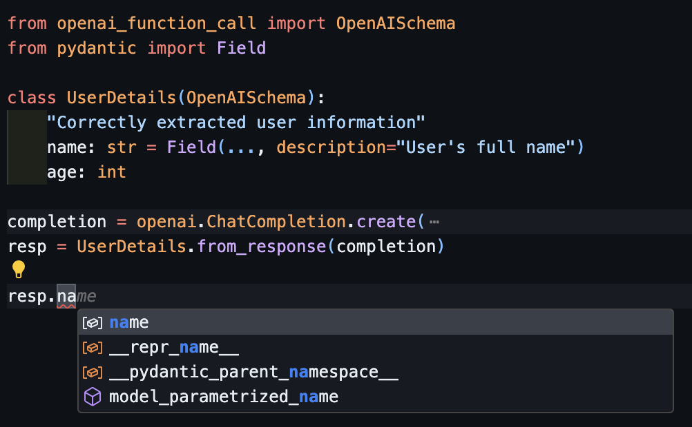
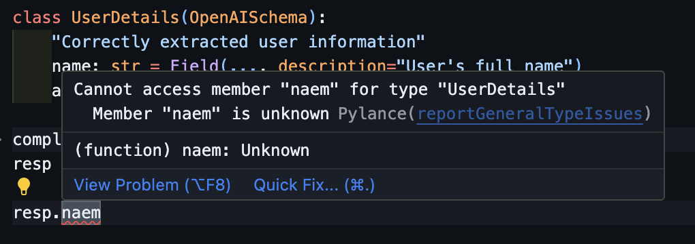

# Instructor (openai_function_call)

[](https://github.com/jxnl/instructor/stargazers)
[](https://github.com/jxnl/instructor/network)
[](https://github.com/jxnl/instructor/issues)
[](https://github.com/jxnl/instructor/blob/main/LICENSE)
[](https:github.com/jxnl/instructor/discussions)
[](https://jxnl.github.io/instructor)
[](https://www.buymeacoffee.com/jxnlco)
[](https://twitter.com/jxnlco)

_Structured extraction in Python, powered by OpenAI's function calling API, designed for simplicity, transparency, and control._

Built to interact solely openai's function calling api from python. It's designed to be intuitive, easy to use, but give great visibily in how we call openai. My goal isn't to hide the api, but to make it easier to use and show you how to leverage it via the [docs](https://jxnl.github.io/instructor).

### Installation

To get started you need to install it using `pip`. Run the following command in your terminal:

```sh
$ pip install instructor
```

## Quick Start with Patching ChatCompletion

To simplify your work with OpenAI models and streamline the extraction of Pydantic objects from prompts, we offer a patching mechanism for the `ChatCompletion`` class. Here's a step-by-step guide:

This patch introduces 2 features to the `ChatCompletion` class:

1. The `response_model` parameter, which allows you to specify a Pydantic model to extract data into.
2. The `max_retries` parameter, which allows you to specify the number of times to retry the request if it fails.
3. The `validation_context` parameter, which allows you to specify a context object that validators have access to.

note: to learn more about validators checkout our [blog](https://jxnl.github.io/instructor/blog/2023/10/23/good-llm-validation-is-just-good-validation/)

### Step 1: Import and Patch the Module

First, import the required libraries and apply the patch function to the OpenAI module. This exposes new functionality with the response_model parameter.

```python
import openai
import instructor

instructor.patch()
```

### Step 2: Define the Pydantic Model

Create a Pydantic model to define the structure of the data you want to extract. This model will map directly to the information in the prompt.

```python
from pydantic import BaseModel

class UserDetail(BaseModel):
    name: str
    age: int
```

### Step 3: Extract Data with ChatCompletion

Use the openai.ChatCompletion.create method to send a prompt and extract the data into the Pydantic object. The response_model parameter specifies the Pydantic model to use for extraction.

```python
user: UserDetail = openai.ChatCompletion.create(
    model="gpt-3.5-turbo",
    response_model=UserDetail,
    messages=[
        {"role": "user", "content": "Extract Jason is 25 years old"},
    ]
)
```

### Step 4: Validate the Extracted Data

You can then validate the extracted data by asserting the expected values. By adding the type things you also get a bunch of nice benefits with your IDE like spell check and auto complete!

```python
assert user.name == "Jason"
assert user.age == 25
```

### LLM-Based Validation

LLM-based validation can also be plugged into the same Pydantic model. Here, if the answer attribute contains content that violates the rule "don't say objectionable things," Pydantic will raise a validation error.

```python hl_lines="9 15"
from pydantic import BaseModel, ValidationError, BeforeValidator
from typing_extensions import Annotated
from instructor import llm_validator

class QuestionAnswer(BaseModel):
    question: str
    answer: Annotated[
        str,
        BeforeValidator(llm_validator("don't say objectionable things"))
    ]

try:
    qa = QuestionAnswer(
        question="What is the meaning of life?",
        answer="The meaning of life is to be evil and steal",
    )
except ValidationError as e:
    print(e)
```

Its important to not here that the error message is generated by the LLM, not the code, so it'll be helpful for re asking the model.

```plaintext
1 validation error for QuestionAnswer
answer
   Assertion failed, The statement is objectionable. (type=assertion_error)
```

## Using the Client with Retries

Here, the `UserDetails` model is passed as the `response_model`, and `max_retries` is set to 2.

```python
import instructor
from pydantic import BaseModel, field_validator

# Apply the patch to the OpenAI client
instructor.patch()

class UserDetails(BaseModel):
    name: str
    age: int

    @field_validator("name")
    @classmethod
    def validate_name(cls, v):
        if v.upper() != v:
            raise ValueError("Name must be in uppercase.")
        return v

model = openai.ChatCompletion.create(
    model="gpt-3.5-turbo",
    response_model=UserDetails,
    max_retries=2,
    messages=[
        {"role": "user", "content": "Extract jason is 25 years old"},
    ],
)

assert model.name == "JASON"
```

## IDE Support

Everything is designed for you to get the best developer experience possible, with the best editor support.

Including **autocompletion**:



And even **inline errors**



To see more examples of how we can create interesting models check out some [examples.](https://jxnl.github.io/instructor/examples/)

## License

This project is licensed under the terms of the MIT License.
