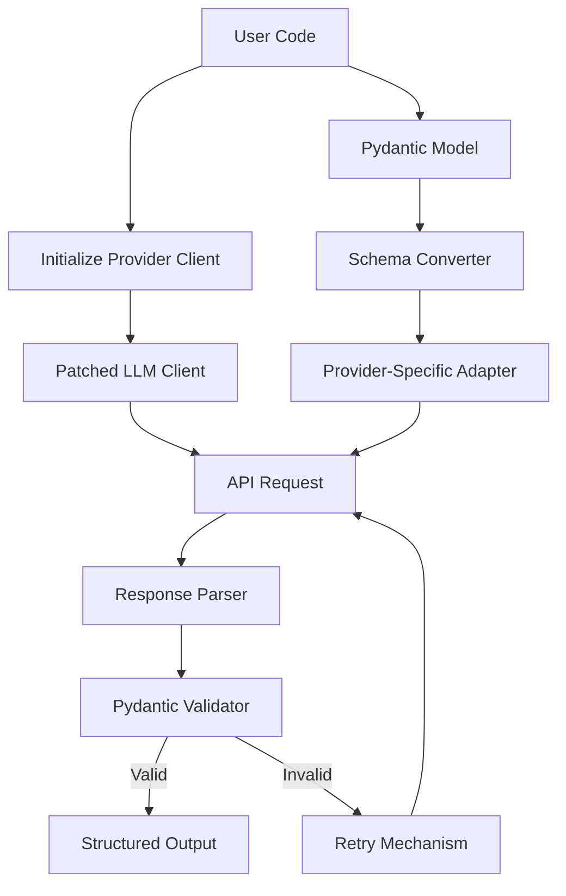
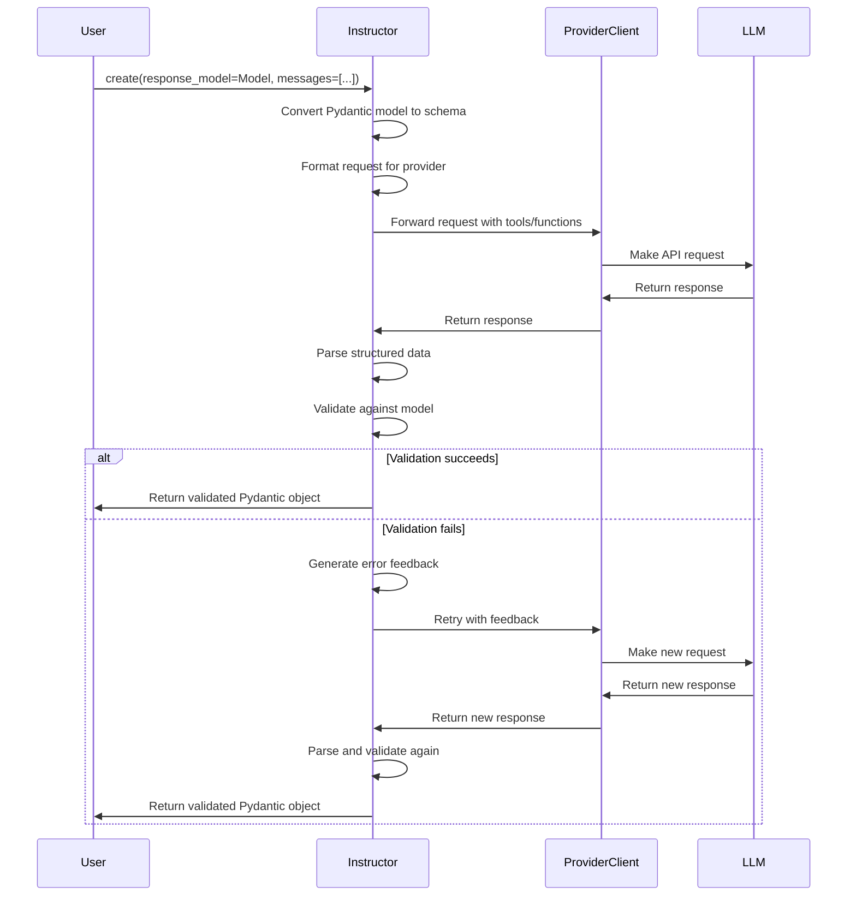

# Instructor Architecture

This document explains how Instructor works internally and how it integrates with different LLM providers.

## Core Components

Instructor consists of several key components that work together:

### Components Explained

1. **Pydantic Model**: Defines the structure of the data you want to extract
2. **Schema Converter**: Transforms Pydantic models into schemas understood by LLMs
3. **Provider-Specific Adapter**: Formats requests for specific LLM providers
4. **Patched LLM Client**: Augments provider clients with structured output capabilities
5. **Response Parser**: Extracts structured data from LLM responses
6. **Validator**: Validates responses against the Pydantic model
7. **Retry Mechanism**: Automatically retries with feedback when validation fails

## Request Flow

Here's how a typical Instructor request flows through the system:

This architecture enables Instructor to provide a consistent interface across different LLM providers while handling their specific implementation details behind the scenes.