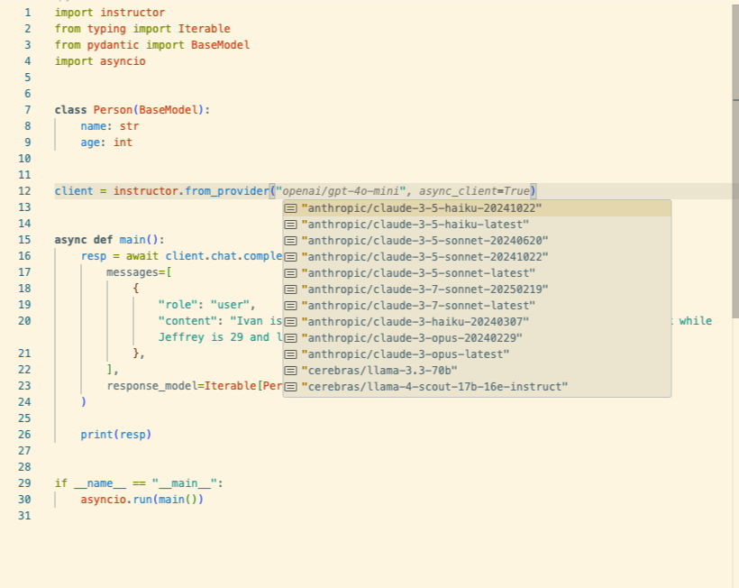

---
authors:
  - jxnl
  - ivanleomk
categories:
  - instructor
comments: true
date: 2025-05-08
description: Switch between different models and providers with a single string!
draft: false
tags:
  - LLMs
  - Instructor
---

We are pleased to introduce a significant enhancement to Instructor: the **`from_provider()`** function. While Instructor has always focused on providing robust structured outputs, we've observed that many users work with multiple LLM providers. This often involves repetitive setup for each client.

The `from_provider()` function aims to simplify this process, making it easier to initialize clients and experiment across different models.

This new feature offers a streamlined, string-based method to initialize an Instructor-enhanced client for a variety of popular LLM providers.

<!-- more -->

## What is `from_provider()`?

The `from_provider()` function serves as a smart factory for creating LLM clients. By providing a model string identifier, such as `"openai/gpt-4o"` or `"anthropic/claude-3-opus-20240229"`, the function handles the necessary setup:

- **Automatic SDK Detection**: It identifies the targeted provider (e.g., OpenAI, Anthropic, Google, Mistral, Cohere).
- **Client Initialization**: It dynamically imports the required provider-specific SDK and initializes the native client (like `openai.OpenAI()` or `anthropic.Anthropic()`).
- **Instructor Patching**: It automatically applies the Instructor patch to the client, enabling structured outputs, validation, and retry mechanisms.
- **Sensible Defaults**: It uses recommended `instructor.Mode` settings for each provider, optimized for performance and capabilities such as tool use or JSON mode, where applicable.
- **Sync and Async Support**: Users can obtain either a synchronous or an asynchronous client by setting the `async_client=True` flag.

## Key Benefits

The `from_provider()` function is designed to streamline several common workflows:

- **Model Comparison**: Facilitates quick switching between different models or providers to evaluate performance, cost, or output quality for specific tasks.
- **Multi-Provider Strategies**: Simplifies the implementation of fallback mechanisms or routing queries to different LLMs based on criteria like complexity or cost, reducing client management overhead.
- **Rapid Prototyping**: Allows for faster setup when starting with a new provider or model.
- **Simplified Configuration**: Reduces boilerplate code in projects that integrate with multiple LLM providers.

## How it Works: A Look Under the Hood

Internally, `from_provider()` (located in `instructor/auto_client.py`) parses the model string (e.g., `"openai/gpt-4o-mini"`) to identify the provider and model name. It then uses conditional logic to import the correct libraries, instantiate the client, and apply the appropriate Instructor patch. For instance, the conceptual handling for an OpenAI client would involve importing the `openai` SDK and `instructor.from_openai`.

```python
# Conceptual illustration of internal logic for OpenAI:
# (Actual implementation is in instructor/auto_client.py)

# if provider == "openai":
#     import openai
#     from instructor import from_openai, Mode
#
#     # 'async_client', 'model_name', 'kwargs' are determined by from_provider
#     native_client = openai.AsyncOpenAI() if async_client else openai.OpenAI()
#
#     return from_openai(
#         native_client,
#         model=model_name,
#         mode=Mode.TOOLS,  # Default mode for OpenAI
#         **kwargs,
#     )
```

The function also manages dependencies by alerting users to install missing packages (e.g., via `uv pip install openai`) if they are not found.

## Example Usage

> Note : Ensure your API keys (e.g., `OPENAI_API_KEY`, `ANTHROPIC_API_KEY`) are configured as environment variables to run this code.

Here's a self-contained example demonstrating how `from_provider()` can be used to retrieve structured output from google gemini's flash-2.0 model.

```python
import instructor
from pydantic import BaseModel
from typing import Iterable

# Define your data structure
class Person(BaseModel):
    name: str
    age: int

# Connect to any provider with a single line
client = instructor.from_provider("google/gemini-2.0-flash")

# Extract structured data
response = client.chat.completions.create(
    messages=[
        {
            "role": "user",
            "content": "Alice is 30 and Bob is 25.",
        }
    ],
    response_model=Iterable[Person],
)

for person in response:
    print(f"Name: {person.name}, Age: {person.age}")
# Output:
# Name: Alice, Age: 30
# Name: Bob, Age: 25
```

Switching providers is as simple as changing the string:

```python
# OpenAI
client = instructor.from_provider("openai/gpt-4.1")

# Anthropic (with version date)
client = instructor.from_provider("anthropic/claude-3-5-haiku-20241022")
```

With the unified provider interface, you can now easily benchmark different models on the same task. This is crucial when you need to:

1. Compare response quality across different providers
2. Test which model gives the best structured extraction results
3. Optimize for speed vs. accuracy tradeoffs
4. Run A/B tests between providers without code refactoring

Instead of maintaining separate codebases for each provider or complex switching logic, you can focus on what matters: finding the optimal model for your specific use case.

### Async Support

When building production applications that need to remain responsive, asynchronous processing is essential.

Instructor's unified provider interface supports this workflow with a simple `async_client` keyword during initialization.

```python
client = instructor.from_provider("openai/gpt-4.1", async_client=True)
```

The async implementation works particularly well for web servers, batch processing jobs, or any scenario where you need to extract structured data without blocking your application's main thread.

Here's how you can implement it:

```python
import instructor
from pydantic import BaseModel
import asyncio

class UserProfile(BaseModel):
    name: str
    country: str

async def get_user_profile():
    # Initialise an asynchronous client
    async_client = instructor.from_provider(
        "openai/gpt-4.1-mini",
        async_client=True
    )

    # Extract data asynchronously
    profile = await async_client.chat.completions.create(
        messages=[{"role": "user", "content": "Extract: Maria lives in Spain."}],
        response_model=UserProfile
    )
    print(f"Name: {profile.name}, Country: {profile.country}")

if __name__ == "__main__":
    asyncio.run(get_user_profile())
```

### Provider Specific Parameters

Some providers require additional parameters for optimal performance.

Rather than hiding these options, Instructor allows you to pass them directly through the from_provider function:

```python
# Anthropic requires max tokens
client = instructor.from_provider(
    "anthropic/claude-3-sonnet-20240229",
    max_tokens=1024
)
```

If you'd like to change this parameter down the line, you can just do so by setting it on the `client.chat.completions.create` function again.

### Type Completion

To make it easy for you to find the right model string, we now ship with auto-complete for these new model-provider initialisation strings.

This is automatically provided for you out of the box when you use the new `from_provider` method as seen below.



Say bye to fiddling around with messy model versioning and get cracking to working on your business logic instead!

## Path Forward

The `from_provider()` function offers a convenient method for client initialization. Instructor remains a lightweight wrapper around your chosen LLM provider's client, and users always retain the flexibility to initialize and patch clients manually for more granular control or when using providers not yet covered by this utility.

This unified interface is intended to balance ease of use for common tasks with the underlying flexibility of Instructor, aiming to make multi-provider LLM development more accessible and efficient. However, there is still much to do to further streamline multi-provider workflows. Future efforts could focus on:

- **Unified Prompt Caching API**: While Instructor supports prompt caching for providers like [Anthropic](../integrations/anthropic.md#caching) (see also our [blog post on Anthropic prompt caching](../blog/posts/anthropic-prompt-caching.md) and the general [Prompt Caching concepts](../concepts/prompt_caching.md)), a more standardized, cross-provider API for managing cache behavior could significantly simplify optimizing costs and latency.
- **Unified Multimodal Object Handling**: Instructor already provides a robust way to work with [multimodal inputs like Images, Audio, and PDFs](../concepts/multimodal.md) across different providers. However, a higher-level unified API could further abstract provider-specific nuances for these types, making it even simpler to build applications that seamlessly switch between, for example, OpenAI's vision capabilities and Anthropic's, without changing how media objects are passed.

These are areas where `instructor` can continue to reduce friction for developers working in an increasingly diverse LLM ecosystem.

We encourage you to try `from_provider()` in your projects, particularly when experimenting with multiple LLMs. Feedback and suggestions for additional providers or features are always welcome.
