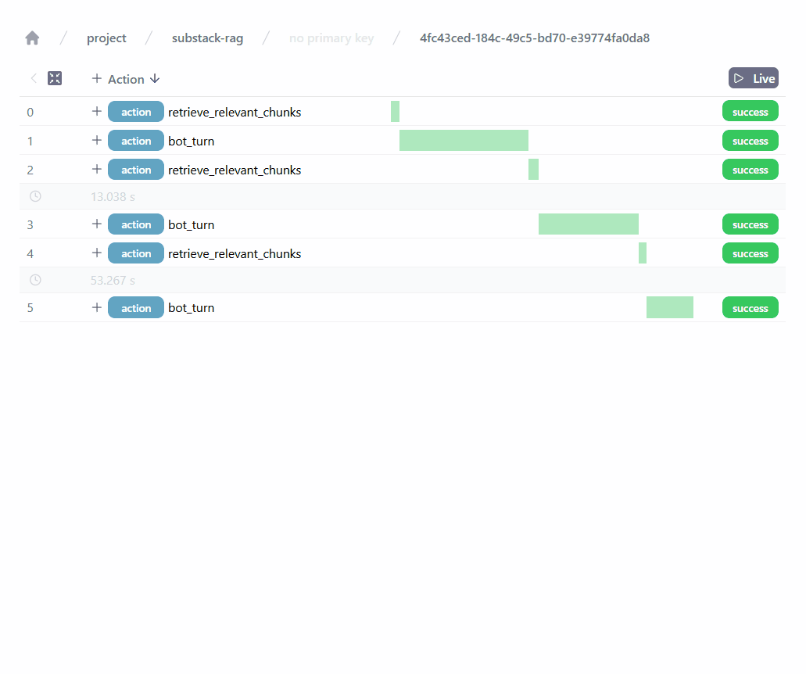
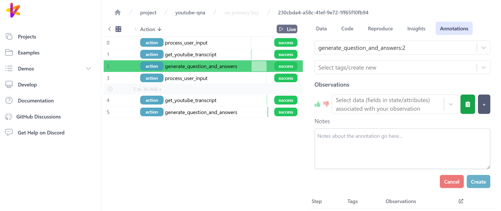

---
authors:
- jxnl
- joschkabraun
categories:
- LLM Observability
comments: true
date: 2024-10-17
description: Flashcard generator application with Instructor + Burr
draft: false
tags:
- instructor
- Burr
- OpenAI
- LLM
- observability
---

# Flashcard generator application with Instructor + Burr

Flashcards help break down complex topics and learn anything from biology, to a new
language, or lines for a play. This blog will show how to use LLMs to generate
flashcards and kickstart your learning! 

**Instructor** lets us get structured outputs from LLMs reliably and **Burr** create
an LLM application that's easy to understand and debug. It comes with **Burr UI**,
a free, open source, and local-first tool for observability, annotations, and more!

??? info 

    This post expands on an earlier one: [Analyzing Youtube Transcripts with Instructor](https://python.useinstructor.com/blog/2024/07/11/youtube-transcripts/).

<!-- more -->

## Generating flashcards with Instructor

```bash
pip install openai instructor pydantic youtube_transcript_api "burr[start]"
```

### Define the LLM response model 

With `instructor`, you define Pydantic models that will serve as template for the LLM to
fill.

Here, we define the `QuestionAnswer` model which will store the question, the answer, and
some metadata. Attribute without a default value will be generated by the LLM.

```python hl_lines="10-11 23 24-27"
import uuid

from pydantic import BaseModel, Field
from pydantic.json_schema import SkipJsonSchema

class QuestionAnswer(BaseModel):
    question: str = Field(description="Question about the topic")
    options: list[str] = Field(
        description="Potential answers to the question.",
        min_items=3,
        max_items=5
    )
    answer_index: int = Field(
        description="Index of the correct answer options (starting from 0).",
        ge=0,
        lt=5
    )
    difficulty: int = Field(
        description="Difficulty of this question from 1 to 5, 5 being the most difficult.",
        gt=0,
        le=5, 
    )
    youtube_url: SkipJsonSchema[str | None] = None
    id: uuid.UUID = Field(
        description="Unique identifier",
        default_factory=uuid.uuid4
    )
```

This examples shows several `instructor` features:
- `Field` can have a `default` or `default_factory` value to prevent the LLM from
  hallucinating the value
    - `id` generates a unique id (`uuid`)
- The type annotation `SkipJsonSchema` also prevents the LLM from generating the value.
    - `youtube_url` is set programmatically in the application. We don't want the LLM
      to hallucinate it.
- `Field` can set constraints on what the LLM generates.
    - `min_items=3, max_items=5` to limit the number of potential answers between 3 and 5
    - `ge=0, lt=5` to limit the difficulty between 0 and 5 with 5 being the most difficult

### Retrieve the YouTube transcript

The library `youtube-transcript-api` helps getting the full transcript of a video.

```python
from youtube_transcript_api import YouTubeTranscriptApi

youtube_url = "https://www.youtube.com/watch?v=hqutVJyd3TI" 
_, _, video_id = youtube_url.partition("?v=")
segments = YouTubeTranscriptApi.get_transcript(video_id)
transcript = " ".join([s['text'] for s in segments])
```

### Generate question-answer pairs

Now, to produce question-answer pairs:
1. Create an `instructor` client by wrapping the OpenAI client
2. Use `.create_iterable()` on the `instructor_client` to generate multiple outputs from
   the input
3. Specify `response_model=QuestionAnswer` to ensure outputs are `QuestionAnswer` objects
4. Use the `messages` to pass the task instructos via the `system` message, and the input
   transcript via `user` message.

```python hl_lines="4 10 12"
import instructor
import openai

instructor_client = instructor.from_openai(openai.OpenAI())

system_prompt = """Analyze the given YouTube transcript and generate question-answer pairs
to help study and understand the topic better. Please rate all questions from 1 to 5
based on their difficulty."""

response = instructor_client.chat.completions.create_iterable(
    model="gpt-4o-mini",
    response_model=QuestionAnswer,
    messages=[
        {"role": "system", "content": system_prompt},
        {"role": "user", "content": transcript},
    ],
)
```

This will return an generator that you can iterate over to access individual
`QuestionAnswer` objects.

```python
count = 0
for qna in response:
    if count > 3:
        break
    print(qna.question)
    print(qna.options)
    print()
    count += 1
```


## Create an application

The library `burr` uses `actions` and `transitions` to define complex applications while
preserving the simplicity of a flowchart for understanding and debugging.


### 1. Define `actions`

Actions are what your application can do. The `@action` decorator specifies what values
can be read from or written to `State`. The decorated function must take a `State` as
first argument and return a `State` object.

Next, we define 3 actions:
- process the user input to get the YouTube URL
- get the YouTube transcript associated with the URL
- generate question-answer pairs for the transcript

Note that this is only a light refactor from the previous code snippets.

```python
from burr.core import action, State


@action(reads=[], writes=["youtube_url"])
def process_user_input(state: State, user_input: str) -> State:
    """Process user input and update the YouTube URL."""
    youtube_url = user_input  # In practice, we would have more complex validation logic.
    return state.update(youtube_url=youtube_url)


@action(reads=["youtube_url"], writes=["transcript"])
def get_youtube_transcript(state: State) -> State:
    """Get the official YouTube transcript for a video given it's URL"""
    youtube_url = state["youtube_url"]
    
    _, _, video_id = youtube_url.partition("?v=")
    transcript = YouTubeTranscriptApi.get_transcript(video_id)
    full_transcript = " ".join([entry['text'] for entry in transcript])

    # store the transcript in state
    return state.update(transcript=full_transcript, youtube_url=youtube_url)


@action(reads=["transcript", "youtube_url"], writes=["question_answers"])
def generate_question_and_answers(state: State) -> State:
    """Generate `QuestionAnswer` from a YouTube transcript using an LLM."""
    # read the transcript from state
    transcript = state["transcript"]
    youtube_url = state["youtube_url"]

    # create the instructor client
    instructor_client = instructor.from_openai(openai.OpenAI())
    system_prompt = (
        "Analyze the given YouTube transcript and generate question-answer pairs"
        " to help study and understand the topic better. Please rate all questions from 1 to 5"
        " based on their difficulty."
    )
    response = instructor_client.chat.completions.create_iterable(
        model="gpt-4o-mini",
        response_model=QuestionAnswer,
        messages=[
            {"role": "system", "content": system_prompt},
            {"role": "user", "content": transcript},
        ],
    )

    # iterate over QuestionAnswer, add the `youtube_url`, and append to state
    for qna in response:
        qna.youtube_url = youtube_url
        # `State` is immutable, so `.append()` returns a new object with the appended value
        state = state.append(question_answers=qna)

    return state
```

### 2. Build the `Application`
To create a Burr `Application`, we use the `ApplicationBuilder` object.

Minimally, it needs to:
- use `.with_actions()` to define all possible actions. Simply pass the functions
  decorated with `@action`.
- use `.with_transitions()` to define possible transitions between actions. This is
 done via tuples `(from_action, to_action)`.
- use `.with_entrypoint()` to specify which action to run first.

We also include `.with_tracker()` to log telemetry in **Burr UI**.

```python
from burr.core import ApplicationBuilder

app = (
    ApplicationBuilder()
    .with_actions(
        process_user_input,
        get_youtube_transcript,
        generate_question_and_answers,
    )
    .with_transitions(
        ("process_user_input", "get_youtube_transcript"),
        ("get_youtube_transcript", "generate_question_and_answers"),
        ("generate_question_and_answers", "process_user_input"),
    )
    .with_entrypoint("process_user_input")
    .with_tracker(project="youtube-qna")
    .build()
)
app.visualize()
```


You can always visualize the application graph to understand the logic's flow.


### 3. Launch the application
Using `Application.run()` will make the application execute actions until a halt condition.
In this case, we halt before `process_user_input` to get the YouTube URL from the user. 

The method `.run()` returns a tuple `(action_name, result, state)`. In this case, we only
use the state to inspect the generated question-answer pairs.

```python
action_name, result, state = app.run(
    halt_before=["process_user_input"],
    inputs={"user_input": "https://www.youtube.com/watch?v=hqutVJyd3TI"},
)
print(state["question_answers"][0])
```

You can create a simple local experience by using `.run()` in a `while` loop

```python
while True:
    user_input = input("Enter a YouTube URL (q to quit): ")
    if user_input.lower() == "q":
        break

    action_name, result, state = app.run(
        halt_before=["process_user_input"],
        inputs={"user_input": user_input},
    )
    print(f"{len(state['question_answers'])} question-answer pairs generated")
```

## Next steps

Now that you know how to use `instructor` for reliable LLM outputs and `burr` to
structure your application, many avenues open up depending on your goals!

### 1. Build complex agents

Instructor improves the LLM's reasoning by providing structure. Nesting models and adding
constraints allow to [get facts with citations](https://python.useinstructor.com/examples/exact_citations/#example)
or [extract a knowledge graph](https://python.useinstructor.com/examples/knowledge_graph/)
in a few lines of code. Also, [retries](https://python.useinstructor.com/concepts/retrying/)
the LLM to self-correct.

Burr sets the boundaries between users, LLMs, and the rest of your system. You can add
`Condition` on transitions to create complex workflows that remain easy to reason about.

### 2. Add Burr to your product

Your Burr `Application` is a lightweight Python object. You can run it within a notebook,
via script, a web app (Streamlit, Gradio, etc.), or as a web service (e.g., FastAPI).

The `ApplicationBuilder` provides many features to productionize your app:
- **Persistence**: save and restore `State` (e.g., store conversation history)
- **Observability**: log and monitor application telemetry (e.g., LLM calls, number of
tokens used, errors and retries)
- **Streaming** and **async** support: create snappy user interfaces by streaming LLM
responses and running actions asynchronously.



> Telemetry for a RAG application (retrieved context, prompts, generated answers, etc.) in Burr UI

### 3. Annotate application logs

Burr UI has a built-in annotation tool that allows you to label, rate, or comment on
logged data (e.g., user input, LLM response, content retrieved for RAG). This can be
useful to create test cases and evaluation datasets.




## Conclusion

We've shown how Instructor helps getting reliable outputs from LLMs and Burr provides
the right tools to build an application.