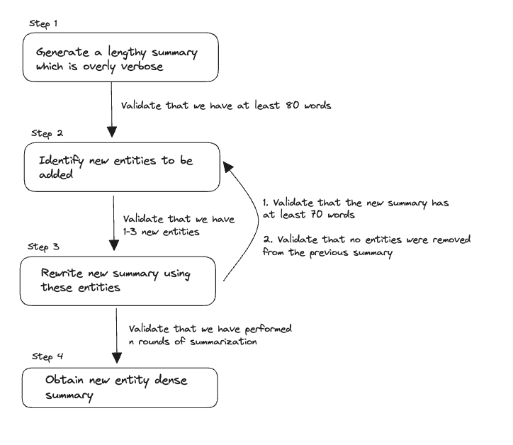

# Smarter Summaries w/ Finetuning GPT-3.5 and Chain of Density

> Discover how to distil an iterative method like Chain Of Density into a single finetuned model using Instructor

In this article, we'll guide you through implementing the original Chain of Density method using Instructor, then show how to distile a GPT 3.5 model to match GPT-4's iterative summarization capabilities. Using these methods were able to decrease latency by 20x, reduce costs by 50x and maintain entity density.

By the end you'll end up with a GPT 3.5 model, (fine-tuned using Instructor's great tooling), capable of producing summaries that rival the effectiveness of Chain of Density. As always, all code is readily available in our `examples/chain-of-density` folder in our repo for your reference.

??? abstract "Datasets and Colab Notebook"

    We've also uploaded all our generated data to Hugging Face [here](https://huggingface.co/datasets/ivanleomk/gpt4-chain-of-density) for you to use if you'd like to try reproducing these experiments. We've also added a [Colab Instance](https://colab.research.google.com/drive/1iBkrEh2G5U8yh8RmI8EkWxjLq6zIIuVm?usp=sharing) for you to check our generated values.

## Part 1) Chain of Density

Summarizing extensive texts with AI can be challenging, often relying on inconsistent techniques. Salesforce AI Research's novel method, Chain Of Density, enhances AI-based text summarization, outperforming human-generated summaries.

Initially, an AI produces a summary, then refines it through multiple iterations, adding missing article entities. Each iteration adds new article entities to the summary, keeping length consistent, leading to an entity-dense, informative summary called Chain Of Density.

First introduced by Salesforce's AI Research wing in their paper - [From Sparse to Dense: GPT-4 Summarization with Chain of Density Prompting](https://arxiv.org/abs/2309.04269). The team has found that this method is able to consistently beats similar summaries written by human annotators.

??? info "Implementation Details"

    Note that our implementation uses a validator to ensure that the rewritten summary has a minimum length rather than a prompt. We also perform just 3 and not 5 rounds of rewrites, resulting in a lower final entity density.

### Original Prompt

We can break down the original process into smaller api calls. This allows us to introduce validation at each step to ensure that we're getting the results that we want.

??? note "Original Chain of Density Prompt"

    ```
    Article: {{ARTICLE}}

    You will generate increasingly concise, entity-dense summaries of the
    above Article.

    Repeat the following 2 steps 5 times.

    Step 1. Identify 1-3 informative Entities (";" delimited) from the
    Article which are missing from the previously generated summary.
    Step 2. Write a new, denser summary of identical length which covers
    every entity and detail from the previous summary plus the Missing
    Entities.

    A Missing Entity is:
    - Relevant: to the main story.
    - Specific: descriptive yet concise (5 words or fewer).
    - Novel; not in the previous summary.
    - Faithful: present in the Article.
    - Anywhere: located anywhere in the Article.

    Guidelines:
    - The first summary should be long (4-5 sentences, -80 words) yet
    highly non-specific, containing little information beyond the
    entities marked as missing. Use overly verbose language and fillers
    (e.g., "this article discusses") to reach -80 words.
    - Make every word count: re-write the previous summary to improve
    flow and make space for additional entities.
    - Make space with fusion, compression, and removal of uninformative
    phrases like "the article discusses"
    - The summaries should become highly dense and concise yet
    self-contained, e.g., easily understood without the Article.
    - Missing entities can appear anywhere in the new summary.
    - Never drop entities from the previous summary. If space cannot be
    made, add fewer new entities.

    Remember, use the exact same number of words for each summary.

    Answer in JSON. The JSON should be a list (length 5) of dictionaries
    whose keys are "Missing_Entities" and "Denser_Summary"
    ```

<figure markdown>
  
  <figcaption>Improved process with Instructor</figcaption>
</figure>

### Data Modelling

Before we begin modelling the data, let's make sure we install all of our dependencies

```
pip install instructor aiohttp rich
```

#### Initial Summary

Let's start by walking through some of the data models that we'll be using as the `response_model` for our open ai function calls

Firstly, we'll need a data model for the initial summary that we will be generating. We'll take the description of this class straight from the original prompt. It's important to note that these docstrings serve a purpose, they are **directly used by the LLM when generating the outputs**.

??? note "A quick note on Docstrings"

    Under the hood, Instructor parses the `response_model` that you give us into a function call for OpenAI to execute. This means that the final output will be closely linked to the Pydantic model you specify.

    For instance, this simple model that we later use in fine-tuning.

    ```py
    class GeneratedSummary(BaseModel):
    """
    This represents a highly concise summary that includes as many entities as possible from the original source article.

    An Entity is a real-world object that's assigned a name - for example, a person, country a product or a book title.

    Guidelines
    - Make every word count
    - The new summary should be highly dense and concise yet self-contained, eg., easily understood without the Article.
    - Make space with fusion, compression, and removal of uninformative phrases like "the article discusses"
    """

    summary: str = Field(
        ...,
        description="This represents the final summary generated that captures the meaning of the original article which is as concise as possible. ",
    )
    ```

    We eventually transform it into an OpenAI function call as seen below.

    ```
    {
    "functions": [
        {
        "name": "GeneratedSummary",
        "description": "This represents a highly concise summary that includes as many entities as possible from the original source article.\n\nAn Entity is a real-world object that's assigned a name - for example, a person, country a product or a book title.\n\nGuidelines\n- Make every word count\n- The new summary should be highly dense and concise yet self-contained, eg., easily understood without the Article.\n- Make space with fusion, compression, and removal of uninformative phrases like \"the article discusses\"",
        "parameters": {
            "properties": {
            "summary": {
                "description": "This represents the final summary generated that captures the meaning of the original article which is as concise as possible. ",
                "title": "Summary",
                "type": "string"
            }
            },
            "required": [
            "summary"
            ],
            "type": "object"
        }
        }
    ]
    }
    }
    ```

    Therefore this means that the more elaborate and detailed your descriptions are, the better the outputs you will be able to get back. But we don't just stop there, since it's all Pydantic under the hood, you can validate and parse the resulting output to make sure it is **exactly what you specify**. It's all python all the way down.

```py
class InitialSummary(BaseModel):
    """
    This is an initial summary which should be long ( 4-5 sentences, ~80 words)
    yet highly non-specific, containing little information beyond the entities marked as missing.
    Use overly verbose languages and fillers (Eg. This article discusses) to reach ~80 words.
    """

    summary: str = Field(
        ...,
        description="This is a summary of the article provided which is overly verbose and uses fillers. It should be roughly 80 words in length",
    )
```

#### Rewritten Summary

We'll also need one additional class to help model the rewritten schema

```py
class RewrittenSummary(BaseModel):
    """
    This is a new, denser summary of identical length which covers every entity
    and detail from the previous summary plus the Missing Entities.

    Guidelines
    - Make every word count : Rewrite the previous summary to improve flow and make space for additional entities
    - Never drop entities from the previous summary. If space cannot be made, add fewer new entities.
    - The new summary should be highly dense and concise yet self-contained, eg., easily understood without the Article.
    - Make space with fusion, compression, and removal of uninformative phrases like "the article discusses"
    - Missing entities can appear anywhere in the new summary

    An Entity is a real-world object that's assigned a name - for example, a person, country a product or a book title.
    """

    summary: str = Field(
        ...,
        description="This is a new, denser summary of identical length which covers every entity and detail from the previous summary plus the Missing Entities. It should have the same length ( ~ 80 words ) as the previous summary and should be easily understood without the Article",
    )
    absent: List[str] = Field(
        ...,
        default_factory=list,
        description="this is a list of Entities found absent from the new summary that were present in the previous summary",
    )
    missing: List[str] = Field(
        default_factory=list,
        description="This is a list of 1-3 informative Entities from the Article that are missing from the new summary which should be included in the next generated summary.",
    )
```

!!! tip "Using Pydantic Validators with Instructor"

    For a more in-depth walkthrough on how to use `Pydantic` validators with the `Instructor`
    library, we recommend checking out our previous article on LLM
    validation - [Good LLM Validation is just Good Validation](/instructor/blog/2023/10/23/good-llm-validation-is-just-good-validation/)

Ideally, we'd like for `Missing` to have a length between 1 and 3, `Absent` to be an empty list and for our rewritten summaries to keep a minimum entity density. With `Instructor`, we can implement this logic using native `Pydantic` validators that are simply declared as part of the class itself.

```py hl_lines="8 40 44"
import nltk
import spacy

nlp = spacy.load("en_core_web_sm")

@field_validator("summary")
def min_length(cls, v: str):
    tokens = nltk.word_tokenize(v) #(1)!
    num_tokens = len(tokens)
    if num_tokens < 60:
        raise ValueError(
            "The current summary is too short. Please make sure that you generate a new summary that is around 80 words long."
        )
    return v

@field_validator("missing")
def has_missing_entities(cls, missing_entities: List[str]):
    if len(missing_entities) == 0:
        raise ValueError(
            "You must identify 1-3 informative Entities from the Article which are missing from the previously generated summary to be used in a new summary"
        )
    return missing_entities

@field_validator("absent")
def has_no_absent_entities(cls, absent_entities: List[str]):
    absent_entity_string = ",".join(absent_entities)
    if len(absent_entities) > 0:
        print(f"Detected absent entities of {absent_entity_string}")
        raise ValueError(
            f"Do not omit the following Entities {absent_entity_string} from the new summary"
        )
    return absent_entities

@field_validator("summary")
    def min_entity_density(cls, v: str):
        tokens = nltk.word_tokenize(v)
        num_tokens = len(tokens)

        # Extract Entities
        doc = nlp(v) #(2)!
        num_entities = len(doc.ents)

        density = num_entities / num_tokens
        if density < 0.08: #(3)!
            raise ValueError(
                f"The summary of {v} has too few entities. Please regenerate a new summary with more new entities added to it. Remember that new entities can be added at any point of the summary."
            )

        return v
```

1.  Similar to the original paper, we utilize the `NLTK` word tokenizer to count the number of tokens within our generated sentences.
    We aim for at least 60 tokens in our generated summary so that we don't lose information.

2.  We also use the spaCy library to calculate the entity density of the generated summary.

3.  We also implement a minimum entity density so that we stay within a given range. 0.08 is arbitrarily chosen in this case

### Putting it all Together

Now that we have our models and the rough flow figured out, let's implement a function to summarize a piece of text using `Chain Of Density` summarization.

```py hl_lines="4 9-24 38-68"
from openai import OpenAI
import instructor

client = instructor.patch(OpenAI()) #(1)!

def summarize_article(article: str, summary_steps: int = 3):
    summary_chain = []
    # We first generate an initial summary
    summary: InitialSummary = client.chat.completions.create(  # (2)!
        model="gpt-4-0613",
        response_model=InitialSummary,
        messages=[
            {
                "role": "system",
                "content": "Write a summary about the article that is long (4-5 sentences) yet highly non-specific. Use overly, verbose language and fillers(eg.,'this article discusses') to reach ~80 words",
            },
            {"role": "user", "content": f"Here is the Article: {article}"},
            {
                "role": "user",
                "content": "The generated summary should be about 80 words.",
            },
        ],
        max_retries=2,
    )
    prev_summary = None
    summary_chain.append(summary.summary)
    for i in range(summary_steps):
        missing_entity_message = (
            []
            if prev_summary is None
            else [
                {
                    "role": "user",
                    "content": f"Please include these Missing Entities: {','.join(prev_summary.missing)}",
                },
            ]
        )
        new_summary: RewrittenSummary = client.chat.completions.create( # (3)!
            model="gpt-4-0613",
            messages=[
                {
                    "role": "system",
                    "content": """
                You are going to generate an increasingly concise,entity-dense summary of the following article.

                Perform the following two tasks
                - Identify 1-3 informative entities from the following article which is missing from the previous summary
                - Write a new denser summary of identical length which covers every entity and detail from the previous summary plus the Missing Entities

                Guidelines
                - Make every word count: re-write the previous summary to improve flow and make space for additional entities
                - Make space with fusion, compression, and removal of uninformative phrases like "the article discusses".
                - The summaries should become highly dense and concise yet self-contained, e.g., easily understood without the Article.
                - Missing entities can appear anywhere in the new summary
                - Never drop entities from the previous summary. If space cannot be made, add fewer new entities.
                """,
                },
                {"role": "user", "content": f"Here is the Article: {article}"},
                {
                    "role": "user",
                    "content": f"Here is the previous summary: {summary_chain[-1]}",
                },
                *missing_entity_message,
            ],
            max_retries=3, #(4)!
            max_tokens=1000,
            response_model=RewrittenSummary,
        )
        summary_chain.append(new_summary.summary)
        prev_summary = new_summary

    return summary_chain
```

1.  We need to apply a `patch` function on the `OpenAI` client for us to get all
    of the benefits that `Instructor` provides. With a simple `patch`, we can get
    **automatic type coercion of our outputs and automatic retries for invalid outputs**
    out of the box!

2.  We first generate an initial summary. Note here that we explictly ask for a summary that has
    80 words and is lengthy with overly verbose fillers in the system prompt

3.  We slightly modify the original system prompt used in the original paper to perform a rewrite of the summary.
    Using `Instructor`, we also get validation of the generated output with our `field_validator`s that we defined above

4.  If you've chosen a value that is larger than 0.08, make sure to increase this value in case you need to do multiple rewrites

This summarization function yields a result which triples the number of entities while maintaining the same number of tokens. We can also see that stylistically, the summary is a lot more natural.

**First Iteration**

> This article discusses the highly-anticipated boxing match between Manny Pacquiao and Floyd Mayweather. The article revolves around Manny Pacquiao's statements about his upcoming fight and his preparations for the same. A portion of the article provides details about the financial stipulations of the match and its significance in the sporting arena. Quotes from Pacquiao illustrating his determination and his battle strategy are highlighted. The tone of the article is largely centered around creating a build-up to the upcoming mega event.

**Final Iteration**

> Manny Pacquiao, the Filipino boxer, anticipates the forthcoming May 2 showdown at the MGM Grand as the fight of his life, against the undefeated American Floyd Mayweather, in a $300m bout. Despite being seen as the underdog in this high-stakes Las Vegas match, Pacquiao is confident, promising a warrior's spirit and assuring the fans who have been awaiting this encounter for a decade, that it will indeed be the biggest sporting spectacle in history worthy of their anticipation

## Part 2) Fine-Tuning

In this section, we'll look into how to fine-tune a GPT 3.5 model so that it is able to perform at an equivalent level as a GPT-4 model. We'll then compare the performance of our model against that of `GPT-4` to see how it stacks up.

### Creating a Training Set

In order to prevent any contamination of data during testing, we randomly sampled 120 articles from the `griffin/chain-of-density` dataset and split these articles into a `train.csv` and a `test.csv` file which we uploaded to [Hugging Face](https://huggingface.co/datasets/ivanleomk/gpt4-chain-of-density). Now, we just neeed to import the `Instructions` module from the `Instructor` package which allows you to generate a nicely formatted `.jsonl` file to be used for fine-tuning

```py hl_lines="2 9 11 13-21 40 43"
from typing import List
from chain_of_density import summarize_article #(1)!
import csv
import logging
import instructor
from pydantic import BaseModel
from openai import OpenAI

client = instructor.patch(OpenAI()) # (2)!

logging.basicConfig(level=logging.INFO) #(3)!

instructions = instructor.Instructions( #(4)!
    name="Chain Of Density",
    finetune_format="messages",
    # log handler is used to save the data to a file
    # you can imagine saving it to a database or other storage
    # based on your needs!
    log_handlers=[logging.FileHandler("generated.jsonl")],
    openai_client=client,
)

class GeneratedSummary(BaseModel):
    """
    This represents a highly concise summary that includes as many entities as possible from the original source article.

    An Entity is a real-world object that's assigned a name - for example, a person, country a product or a book title.

    Guidelines
    - Make every word count
    - The new summary should be highly dense and concise yet self-contained, eg., easily understood without the Article.
    - Make space with fusion, compression, and removal of uninformative phrases like "the article discusses"
    """

    summary: str = Field(
        ...,
        description="This represents the final summary generated that captures the meaning of the original article which is as concise as possible. ",
    )

@instructions.distil #(4)!
def distil_summarization(text: str) -> GeneratedSummary:
    summary_chain: List[str] = summarize_article(text)
    return GeneratedSummary(summary=summary_chain[-1]) #(5)!

with open("train.csv", "r") as file:
    reader = csv.reader(file)
    next(reader)  # Skip the header
    for article, summary in reader:
        # Run Distillisation to generate the values
        distil_summarization(article)
```

1.  In this example, we're using the summarize_article that we defined up above. We saved it in a local file called `chain_of_density.py`,
    hence the import

2.  We patch the default OpenAI client so that we can use the Instructor library with it

3.  We also need to configure logging at the `INFO` level. This is very important, if this is not configured, your output will not be generated.

4.  We instantiate a `Instruction` object which will help us handle the conversion of our function calls into a valid `.jsonl` file. We also define
    the name of the `.jsonl` file in the `log_handlers` parameter

5.  We add in an `instructions.distil` annotation so that we automatically capture the input and output of the function we'd like to
    fine-tune our model to output

6.  We return a `Pydantic` object which matches the annotation that we use on our function. Note that we must specify a `Pydantic` object to
    be returned when using the `instructions.distil` annotation

!!! warning "Rate Limiting"

    We recommend running this script on a small subset of the dataset first to test you've got everything configured nicely.
    Don't forget to add in rate limiting error handling with `tenacity` and set the `OPENAI_API_KEY` shell environment variable
    before running any subsequent commands

### Creating Fine-Tuning Jobs

Once we run this script, we'll have a new file called `generated.jsonl` in our local repository. Now all that's left is to run the command below to start fine-tuning your first model!

```sh
instructor jobs create-from-file generated.jsonl
```

??? notes "Finetuning Reference"

    Checking out our [Finetuning CLI](/instructor/cli/finetune/) to learn about other hyperparameters that you can tune to improve your model's performance.

Once the job is complete, all we need to do is to then change the annotation in the function call to `distil_summarization` in our original file above to start using our new model.

```py
@instructions.distil(model='gpt-3.5-turbo:finetuned-123', mode="dispatch") #(1)!
def distil_summarization(text: str) -> GeneratedSummary:
    summary_chain: List[str] = summarize_article(text)
    return GeneratedSummary(summary=summary_chain[-1])
```

1. Don't forget to replace this with your new model id. OpenAI identifies fine tuned models with an id of
   ft:gpt-3.5-turbo-0613:personal::<id> under their Fine-tuning tab on their dashboard

With that, you've now got your own fine-tuned model ready to go and serve data in production. We've seen how Instructor can make your life easier, from fine-tuning to distillation.

## Results and Benchmarks

We'l be comparing the following models in 3 ways using 20 articles that were not used for fine-tuning.

- Entity Density : This is entities per token, the higher the better for density.
- Latency : Time to last token generated in seconds
- Costs : Total cost to generate outputs - we break down the cost into training and inference costs for easy reference

`3.5 Finetuned (n)	`

: This is a GPT 3.5 model that we fine-tuned on `n` examples. Each model was finetuned for 4-5 epochs ( This was automatically decided by the OpenAI scheduler )

`GPT-4 (COD)`

: This is a GPT4 model which we applied 3 rounds of Chain Of Density rewrites to generate a summary with using the methodology above

`GPT-3 (Vanilla)`

: This is a GPT 3.5 model that we asked to generate entity-dense summaries which were concise. Summaries were generated in a single pass

| Model              | Mean Latency (s) | Mean Entity Count | Mean Entity Density | Mean Tokens |
| ------------------ | ---------------- | ----------------- | ------------------- | ----------- |
| GPT-4 (COD)        | 49.5             | 11.3              | 0.138               | 81.65       |
| GPT-3.5 (Vanilla)  | 16.8             | 11.95             | 0.122               | 98.35       |
| 3.5 Finetuned (20) | 2.25             | 14.7              | 0.154               | 95.45       |
| 3.5 Finetuned (50) | 2.09             | 12.4              | 0.140               | 88.35       |
| 3.5 Finetuned (76) | 2.17             | 11.65             | 0.142               | 82.05       |

??? notes "Finetuning Datasets"

    For our finetuned models, we did a few optimisations to raise the performance.

    We only included summaries that had a minimum density of 0.15 in the dataset, took the summary in the entire chain with the highest density as the final one, forced every regenerated summary to have a minimum density of 0.12 and regenerated summaries up to three times if they didn't meet the summaries. **This is a much more expensive strategy and can cost up to 2.5x or more what we do in this tutorial**

    This resulted in the total cost of $63.46 to generate just 75 examples due to the stringent requirements, translating to about $0.85 per generated summary example.

Using the OpenAI Usage Dashboard, we can calculate the cost of generating 20 summaries as seen below.

| Model              | Training Cost ($) | Inference Cost ($) | Tokens Used | Total Cost ($) |
| ------------------ | ----------------- | ------------------ | ----------- | -------------- |
| 3.5 Finetuned (20) | 0.664             | 0.207              | 56,573      | 0.817          |
| 3.5 Finetuned (50) | 1.368             | 0.165              | 49,057      | 1.266          |
| 3.5 Finetuned (76) | 1.824             | 0.174              | 51,583      | 2.481          |
| GPT-4 (COD)        | -                 | 12.9               | 409,062     | 12.9           |
| GPT-3.5 (Vanilla)  | -                 | 0.20               | 51,162      | 0.2            |

Here, we can see that `GPT-4` has an approximate inference cost of `0.65` per summary while our finetuned models have an inference cost of `0.0091` per summary which is ~ `72x` cheaper.

Interestingly, the model finetuned with the least examples seems to outperform the others. While the reason for this is unknown, a few potential reasons could be that either we didn't train for sufficient epochs ( We chose the default 5 epochs ) or that the models started learning to imitate other behaviour such as more abstract writing styles from the larger variety of samples, resulting in a decrease in entity density.

## Conclusions

Finetuning this iterative method was 20-40x faster while improving overall performance, resulting in massive efficiency gains by finetuning and distilling capabilities into specialized models.

We've seen how `Instructor` can make your life easier, from data modeling to distilation and finetuning. If you enjoy the content or want to try out `instructor` check out the [github](https://github.com/jxnl/instructor) and don't forget to give us a star!
