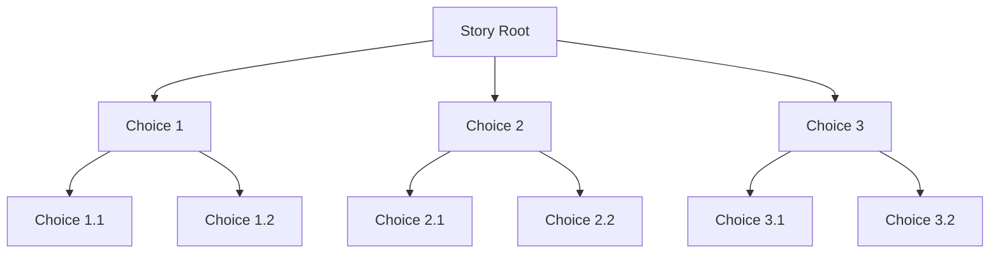
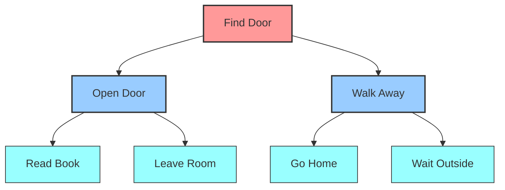

---
authors:
  - ivanleomk
categories:
  - OpenAI
comments: true
date: 2024-12-10
description: Generating complex DAGS with gpt-4o
draft: false
tags:
  - OpenAI
  - DAGs
---

# Consistent Stories with GPT-4o

Language Models struggle to generate consistent graphs that have a large number of nodes. Often times, this is because the graph itself is too large for the model to handle. This causes the model to generate inconsistent graphs that have invalid and disconnected nodes among other issues.

In this article, we'll look at how we can get around this limitation by using a two-phase approach to generate complex DAGs with gpt-4o by looking at a simple example of generating a Choose Your Own Adventure story.

<!-- more -->

## Why do DAGs matter?

DAGs are directed acyclic graphs. A graph is considered a DAG when every connection between nodes is directed ( it goes in a single direction ) and there are no cycles ( it doesn't loop back to a previous node ).


This isn't too far away from a Choose Your Own Adventure story where users have a fixed set of choices at each step and can only move forward in the story. We can see this in action below:



## The Challenge: Scaling Story Generation

When we try to use a language model to generate a story in a single run, this hits several limitations quickly because just with 4 choices at each step, we're already at 20 nodes by the second level. If users can only make 2 choices before our story ends, that doesn't result in a very interesting story to play with.

In other words, we'll overflow the context window of the model quickly. To get around this, we can use a two-phase approach to generate the story where we generate an initial story setting and then generate the choices/other options in parallel.

## Parallel Story Generation

### Generating an Outline

First, we generate an outline of the story using gpt-4o. This is important because it gives us a starting setting, visual style and image description ( for the banner image ). We can then use this down the line to ensure the images we generate are consistent as much as possible.

```python
from pydantic import BaseModel
from typing import List

class GeneratedStory(BaseModel):
    setting: str
    plot_summary: str
    choices: List[str]
    visual_style: str
    image_description: str

async def generate_story(
    client: instructor.AsyncInstructor,
    story_input: RestateStoryInput
):
    resp = await client.chat.completions.create(
        messages=[{
            "role": "user",
            "content": """
            Generate a story with:
            - Setting: {{ story_input.setting}}
            - Title: {{ story_input.title }}

            Rules:
            - Generate 2-4 initial choices that represent actions
            - Choices must move story forward
            - Include brief setting description
            - Generate a visual description for the story

            Required Elements:
            1. Plot Summary: A vivid description of the setting and plot
            2. Initial Choices: 2-4 distinct actions the user can take
            3. Visual Style: Description of art style, color palette
            4. Image Description: One-sentence scene description
            """
        }],
        model="gpt-4o",
        response_model=GeneratedStory,
        context={"story_input": story_input},
    )
    return resp
```

This outputs a story with a setting, plot summary, choices, visual style and image description.

```bash
# Example generated output
{
    "setting": "A neon-lit cyberpunk metropolis in 2150",
    "plot_summary": "In the sprawling city of Neo-Tokyo...",
    "choices": [
        "Investigate the mysterious signal in the abandoned district",
        "Meet your contact at the underground hacker hub",
        "Follow the corporate executive who seems suspicious"
    ],
    "visual_style": "Vibrant neon colors, detailed cyberpunk architecture",
    "image_description": "A towering cyberpunk cityscape at night with neon signs"
}
```

### Parallel Choice Expansion

One of the biggest challenges in generating deep story trees is maintaining consistency as the story branches grow.

Here's how we solve this with parallel generation and state tracking:



The key insight is that each path through the story tree has its own unique state. We do so by having a simple accumulator that allows us to keep track of the previous choices and the story context.

It's also important to note here that the model also has the full flexibility to end the story at any point in time.

Here's how we implement this:

```python
async def rewrite_choice(
    client: instructor.AsyncInstructor,
    choice: str,
    story: GeneratedStory,
    prev_choices: list[dict],  # Accumulator for path state
    max_depth: int,
    sem: asyncio.Semaphore
) -> FinalStoryChoice:
    # Each choice knows its entire path history
    async with sem:
        rewritten_choice = await client.chat.completions.create(
            model="gpt-4o",
            response_model=RewrittenChoice,
            messages=[{
                "role": "user",
                "content": """
                Given this choice: {{ choice }}

                Story context:
                Setting: {{ story.setting }}
                Plot: {{ story.plot_summary }}

                Previous choices made in this path:
                
                - {{ prev.choice_description }}
                  Result: {{ prev.choice_consequences }}
                

                Generate the next story beat and 2-4 new choices.
                The story should end in {{ max_depth - len(prev_choices) }} more turns.
                """
            }],
            context={
                "choice": choice,
                "story": story,
                "prev_choices": prev_choices,
            }
        )

    # For terminal nodes (at max depth)
    if len(prev_choices) == max_depth - 1:
        return FinalStoryChoice(
            choice_description=rewritten_choice.choice_description,
            choice_consequences=rewritten_choice.choice_consequences,
            choices=[]  # Terminal node
        )

    # Recursively expand child choices
    child_choices = await asyncio.gather(*[
        rewrite_choice(
            client=client,
            choice=new_choice,
            story=story,
            prev_choices=prev_choices + [{
                "choice_description": rewritten_choice.choice_description,
                "choice_consequences": rewritten_choice.choice_consequences
            }],
            max_depth=max_depth,
            sem=sem
        )
        for new_choice in rewritten_choice.choices
    ])

    return FinalStoryChoice(
        choice_description=rewritten_choice.choice_description,
        choice_consequences=rewritten_choice.choice_consequences,
        choices=child_choices
    )
```

This approach gives us several key benefits:

1. **Path-Specific Context**: Each node maintains the complete history of choices that led to it, ensuring consistency within each branch
2. **Parallel Generation**: Different branches can be generated simultaneously since they each maintain their own state
3. **Controlled Growth**: The `max_depth` parameter prevents exponential expansion
4. **Rate Limiting**: The semaphore controls concurrent API calls while allowing maximum parallelization

The semaphore isn't just for rate limiting - it ensures we process choices at a manageable pace while maintaining state consistency.

Each path through the story tree becomes a self-contained narrative with access to its complete history, allowing us to generate coherent stories at a much faster speed and verbosity than a single call would be able to generate.

Additionally, we can generate stories that are much broader and deeper than a single call would be able to generate.

## Beyond Story Generation

The success of this approach comes down to three key principles:

1. **State Isolation**: Each node maintains only the context it needs, preventing context window overflow
2. **Parallel Processing**: Generation can happen simultaneously across branches, dramatically reducing total generation time
3. **Structured Validation**: Using Pydantic models ensures each generated component meets your requirements

For example, generating a 20-node story tree sequentially might take 60 seconds (3s per node), but with parallel generation and 10 concurrent requests, it could complete in just 45-50 seconds.

This pattern is particularly valuable when:

- Your generation tasks naturally form a tree or graph structure
- Individual nodes need some but not all context from their ancestors
- You need to generate content that exceeds a single context window
- Speed of generation is important

By combining structured outputs with parallel generation, you can reliably generate complex, interconnected content at scale while maintaining consistency and control.

`instructor` makes it easy to generate complex Data Structures with language models - whether they're open source models with ollama or proprietary models with providers such as OpenAI. Give us a try today!
