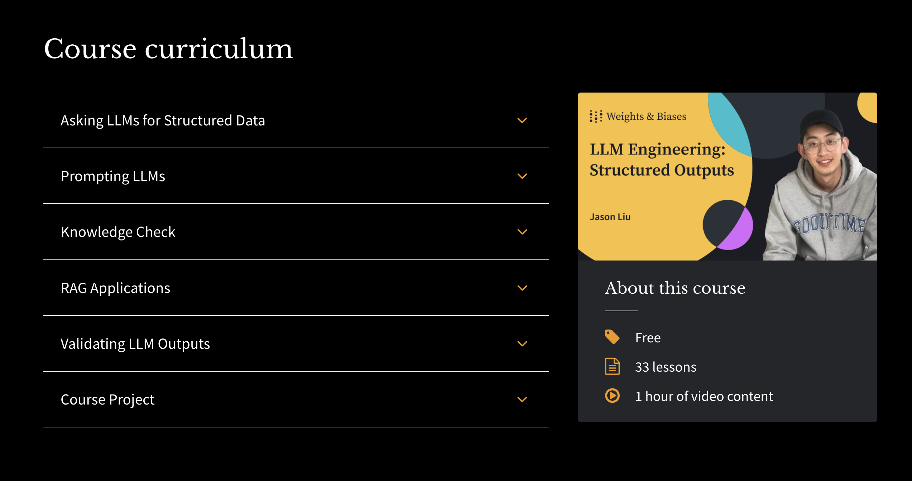

---
authors:
- jxnl
categories:
- OpenAI
comments: true
date: 2024-02-14
description: Discover a free one-hour course on Weights and Biases covering essential
  techniques for language models.
draft: false
slug: weights-and-biases-course
tags:
- Weights and Biases
- AI course
- machine learning
- language models
- free resources
---

# Free course on Weights and Biases

I just released a free course on wits and biases. It goes over the material from [tutorial](../../tutorials/1-introduction.ipynb). Check it out at [wandb.courses](https://www.wandb.courses/courses/steering-language-models) its free and open to everyone and just under an hour long!

> Click the image to access the course