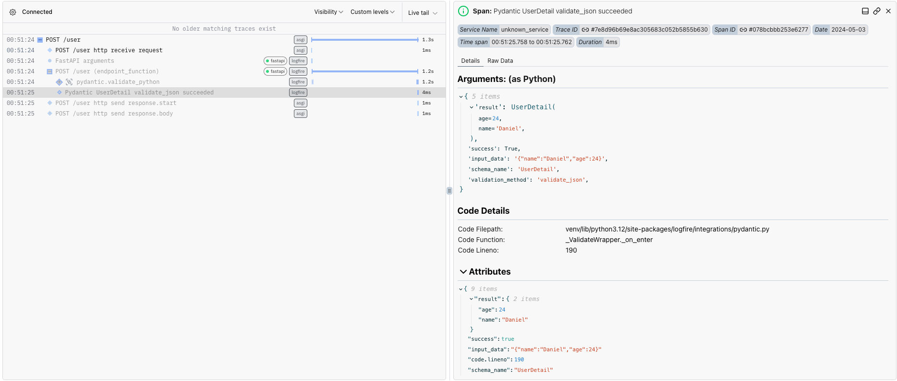
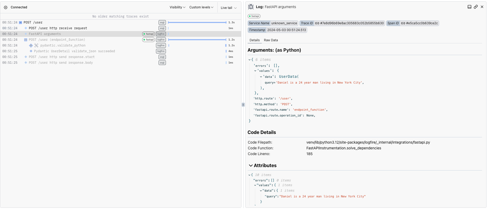
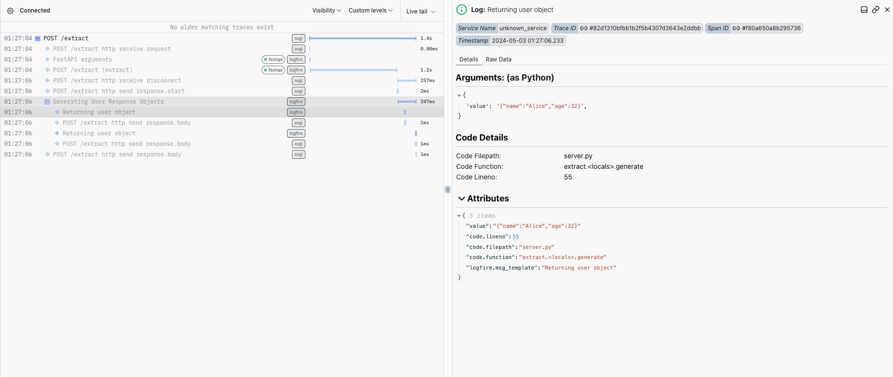

# Why Logfire is a perfect fit for FastAPI + Instructor

Logfire is a new tool that provides key insight into your application with Open Telemtry. Instead of using ad-hoc print statements, Logfire helps to profile every part of your application and is integrated directly into Pydantic and FastAPI, two popular libraries amongst Instructor users.

In short, this is the secret sauce to help you get your application to the finish line and beyond. We'll show you how to easily integrate Logfire into FastAPI, one of the most popular choices amongst users of Instructor using two examples

1. Data Extraction from a single User Query
2. Using `asyncio` to process multiple users in parallel
3. Streaming multiple objects using an `Iterable` so that they're avaliable on demand

<!-- more -->

As usual, all of the code that we refer to here is provided in [examples/logfire-fastapi](https://www.github.com/jxnl/instructor/tree/main/examples/logfire-fastapi) for you to use in your projects.

??? info "Configure Logfire"

    Before starting this tutorial, make sure that you've registered for a [Logfire](https://logfire.pydantic.dev/) account. You'll also need to create a project to track these logs. Lastly, in order to see the request body, you'll also need to configure the default log level to `debug` instead of the default `info` on the dashboard console.

Make sure to create a virtual environment and install all of the packages inside the `requirements.txt` file at [examples/logfire-fastapi](https://www.github.com/jxnl/instructor/tree/main/examples/logfire-fastapi).

## Data Extraction

Let's start by trying to extract some user information given a user query. We can do so with a simple Pydantic model as seen below.

```python
from pydantic import BaseModel
from fastapi import FastAPI
from openai import AsyncOpenAI
import instructor


class UserData(BaseModel):
    query: str


class UserDetail(BaseModel):
    name: str
    age: int


app = FastAPI()
client = instructor.from_openai(AsyncOpenAI())


@app.post("/user", response_model=UserDetail)
async def endpoint_function(data: UserData) -> UserDetail:
    user_detail = await client.chat.completions.create(
        model="gpt-3.5-turbo",
        response_model=UserDetail,
        messages=[
            {"role": "user", "content": f"Extract: `{data.query}`"},
        ],
    )

    return user_detail

```

This simple endpoint takes in a user query and extracts out a user from the statement. Let's see how we can add in Logfire into this endpoint with just a few lines of code

```python hl_lines="5 18-21"
from pydantic import BaseModel
from fastapi import FastAPI
from openai import AsyncOpenAI
import instructor
import logfire #(1)!


class UserData(BaseModel):
    query: str


class UserDetail(BaseModel):
    name: str
    age: int


app = FastAPI()
openai_client = AsyncOpenAI() #(2)!
logfire.configure(pydantic_plugin=logfire.PydanticPlugin(record="all"))
logfire.instrument_openai(openai_client)
logfire.instrument_fastapi(app)
client = instructor.from_openai(openai_client)


@app.post("/user", response_model=UserDetail)
async def endpoint_function(data: UserData) -> UserDetail:
    user_detail = await client.chat.completions.create(
        model="gpt-3.5-turbo",
        response_model=UserDetail,
        messages=[
            {"role": "user", "content": f"Extract: `{data.query}`"},
        ],
    )

    return user_detail
```

1. Import in the logfire package
2. Setup logging using their native integrations with FastAPI and OpenAI

With just those few lines of code, we've got ourselves a working integration with Logfire. When we call our endpoint at `/user` with the following payload, everything is immediately logged in the console.

```bash
curl -X 'POST' \
  'http://localhost:8000/user' \
  -H 'accept: application/json' \
  -H 'Content-Type: application/json' \
  -d '{
  "query": "Daniel is a 24 year man living in New York City"
}'
```

We can see that Pydantic has nicely logged for us the validation result of our openai call here. Just right above, we also have the result of the OpenAI call.



We've also got full visibility into the arguments that were passed into the endpoint when we called it. This is extremely useful for users when they eventually want to reproduce errors in production locally.



## Using Asyncio

Sometimes, we might need to run multiple jobs in parallel. Let's see how we can take advantage of `asyncio` so that we can speed up our operations. We can do so by adding the following bits of code to our previous file.

??? info "What is Asyncio?"

    For a deeper guide into how to work with Asycnio, see our previous guide [here](./learn-async.md).

=== "New Code"

    ```python
    import asyncio

    class MultipleUserData(BaseModel):
        queries: list[str]

    @app.post("/many-users", response_model=list[UserDetail])
    async def extract_many_users(data: MultipleUserData):
        async def extract_user(query: str):
            user_detail = await client.chat.completions.create(
                model="gpt-3.5-turbo",
                response_model=UserDetail,
                messages=[
                    {"role": "user", "content": f"Extract: `{query}`"},
                ],
            )
            logfire.info("/User returning", value=user_detail)
            return user_detail

        coros = [extract_user(query) for query in data.queries]
        return await asyncio.gather(*coros)
    ```

=== "Full File"

    ```python
    from pydantic import BaseModel
    from fastapi import FastAPI
    from openai import AsyncOpenAI
    import instructor
    import logfire
    from collections.abc import Iterable
    from fastapi.responses import StreamingResponse
    import asyncio


    class UserData(BaseModel):
        query: str


    class MultipleUserData(BaseModel):
        queries: list[str]


    class UserDetail(BaseModel):
        name: str
        age: int


    app = FastAPI()
    openai_client = AsyncOpenAI()
    logfire.configure(pydantic_plugin=logfire.PydanticPlugin(record="all"))
    logfire.instrument_openai(openai_client)
    logfire.instrument_fastapi(app)
    client = instructor.from_openai(openai_client)


    @app.post("/user", response_model=UserDetail)
    async def endpoint_function(data: UserData) -> UserDetail:
        user_detail = await client.chat.completions.create(
            model="gpt-3.5-turbo",
            response_model=UserDetail,
            messages=[
                {"role": "user", "content": f"Extract: `{data.query}`"},
            ],
        )
        logfire.info("/User returning", value=user_detail)
        return user_detail


    @app.post("/many-users", response_model=list[UserDetail])
    async def extract_many_users(data: MultipleUserData):
        async def extract_user(query: str):
            user_detail = await client.chat.completions.create(
                model="gpt-3.5-turbo",
                response_model=UserDetail,
                messages=[
                    {"role": "user", "content": f"Extract: `{query}`"},
                ],
            )
            logfire.info("/User returning", value=user_detail)
            return user_detail

        coros = [extract_user(query) for query in data.queries]
        return await asyncio.gather(*coros)
    ```

We can call this endpoint with a simple `curl` call

```bash
curl -X 'POST' \
  'http://localhost:8000/many-users' \
  -H 'accept: application/json' \
  -H 'Content-Type: application/json' \
  -d '{
  "queries": [
    "Daniel is a 34 year man in New York City","Sarah is a 20 year old living in Tokyo", "Jeffrey is 55 and lives down in Leeds"
  ]
}'
```

This is all logged in Logfire as seen below. We have complete visiblity into the eprformance of our entire application and it's pretty clear that a large chunk of the latency is taken up by the OpenAI Call.

We could also potentially separate the logs into more graunular levels by creating a new span for each instance of `extract_user` created.


## Streaming

Now let's see how we can take advantage of Instructor's `Iterable` support to stream multiple instances of an extracted object. This is extremely useful for application where speed is crucial and users want to get the results quickly.

Let's add a new endpoint to our server to see how this might work

=== "New Code"

    ```python
    import asyncio
    from collections.abc import Iterable
    from fastapi.responses import StreamingResponse

    class MultipleUserData(BaseModel):
        queries: list[str]

    @app.post("/extract", response_class=StreamingResponse)
    async def extract(data: UserData):
        supressed_client = AsyncOpenAI()
        logfire.instrument_openai(supressed_client, suppress_other_instrumentation=False) #(1)!
        client = instructor.from_openai(supressed_client)
        users = await client.chat.completions.create(
            model="gpt-3.5-turbo",
            response_model=Iterable[UserDetail],
            stream=True,
            messages=[
                {"role": "user", "content": data.query},
            ],
        )

        async def generate():
            with logfire.span("Generating User Response Objects"):
                async for user in users:
                    resp_json = user.model_dump_json()
                    logfire.info("Returning user object", value=resp_json)

                    yield resp_json

        return StreamingResponse(generate(), media_type="text/event-stream")
    ```

    1. Note that we supress instrumentation to print out the stream objects. This has to do with the parsing of partials in Instructor.

=== "Full File"

    ```python
    from pydantic import BaseModel
    from fastapi import FastAPI
    from openai import AsyncOpenAI
    import instructor
    import logfire
    import asyncio
    from collections.abc import Iterable
    from fastapi.responses import StreamingResponse


    class UserData(BaseModel):
        query: str


    class MultipleUserData(BaseModel):
        queries: list[str]


    class UserDetail(BaseModel):
        name: str
        age: int


    app = FastAPI()
    openai_client = AsyncOpenAI()
    logfire.configure(pydantic_plugin=logfire.PydanticPlugin(record="all"))
    logfire.instrument_fastapi(app)
    logfire.instrument_openai(openai_client)
    client = instructor.from_openai(openai_client)


    @app.post("/user", response_model=UserDetail)
    async def endpoint_function(data: UserData) -> UserDetail:
        user_detail = await client.chat.completions.create(
            model="gpt-3.5-turbo",
            response_model=UserDetail,
            messages=[
                {"role": "user", "content": f"Extract: `{data.query}`"},
            ],
        )
        logfire.info("/User returning", value=user_detail)
        return user_detail


    @app.post("/many-users", response_model=list[UserDetail])
    async def extract_many_users(data: MultipleUserData):
        async def extract_user(query: str):
            user_detail = await client.chat.completions.create(
                model="gpt-3.5-turbo",
                response_model=UserDetail,
                messages=[
                    {"role": "user", "content": f"Extract: `{query}`"},
                ],
            )
            logfire.info("/User returning", value=user_detail)
            return user_detail

        coros = [extract_user(query) for query in data.queries]
        return await asyncio.gather(*coros)


    @app.post("/extract", response_class=StreamingResponse)
    async def extract(data: UserData):
        supressed_client = AsyncOpenAI()
        logfire.instrument_openai(supressed_client, suppress_other_instrumentation=False)
        client = instructor.from_openai(supressed_client)
        users = await client.chat.completions.create(
            model="gpt-3.5-turbo",
            response_model=Iterable[UserDetail],
            stream=True,
            messages=[
                {"role": "user", "content": data.query},
            ],
        )

        async def generate():
            with logfire.span("Generating User Response Objects"):
                async for user in users:
                    resp_json = user.model_dump_json()
                    logfire.info("Returning user object", value=resp_json)

                    yield resp_json

        return StreamingResponse(generate(), media_type="text/event-stream")
    ```

We can call and log out the stream returned using the `requests` library and using the `iter_content` method

```python
import requests

response = requests.post(
    "http://127.0.0.1:3000/extract",
    json={
        "query": "Alice and Bob are best friends. They are currently 32 and 43 respectively. "
    },
    stream=True,
)

for chunk in response.iter_content(chunk_size=1024):
    if chunk:
        print(str(chunk, encoding="utf-8"), end="\n")

```

This gives us the output of

```bash
{"name":"Alice","age":32}
{"name":"Bob","age":43}
```

We can also see the individual stream objects inside the Logfire dashboard as seen below. Note that we've grouped the generated logs inside a span of its own for easy logging.


