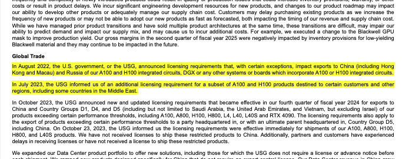

---
authors:
  - ivanleomk
categories:
  - Gemini
  - Document Processing
comments: true
date: 2024-11-15
description: Generate accurate citations and eliminate hallucinations with structured outputs using Gemini.
draft: false
tags:
  - Gemini
  - Document Processing
  - PDF Analysis
  - Pydantic
  - Python
---

# Eliminating Hallucinations with Structured Outputs using Gemini

In this post, we'll explore how to use Google's Gemini model with Instructor to generate accurate citations from PDFs. This approach ensures that answers are grounded in the actual content of the PDF, reducing the risk of hallucinations.

We'll be using the Nvidia 10k report for this example which you can download at this [link](https://d18rn0p25nwr6d.cloudfront.net/CIK-0001045810/78501ce3-7816-4c4d-8688-53dd140df456.pdf).

<!-- more -->

## Introduction

When processing PDFs, it's crucial to ensure that any answers or insights derived are directly linked to the source material. This is especially important in applications where users need to verify the origin of information, such as legal or academic contexts.

We're using PyMuPDF here to handle PDF parsing but you can use any other library that you want. Ultimately when your citations get more complex, you'll want to invest more time into validating the PDF citations against a document.

## Setting Up the Environment

First, let's set up our environment with the necessary libraries:

```bash
pip install "instructor[google-generativeai]" pymupdf
```

Then let's import the necessary libraries:

```python

```

## Defining Our Data Models

We'll use Pydantic to define our data models for citations and answers:

```python
class Citation(BaseModel):
    reason_for_relevance: str
    text: list[str]
    page_number: int


class Answer(BaseModel):
    chain_of_thought: str
    citations: list[Citation]
    answer: str
```

## Initializing the Gemini Client

Next, we'll set up our Gemini client using Instructor:

```python
client = instructor.from_gemini(
    client=genai.GenerativeModel(
        model_name="models/gemini-1.5-pro-latest",
    )
)
```

## Processing the PDF

To analyze a PDF and generate citations, follow these steps:

```python
pdf_path = "./10k.pdf"
doc = pymupdf.open(pdf_path)

# Upload the PDF
file = genai.upload_file(pdf_path)

# Wait for file to finish processing
while file.state != File.State.ACTIVE:
    time.sleep(1)
    file = genai.get_file(file.name)
    print(f"File is still uploading, state: {file.state}")

resp: Answer = client.chat.completions.create(
    messages=[
        {
            "role": "system",
            "content": "You are a helpful assistant that can answer questions about the provided pdf file. You will be given a question and a pdf file. Your job is to answer the question using the information in the pdf file. Provide all citations that are relevant to the question and make sure that the coordinates are accurate.",
        },
        {
            "role": "user",
            "content": [
                "What were all of the export restrictions announced by the USG in 2023? What chips did they affect?",
                file,
            ],
        },
    ],
    response_model=Answer,
)

print(resp)
# Answer(
#     chain_of_thought="The question asks about export restrictions in 2023. Page 25 mentions the USG announcing licensing requirements for A100 and H100 chips in August 2022, and additional licensing requirements for a subset of these products in July 2023.",
#     citations=[
#         Citation(
#             reason_for_relevance="Describes the export licensing requirements and which chips they affect.",
#             text=[
#                 "In August 2022, the U.S. government, or the USG, announced licensing requirements that, with certain exceptions, impact exports to China (including Hong",
#                 "Kong and Macau) and Russia of our A100 and H100 integrated circuits, DGX or any other systems or boards which incorporate A100 or H100 integrated circuits.",
#                 "In July 2023, the USG informed us of an additional licensing requirement for a subset of A100 and H100 products destined to certain customers and other",
#                 "regions, including some countries in the Middle East.",
#             ],
#             page_number=25,
#         )
#     ],
#     answer="In 2023, the U.S. government (USG) announced new licensing requirements for the export of certain chips to China, Russia, and other countries.  These chips included the A100 and H100 integrated circuits, the DGX system, and any other systems or boards incorporating the A100 or H100 chips.",
# )
```

## Highlighting Citations in the PDF

Once you have the citations, you can highlight them in the PDF:

```python
for citation in resp.citations:
    page = doc.load_page(citation.page_number - 1)
    for text in citation.text:
        text_instances = page.search_for(text)
        for instance in text_instances:
            page.add_highlight_annot(instance)

doc.save("./highlighted.pdf")
doc.close()
```

In our case, we can see that the citations are accurate and the answer is correct.



## Why Structured Outputs?

One of the significant advantages of using structured outputs is the ability to handle complex data extraction tasks with ease and reliability. When dealing with raw completion strings or JSON data, developers often face challenges related to parsing complexity and code maintainability.

Over time, this just becomes error-prone, difficult to iterate upon and impossible to maintain. Instead, by leveraging pydantic, you get access to one of the best tools available for validating and parsing data.

1. Ease of Definition: Pydantic allows you to define data models with specific fields effortlessly. This makes it easy to understand and maintain the structure of your data.
2. Robust Validation: With Pydantic, you can build validators to test against various edge cases, ensuring that your data is accurate and reliable. This is particularly useful when working with PDFs and citations, as you can validate the extracted data without worrying about the underlying language model.
3. Separation of Concerns: By using structured outputs, the language model's role is reduced to a single function call. This separation allows you to focus on building reliable and efficient data processing pipelines without being bogged down by the intricacies of the language model.

In summary, structured outputs with Pydantic provide a powerful and ergonomic way to manage complex data extraction tasks. They enhance reliability, simplify code maintenance, and enable developers to build better applications with less effort.

## Conclusion

By using Gemini and Instructor, you can generate accurate citations from PDFs, ensuring that your answers are grounded in the source material. This approach is invaluable for applications requiring high levels of accuracy and traceability.

Give instructor a try today and see how you can build reliable applications. Just run `pip install instructor` or check out our [Getting Started Guide](../../index.md)
