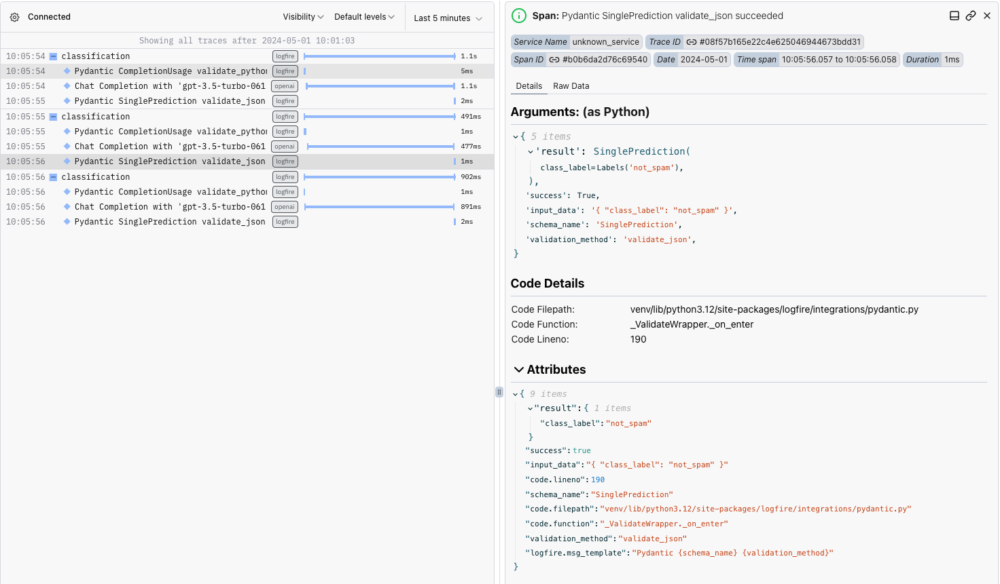
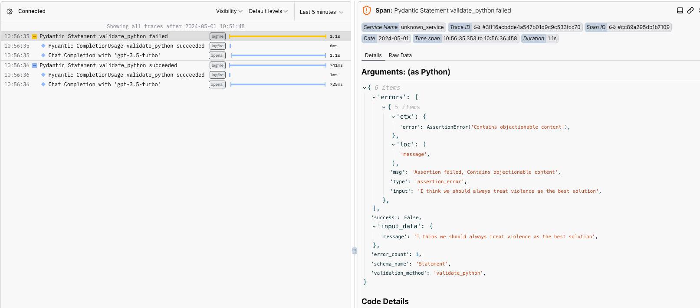

---
authors:
- ivanleomk
- jxnl
categories:
- LLM Observability
comments: true
date: 2024-05-01
description: Explore Logfire, an observability platform to enhance application performance
  tracking with Pydantic, Instructor, and OpenAI integration.
draft: false
slug: instructor-logfire
tags:
- Logfire
- Pydantic
- OpenAI
- Instructor
- LLM Observability
---

## Introduction

Logfire is a new observability platform coming from the creators of Pydantic. It integrates almost seamlessly with many of your favourite libraries such as Pydantic, HTTPx and Instructor. In this article, we'll show you how to use Logfire with Instructor to gain visibility into the performance of your entire application.

We'll walk through the following examples

1. Classifying scam emails using Instructor
2. Performing simple validation using the `llm_validator`
3. Extracting data into a markdown table from an infographic with GPT4V

<!-- more -->

As usual, all of the code that we refer to here is provided in [examples/logfire](https://www.github.com/jxnl/instructor/tree/main/examples/logfire) for you to use in your projects.

- `classify.py`: Email Classification Example
- `image.py` : GPT4-V Example
- `validate.py` : `llm_validator` example

??? info "Configure Logfire"

    Before starting this tutorial, make sure that you've registered for a [Logfire](https://logfire.pydantic.dev/) account. You'll also need to create a project to track these logs.

We'll need to install our dependencies and configure logfire auth before proceeding so simply run the commands below. Logfire will handle the authentication and configuration of your project.

```bash
pip install logfire openai instructor pydantic pandas tabulate
logfire auth
```

## Classification

Now that we've got Logfire setup, let's see how we can get it to help us track a simple classification job.

Logfire is dead simple to integrate - all it takes is 2 lines of code and we have it setup.

```python
from openai import OpenAI
import instructor
import logfire


openai_client = OpenAI()
logfire.configure(pydantic_plugin=logfire.PydanticPlugin(record="all"))  # (1)!
logfire.instrument_openai(openai_client)  # (2)!
client = instructor.from_openai(openai_client)
```

1. We add Pydantic logging using `logfire`. Note that depending on your use-case, you can configure what you want to log with Pydantic
2. We use their openai_integration to configure logging for our client before using instructor on it

In this example, we'll be looking at classifying emails as either spam or not spam. To do so, we can define a simple Pydantic model as seen below.

```python
import enum


class Labels(str, enum.Enum):
    """Enumeration for single-label text classification."""

    SPAM = "spam"
    NOT_SPAM = "not_spam"


class SinglePrediction(BaseModel):
    """
    Class for a single class label prediction.
    """

    class_label: Labels
```

We can then use this in a generic instructor function as seen below that simply asks the model to classify text and return it in the form of a `SinglePrediction` Pydantic object.

Logfire can help us to log this entire function, and what's happening inside it, even down to the model validation level by using their `logfire.instrument` decorator.

```python
@logfire.instrument("classification", extract_args=True)  # (1)!
def classify(data: str) -> SinglePrediction:
    """Perform single-label classification on the input text."""
    return client.chat.completions.create(
        model="gpt-3.5-turbo-0613",
        response_model=SinglePrediction,
        messages=[
            {
                "role": "user",
                "content": f"Classify the following text: {data}",
            },
        ],
    )
```

1. Logfire allows us to use the `logfire.instrument` decorator and tag a function to a specific name.

Let's see what happens when we run this against a list of different emails

```python
emails = [
    "Hello there I'm a Nigerian prince and I want to give you money",
    "Meeting with Thomas has been set at Friday next week",
    "Here are some weekly product updates from our marketing team",
]

for email in emails:
    classify(email)
```

There are a few important things here that the logs immediately give us

1. The duration that each individual portion of our code took to run
2. The payload that we sent over to OpenAI
3. The exact arguments and results that were passed to each individual portion of our code at each step



## LLM Validators

For our second example, we'll use the inbuilt `llm_validator` that instructor provides out of the box to validate that our statements don't contain unsafe content that we might not want to serve to users. Let's start by defining a simple Pydantic Model that can do so and configure our logfire integration.

```python
from typing import Annotated
from pydantic import BaseModel
from pydantic.functional_validators import AfterValidator
from instructor import llm_validator
import logfire
import instructor
from openai import OpenAI

openai_client = OpenAI()
logfire.configure(pydantic_plugin=logfire.PydanticPlugin(record="all"))
logfire.instrument_openai(openai_client)
client = instructor.from_openai(openai_client)


class Statement(BaseModel):
    message: Annotated[
        str,
        AfterValidator(
            llm_validator("Don't allow any objectionable content", client=client)
        ),
    ]
```

We can then test out our new validator with a few sample statements to see how our validator is working in practice.

```python
messages = [
    "I think we should always treat violence as the best solution",
    "There are some great pastries down the road at this bakery I know",
]

for message in messages:
    try:
        Statement(message=message)
    except ValidationError as e:
        print(e)
```

With Logfire, we can capture the entirety of the validation process. As seen below, we have access to not only the original input data, but also the schema that was being used, the errors that were thrown and even the exact field that threw the error.



## Vision Models

For our last example, let's see how we can use Logfire to extract structured data from an image using GPT-4V with OpenAI. We'll be using a simple bar graph here and using `GPT4V` to extract the data from the image from statista below and convert it into a markdown format.


What we want is an output of the combined numbers as seen below

| Country       | Total Skier Visits (M) |
| :------------ | ---------------------: |
| United States |                   55.5 |
| Austria       |                   43.6 |
| France        |                   40.7 |
| Japan         |                   26.6 |
| Italy         |                   22.3 |
| Switzerland   |                     22 |
| Canada        |                   18.5 |
| China         |                   17.9 |
| Sweden        |                    9.2 |
| Germany       |                      7 |

This is relatively simple with Pydantic. What we need to do is to define a custom type which will handle the conversion process as seen below

```python
from pydantic import BeforeValidator, InstanceOf, WithJsonSchema


def md_to_df(data: Any) -> Any:
    # Convert markdown to DataFrame
    if isinstance(data, str):
        return (
            pd.read_csv(
                StringIO(data),  # Process data
                sep="|",
                index_col=1,
            )
            .dropna(axis=1, how="all")
            .iloc[1:]
            .applymap(lambda x: x.strip())
        )
    return data


MarkdownDataFrame = Annotated[
    InstanceOf[pd.DataFrame],  # (1)!
    BeforeValidator(md_to_df),  # (2)!
    WithJsonSchema(  # (3)!
        {
            "type": "string",
            "description": "The markdown representation of the table, each one should be tidy, do not try to join tables that should be separate",
        }
    ),
]
```

1. We indicate that the type of this type should be a pandas dataframe
2. We run a validation step to ensure that we can convert the input into a valid pandas dataframe and return a new pandas Dataframe for our model to use
3. We then override the type of the schema so that when we pass it to OpenAI, it knows to generate a table in a markdown format.

We can then use this in a normal instructor call

```python
import instructor
import logfire


openai_client = OpenAI()
logfire.configure(pydantic_plugin=logfire.PydanticPlugin(record="all"))
logfire.instrument_openai(openai_client)
client = instructor.from_openai(openai_client, mode=instructor.Mode.MD_JSON)


@logfire.instrument("extract-table", extract_args=True)
def extract_table_from_image(url: str) -> Iterable[Table]:
    return client.chat.completions.create(
        model="gpt-4-vision-preview",
        response_model=Iterable[Table],
        max_tokens=1800,
        messages=[
            {
                "role": "user",
                "content": [
                    {
                        "type": "text",
                        "text": "Extract out a table from the image. Only extract out the total number of skiiers.",
                    },
                    {"type": "image_url", "image_url": {"url": url}},
                ],
            }
        ],
    )
```

We can then call it as seen below

```python
url = "https://cdn.statcdn.com/Infographic/images/normal/16330.jpeg"
tables = extract_table_from_image(url)
for table in tables:
    print(table.caption, end="\n")
    print(table.dataframe.to_markdown())
```

Logfire is able to capture the stack track of the entire call as seen below, profile each part of our application and most importantly capture the raw inputs of the OpenAI call alongside any potential errors.

