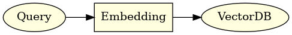
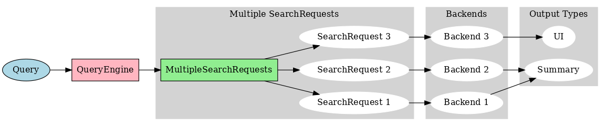
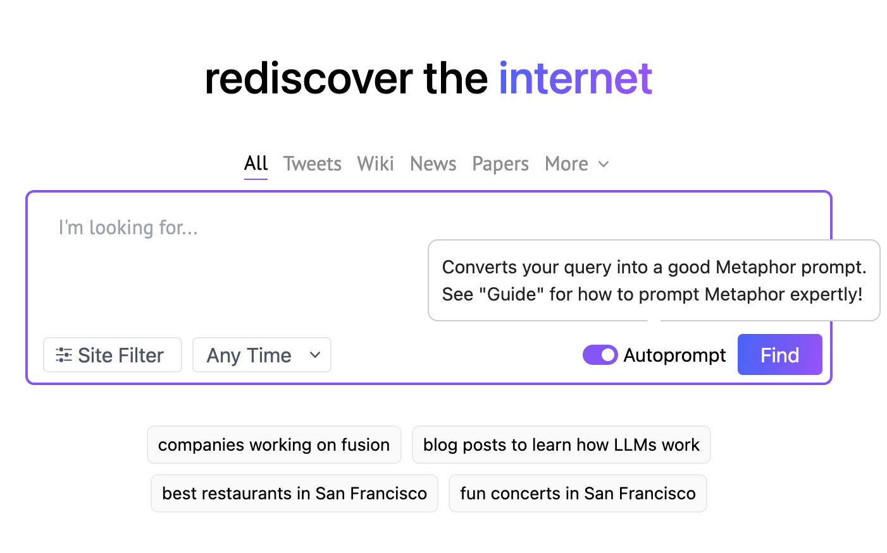

# RAG is more than just embedding search

With the advent of large language models (LLM), retrival augmented generation (RAG) has become a hot topic. However throught the past year of [helping startups](https://jxnl.notion.site/Working-with-me-ec2bb36a5ac048c2a8f6bd888faea6c2?pvs=4) integrate LLMs into their stack I've noticed that the pattern of taking user queries directly into LLMs is effectively demoware.

!!! note "What is RAG?"
    Retrival augmented generation (RAG) is a technique that uses a LLM to generate responses, but uses a search backend to augment the generation, in the past year using text embeddings with a vector databases has been the most popular approach. 

<figure markdown>
  
  <figcaption>Simple RAG that embedded the user query and makes a search.</figcaption>
</figure>

So let's kick things off by examining what I like to call the 'Dumb' RAG Model—a basic setup that's more common than you'd think.

## The 'Dumb' RAG Model

When you ask a question like, "what is the capital of France?" The RAG 'dumb' model embeds the query and searches in some unopinonated search endpoint. Limited to a single method API like `search(query: str) -> List[str]`. This is fine for simple queries, since you'd expect words like 'paris is the capital of france' to be in the top results of say, your wikipedia embeddings.

### Why is this a problem?

- **Query-Document Mismatch**: Assumes query and content are similar in embedding space and only retrival is based on embedding similarity. Only using queries that are semantically similar to the content is a huge limitation.

- **Monolithic Search Backend**: Assumes a single search backend, which is not always the case. You may have multiple search backends, each with their own API, and you want to route the query to vector stores, search clients, sql databases, and more.
  
- **Limitation of text search**: Restricts complex queries to a single string (`{query: str}`), sacrificing expressiveness, in using keywords, filters, and other advanced features.

- **Limited ability to plan**: Assumes that the query is the only input to the search backend, but you may want to use other information to improve the search, like the user's location, or the time of day using the context to rewrite the query.

Now let's dive into how we can make it smarter with query understanding. This is where things get interesting.

## Improving the RAG Model with Query Understanding

!!! note "Shoutouts"
    Much of this work has been inspired by / done in collab with a few of my clients at [new.computer](https://new.computer), [Metaphor Systems](https://metaphor.systems),  and [Naro](https://narohq.com), go check them out!


Ultimately what you want to deploy is a [system that understands](https://en.wikipedia.org/wiki/Query_understanding) how to take the query and rewrite it to improve precision and recall. 

<figure markdown>
  
  <figcaption>Query Understanding system routes to multiple search backends.</figcaption>
</figure>

Not convinced? Let's move from theory to practice with a real-world example. First up, Metaphor Systems.

## Case Study 1: Metaphor Systems

Take [Metaphor Systems](https://metaphor.systems), which turns natural language queries into their custom search-optimized query. If you take a look web ui you'll notice that they have an auto-prompt option, which uses function calls to furthur optimize your query using an language model, and turn it into a fully specified metaphor systems query.

<figure markdown>

<figcaption>Metaphor Systems UI</figcaption>
</figure>

If we peek under the hood, we can see that the query is actually a complex object, with a date range, and a list of domains to search in. Its actually more complex than this but this is a good start.

```python
class DateRange(BaseModel):
    start: datetime.date
    end: datetime.date

class MetaphorQuery(BaseModel):
    rewritten_query: str
    published_daterange: DateRange
    domains_allow_list: List[str]

    async def execute():
        return await metaphor.search(...)
```

Note how we model a rewritten query, range of published dates, and a list of domains to search in. This is a powerful pattern allows the user query to be restructured for better performance without the user having to know the details of how the search backend works. 

```python
import instructor 
import openai

# Enables response_model in the openai client
instructor.patch()

query = openai.ChatCompletion.create(
    model="gpt-4",
    response_model=MetaphorQuery,
    messages=[
        {
            "role": "system", 
            "content": "You're a query understanding system for the Metafor Systems search engine. Here are some tips: ..."
        },
        {
            "role": "user", 
            "content": "What are some recent developments in AI?"
        }
    ],
)
```

**Example Output**

```json
{
    "rewritten_query": "novel developments advancements ai artificial intelligence machine learning",
    "published_daterange": {
        "start": "2023-09-17",
        "end": "2021-06-17"
    },
    "domains_allow_list": ["arxiv.org"]
}
```

This isn't just about adding some date ranges. It's about nuanced, tailored searches, that is deeply integrated with the backend. Metaphor Systems has a whole suite of other filters and options that you can use to build a powerful search query. They can even use some chain of thought prompting to improve how they use some of these advanced features.

```python
class DateRange(BaseModel):
    start: datetime.date
    end: datetime.date
    chain_of_thought: str = Field(
        None,
        description="Think step by step to plan what is the best time range to search in"
    )
```

Now, let's see how this approach can help model an agent like personal assistant.

## Case Study 2: Personal Assistant

Another great example of this multiple dispatch pattern is a personal assistant. You ask, "What do I have today?" You want events, emails, reminders. Multiple backends, one unified summary of result. Here you can't even assume that text is going to be embedded in the search backend. You need to model the search backend and the query.

```python
class ClientSource(enum.Enum):
    GMAIL = "gmail"
    CALENDAR = "calendar"

class SearchClient(BaseModel):
    query: str
    keywords: List[str]
    email: str
    source: ClientSource
    start_date: datetime.date
    end_date: datetime.date

    async def execute(self) -> str:
        if self.source == ClientSource.GMAIL:
            ...
        elif self.source == ClientSource.CALENDAR:
            ...

class Retrival(BaseModel):
    queries: List[SearchClient]

    async def execute(self) -> str:
        return await asyncio.gather(*[query.execute() for query in self.queries])
```

Now we can call this with a simple query like "What do I have today?" and it will try to async dispatch to the correct backend. Its will important to prompt the language model well, but we'll leave that for another day.

```python
import instructor 
import openai

# Enables response_model in the openai client
instructor.patch()

retrival = openai.ChatCompletion.create(
    model="gpt-4",
    response_model=Retrival,
    messages=[
        {"role": "system", "content": "You are Jason's personal assistant."},
        {"role": "user", "content": "What do I have today?"}
    ],
)
```

**Example Output**

```json
{
    "queries": [
        {
            "query": None,
            "keywords": None,
            "email": "jason@example.com",
            "source": "gmail",
            "start_date": "2023-09-17",
            "end_date": None
        },
        {
            "query": None,
            "keywords": ["meeting", "call", "zoom"]]],
            "email": "jason@example.com",
            "source": "calendar",
            "start_date": "2023-09-17",
            "end_date": None

        }
    ]
}
```

Notice that we have a list of queries, that route to different search backends, email and calendar. We can even dispatch them async to be as performance as possible. Not only do we dispatch to different backends (that we have no control over), but you are likely going to render them to the user differently as well, perhaps you want to summarize the emails in text, but you want to render the calendar events as a list that they can scroll across on a mobile app.

!!! Note "Can I used framework X?"
    I get this question many times, but its just code, within these dispatchs you can do whatever you want. You can use `input()` to ask the user for more information, make a post request, call a Langchain agent or LLamaindex query engine to get more information, the sky is the limit.

Both of these examples show case how both search providors and consumers can use `instructor` to model their systems. This is a powerful pattern that allows you to build a system that can be used by anyone, and can be used to build a LLM layer, from scratch, in front of any arbitrary backend.

## Conclusion

This isnt about fancy embedding tricks, its just plain old information retrival and query understanding. The beauty of instructor is that it simplifies modeling the complex and lets you define the output of the language model, the prompts, and the payload we send to the backend in a single place.

## What's Next?

`instructor` isn't just about data extraction, It's building a model, and presenting it to the LLM. Structured output is just the beginning. The untapped goldmine is skilled use of tools and apis. 

I believe collaboration between experts users and AI engineers is what will bring out that expertise. If you're interested, visit [useinstructor.com](https://useinstructor.com) and take our survey. Together, let's create tools that are as brilliant as the minds that use them.