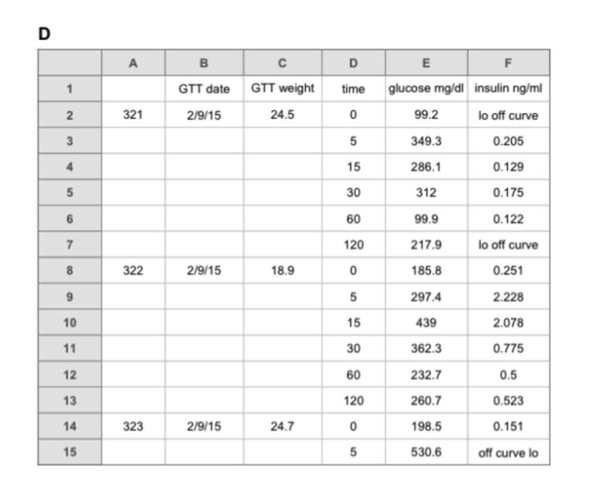

# Using Structured Outputs to convert messy tables into tidy data

## Why is this a problem?

Messy data exports are a common problem. Whether it's multiple headers in the table, implicit relationships that make analysis a pain or even just merged cells, using `instructor` with structured outputs makes it easy to convert messy tables into tidy data, even if all you have is just an image of the table as we'll see below.

Let's look at the following table as an example. It makes analysis unnecessarily difficult because it hides data relationships through empty cells and implicit repetition. If we were using it for data analysis, cleaning it manually would be a huge nightmare.

<!-- more -->



For example, the subject ID (321) and GTT date only appear in the first row, with blank cells below implying these values apply to the following rows. This format breaks most pandas operations - you can't simply group by subject ID or merge with other datasets without complex preprocessing to fill in these missing values.

Instead, we have time series measurements spread across multiple rows, mixed data types in the insulin column (numbers and "lo off curve"), and repeated subject information hidden through empty cells. This means even simple operations like calculating mean glucose levels by time point or plotting glucose curves require data reshaping and careful handling of missing/special values.

## Using Structured Outputs

### Defining a custom type

Using tools like instructor to automatically convert untidy data into tidy format can save hours of preprocessing and reduce errors in your analysis pipeline.

Let's start by first defining a custom type that can parse the markdown table into a pandas dataframe.

```python
from io import StringIO
from typing import Annotated, Any
from pydantic import BeforeValidator, PlainSerializer, InstanceOf, WithJsonSchema
import pandas as pd


def md_to_df(data: Any) -> Any:
    # Convert markdown to DataFrame
    if isinstance(data, str):
        return (
            pd.read_csv(
                StringIO(data),  # Process data
                sep="|",
                index_col=1,
            )
            .dropna(axis=1, how="all")
            .iloc[1:]
            .applymap(lambda x: x.strip())
        )
    return data


MarkdownDataFrame = Annotated[
    InstanceOf[pd.DataFrame],
    BeforeValidator(md_to_df),
    PlainSerializer(lambda df: df.to_markdown()),
    WithJsonSchema(
        {
            "type": "string",
            "description": "The markdown representation of the table, each one should be tidy, do not try to join tables that should be separate",
        }
    ),
]
```

### Extracting the table

Then with this new custom data type, it becomes easy to just pass the image to the LLM and get a tidy dataframe in response.

```python
import instructor
from pydantic import BaseModel
from openai import OpenAI


class Table(BaseModel):
    caption: str
    dataframe: MarkdownDataFrame  # Custom type for handling tables


class TidyTables(BaseModel):
    tables: list[Table]


# Patch the OpenAI client with instructor
client = instructor.from_openai(OpenAI())


def extract_table(image_path: str) -> TidyTables:
    return client.chat.completions.create(
        model="gpt-4o-mini",
        messages=[
            {
                "role": "user",
                "content": [
                    "Convert this untidy table to tidy format",
                    instructor.Image.from_path(image_path),
                ],
            }
        ],
        response_model=TidyTables,
    )


extracted_tables = extract_table("./untidy_table.png")
```

This then returns the following output for us as a single pandas dataframe which we can easily plot and do any sort of data analysis on.

| ID  | GTT date | GTT weight | time | glucose mg/dl | insulin ng/ml | Comment      |
| --- | -------- | ---------- | ---- | ------------- | ------------- | ------------ |
| 321 | 2/9/15   | 24.5       | 0    | 99.2          |               | lo off curve |
| 321 | 2/9/15   | 24.5       | 5    | 349.3         | 0.205         |              |
| 321 | 2/9/15   | 24.5       | 15   | 286.1         | 0.129         |              |
| 321 | 2/9/15   | 24.5       | 30   | 312           | 0.175         |              |
| 321 | 2/9/15   | 24.5       | 60   | 99.9          | 0.122         |              |
| 321 | 2/9/15   | 24.5       | 120  | 217.9         |               | lo off curve |
| 322 | 2/9/15   | 18.9       | 0    | 185.8         | 0.251         |              |
| 322 | 2/9/15   | 18.9       | 5    | 297.4         | 2.228         |              |
| 322 | 2/9/15   | 18.9       | 15   | 439           | 2.078         |              |
| 322 | 2/9/15   | 18.9       | 30   | 362.3         | 0.775         |              |
| 322 | 2/9/15   | 18.9       | 60   | 232.7         | 0.5           |              |
| 322 | 2/9/15   | 18.9       | 120  | 260.7         | 0.523         |              |
| 323 | 2/9/15   | 24.7       | 0    | 198.5         | 0.151         |              |
| 323 | 2/9/15   | 24.7       | 5    | 530.6         |               | off curve lo |

More importantly, we can also extract multiple tables from a single image. This would be useful in helping to segment and identify different sections of a messy report. With tidy data, we get the benefits of

1. Each variable being its own column
2. Each observation being its own row
3. Each value having its own cell
4. Seamlessly working with pandas/numpy operations
5. Visualization libraries "just working"

## Conclusion

We can actually go one step further and make this even tidier by converting things like weight, glucose and insulin into a specific column called metric which would allow us to add arbitrary metrics to the table without having to change the schema or our plotting code. This is a huge productivity boost when doing complex data analysis.

No more wrestling with complex data cleaning pipelines. Let the model handle the heavy lifting while you focus on analysis. With instructor, getting to that step just became a whole lot easier.

Give `instructor` a try today and see how you can build reliable applications. Just run `pip install instructor` or check out our [Getting Started Guide](../../index.md)
