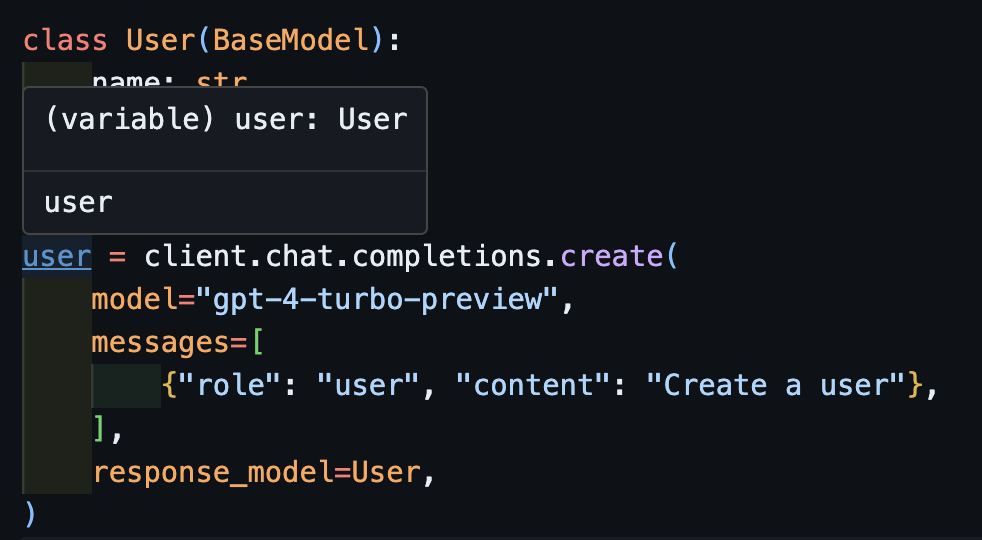
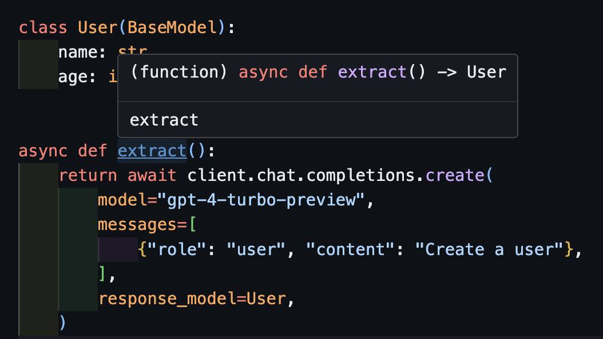
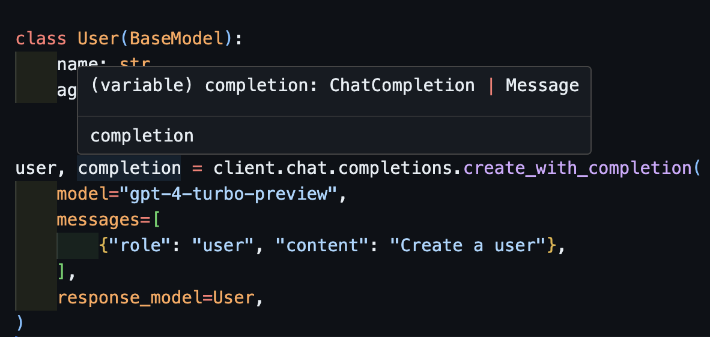
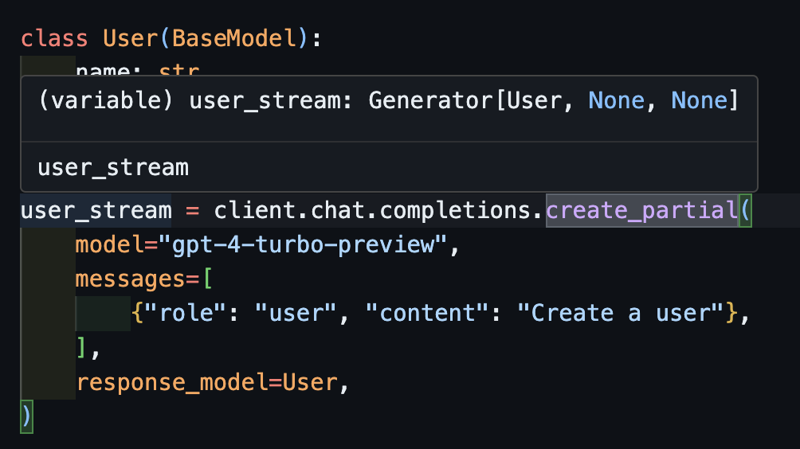
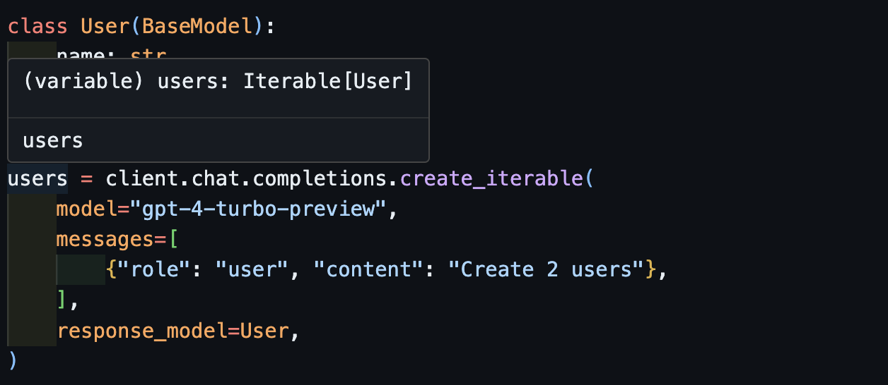

---
authors:
- jxnl
categories:
- OpenAI
comments: true
date: 2024-04-01
description: 'Introducing instructor 1.0.0: Simplified API for OpenAI with improved
  typing support, validation, and streamlined usability.'
draft: false
slug: announce-instructor-v1
tags:
- API Development
- OpenAI
- Data Validation
- Python
- LLM Techniques
---

# Announcing instructor=1.0.0

Over the past 10 months, we've build up instructor with the [principle](../../why.md) of 'easy to try, and easy to delete'. We accomplished this by patching the openai client with the `instructor` package and adding new arguments like `response_model`, `max_retries`, and `validation_context`. As a result I truly believe isntructor is the [best way](./best_framework.md) to get structured data out of llm apis.

But as a result, we've been a bit stuck on getting typing to work well while giving you more control at development time. I'm excited to launch version 1.0.0 which cleans up the api w.r.t. typing without compromising the ease of use.

<!-- more -->

## Growth

Over the past 10 months, we've enjoyed healthy growth with over 4000+ github stars and 100+ contributors, and more importantly, 120k monthly downloads, and 20k unique monthly visitors with 500k requests per month to our docs


## Whats new?

Honestly, nothing much, the simplest change you'll need to make is to replace `instructor.patch` with `instructor.from_openai`.

```python
import openai
import instructor

client = instructor.from_openai(openai.OpenAI())
```

Except now, any default arguments you want to place into the `create` call will be passed to the client. via kwargs.

IF you know you want to pass in temperature, seed, or model, you can do so.

```python
import openai
import instructor

client = instructor.from_openai(
    openai.OpenAI(), model="gpt-4-turbo-preview", temperature=0.2
)
```

Now, whenever you call `client.chat.completions.create` the `model` and `temperature` will be passed to the openai client!

## No new Standards

When I first started working on this project, my goal was to ensure that we weren't introducing any new standards. Instead, our focus was on maintaining compatibility with existing ones. By creating our own client, we can seamlessly proxy OpenAI's `chat.completions.create` and Anthropic's `messages.create` methods. This approach allows us to provide a smooth upgrade path for your client, enabling support for all the latest models and features as they become available. Additionally, this strategy safeguards us against potential downstream changes.

```python
import openai
import anthropic
import litellm
import instructor
from typing import TypeVar

T = TypeVar("T")

# These are all ways to create a client
client = instructor.from_openai(openai.OpenAI())
client = instructor.from_anthropic(anthropic.Anthropic())
client = instructor.from_litellm(litellm.completion)

# all of these will route to the same underlying create function
# allow you to add instructor to try it out, while easily removing it
client.create(model="gpt-4", response_model=type[T]) -> T
client.chat.completions.create(model="gpt-4", response_model=type[T]) -> T
client.messages.create(model="gpt-4", response_model=type[T]) -> T
```

## Type are inferred correctly

This was the dream of instructor but due to the patching of openai, it wasnt possible for me to get typing to work well. Now, with the new client, we can get typing to work well! We've also added a few `create_*` methods to make it easier to create iterables and partials, and to access the original completion.

### Calling `create`

```python
import openai
import instructor
from pydantic import BaseModel


class User(BaseModel):
    name: str
    age: int


client = instructor.from_openai(openai.OpenAI())

user = client.chat.completions.create(
    model="gpt-4-turbo-preview",
    messages=[
        {"role": "user", "content": "Create a user"},
    ],
    response_model=User,
)
```

Now if you use a ID, you can see the type is correctly inferred.



### Handling async: `await create`

This will also work correctly with asynchronous clients.

```python
import openai
import instructor
from pydantic import BaseModel


client = instructor.from_openai(openai.AsyncOpenAI())


class User(BaseModel):
    name: str
    age: int


async def extract():
    return await client.chat.completions.create(
        model="gpt-4-turbo-preview",
        messages=[
            {"role": "user", "content": "Create a user"},
        ],
        response_model=User,
    )
```

Notice that simply because we return the `create` method, the `extract()` function will return the correct user type.



### Returning the original completion: `create_with_completion`

You can also return the original completion object

```python
import openai
import instructor
from pydantic import BaseModel


client = instructor.from_openai(openai.OpenAI())


class User(BaseModel):
    name: str
    age: int


user, completion = client.chat.completions.create_with_completion(
    model="gpt-4-turbo-preview",
    messages=[
        {"role": "user", "content": "Create a user"},
    ],
    response_model=User,
)
```




### Streaming Partial Objects: `create_partial`

In order to handle streams, we still support `Iterable[T]` and `Partial[T]` but to simply the type inference, we've added `create_iterable` and `create_partial` methods as well!

```python
import openai
import instructor
from pydantic import BaseModel


client = instructor.from_openai(openai.OpenAI())


class User(BaseModel):
    name: str
    age: int


user_stream = client.chat.completions.create_partial(
    model="gpt-4-turbo-preview",
    messages=[
        {"role": "user", "content": "Create a user"},
    ],
    response_model=User,
)

for user in user_stream:
    print(user)
    #> name=None age=None
    #> name=None age=None
    #> name=None age=None
    #> name=None age=25
    #> name=None age=25
    #> name=None age=25
    #> name='' age=25
    #> name='John' age=25
    #> name='John Smith' age=25
    #> name='John Smith' age=25
    # name=None age=None
    # name='' age=None
    # name='John' age=None
    # name='John Doe' age=None
    # name='John Doe' age=30
```

Notice now that the type inferred is `Generator[User, None]`



### Streaming Iterables: `create_iterable`

We get an iterable of objects when we want to extract multiple objects.

```python
import openai
import instructor
from pydantic import BaseModel


client = instructor.from_openai(openai.OpenAI())


class User(BaseModel):
    name: str
    age: int


users = client.chat.completions.create_iterable(
    model="gpt-4-turbo-preview",
    messages=[
        {"role": "user", "content": "Create 2 users"},
    ],
    response_model=User,
)

for user in users:
    print(user)
    #> name='John Doe' age=30
    #> name='Jane Smith' age=28
    # User(name='John Doe', age=30)
    # User(name='Jane Smith', age=25)
```



## Validation and Error Handling

Instructor has always supported validation and error handling. But now, we've added a new `validation_context` argument to the `create` call. This allows you to pass in a `ValidationContext` object which will be passed to the `response_model`. This allows you to add custom validation logic to the `response_model`.

If you want to learn more check out the docs on [retrying](../../concepts/retrying.md) and [reasking](../../concepts/reask_validation.md)

## Support in multiple languages

While each flavor is different the core philosophy is the same. Keeping it as close as possible to the common api allows us to support all the same features in all the same languages by hooking into each libraries's popular validation libraries.

Check out:

- [JavaScript](https://github.com/instructor-ai/instructor-js)
- [Elixir](https://github.com/instructor-ai/instructor-elixir)
- [PHP](https://github.com/cognesy/instructor-php)

If you're interested in contributing, check out the [contributing guide](../../contributing.md), and you want to create instructor in your language, let [me](https://twitter.com/jxnlco) know and I can help with promotion and connecting all the docs!
