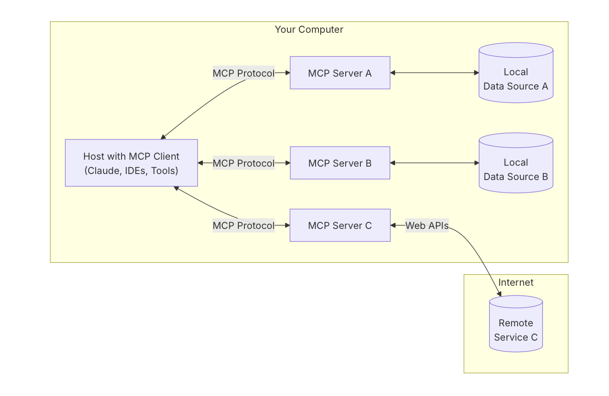
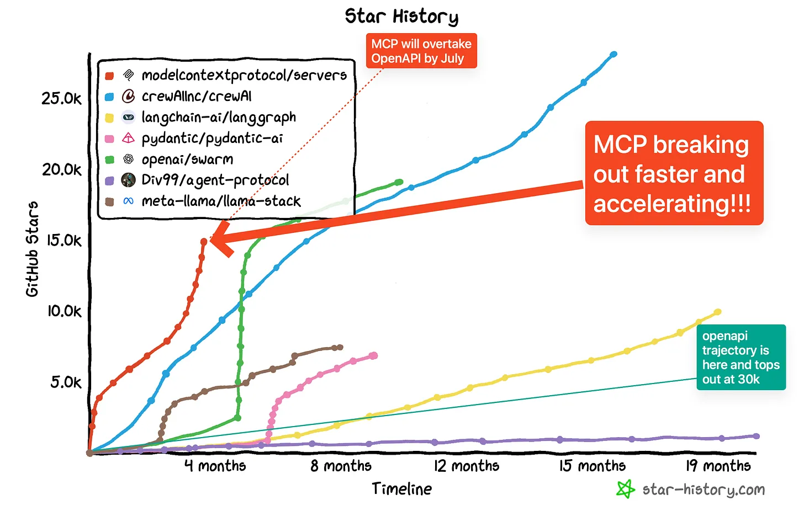
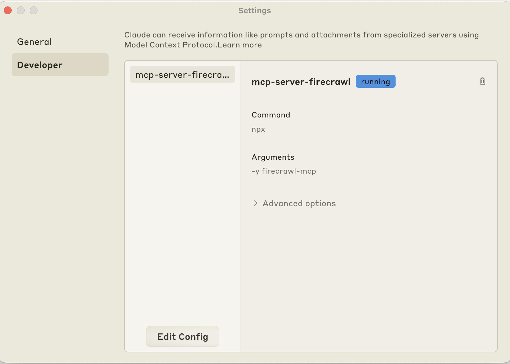
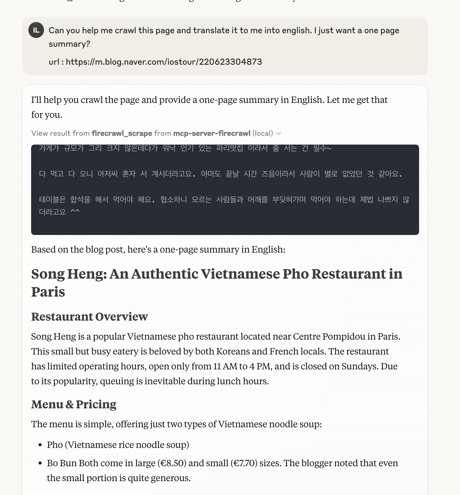
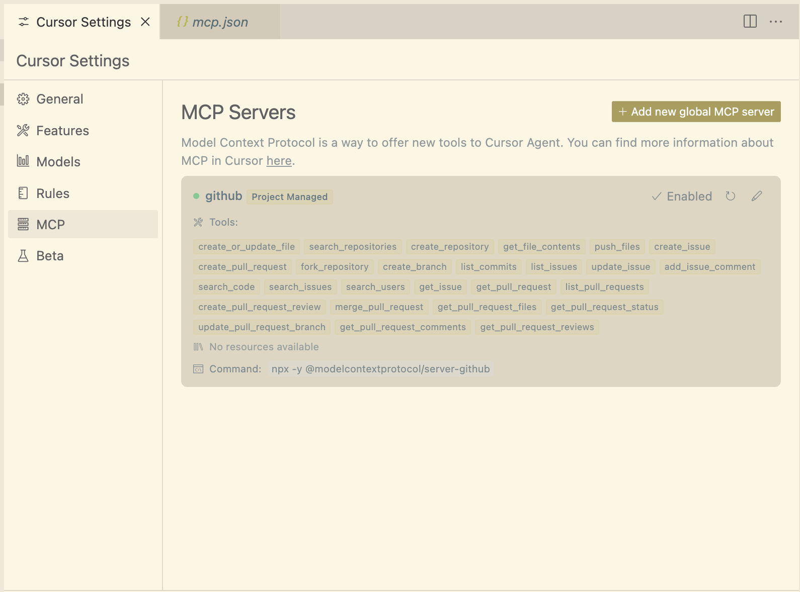
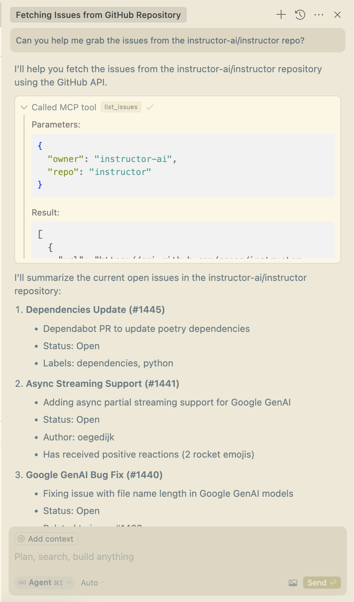
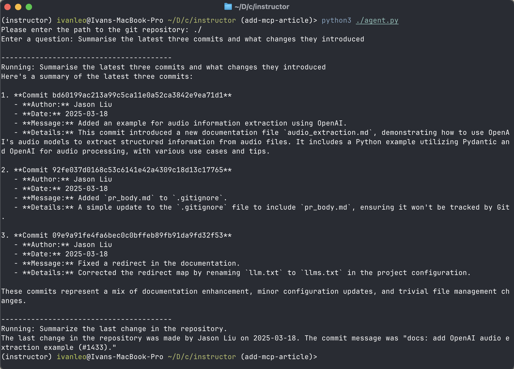

# What is MCP

With [OpenAI joining Anthropic in supporting the Model Context Protocol (MCP)](https://x.com/sama/status/1904957253456941061), we're witnessing a unified standard for language models to interact with external systems. This creates exciting opportunities for multi-LLM architectures where specialized AI applications work in parallel-discovering tools, handing off tasks, and accessing powerful capabilities through standardized interfaces.

<!-- more -->

## What is MCP and Why Does It Matter?

MCP is an open protocol developed by Anthropic that standardizes how AI models and applications interact with external tools, data sources, and systems. It solves the fragmentation problem where teams build custom implementations for AI integrations by providing a standardized interface layer.

There are three components to the MCP ecosystem:

1. **Hosts**: Programs like Claude Desktop, IDEs, or AI tools that want to access data via MCP clients
2. **Clients**: Protocol clients that maintain 1:1 connections with servers
3. **Servers**: Lightweight programs that each expose specific capabilities through the standardized Model Context Protocol



When interacting with Clients, Hosts have access to two primary options: **Tools**, which are model-controlled functions that retrieve or modify data, and **Resources**, which are application-controlled data like files.

There's also the intention of eventually allowing servers themselves to have the capability of requesting completions/approval from Clients and Hosts while executing their tasks [through the `sampling` endpoint](https://modelcontextprotocol.io/docs/concepts/sampling).

### The Integration Problem MCP Solves

Before MCP, integrating AI applications with external tools and systems created what's known as an "M×N problem". If you have M different AI applications (Claude, ChatGPT, custom agents, etc.) and N different tools/systems (GitHub, Slack, Asana, databases, etc.), you would need to build M×N different integrations. This leads to duplicated effort across teams, inconsistent implementations, and a maintenance burden that grows quadratically.

MCP transforms this into an "M+N problem". Tool creators build N MCP servers (one for each system), while application developers build M MCP clients (one for each AI application). The total integration work becomes M+N instead of M×N.

This means a team can build a GitHub MCP server once, and it will work with any MCP-compatible client. Similarly, once you've built an MCP-compatible agent, it can immediately work with all existing MCP servers without additional integration work.

## Market Signals: Growing Adoption

The adoption curve for MCP has been remarkably steep since its introduction. [Almost 3000 community-built MCP servers have emerged in just a few months](https://smithery.ai), showing the strong developer interest in this standard. Major platforms like Zed, Cursor, Perser, and Windsurf have become MCP Hosts, integrating the protocol into their core offerings. Companies including Cloudflare have released official [MCP support with features such as OAuth](https://blog.cloudflare.com/remote-model-context-protocol-servers-mcp/) for developers to start building great applications.



With both OpenAI and Anthropic supporting MCP, we now have a unified approach spanning the two most advanced AI model providers. This critical mass suggests MCP is positioned to become the dominant standard for AI tool integration.

## MCP vs OpenAPI Specification

While MCP and OpenAPI are both standards for API interfaces, they have different purposes and approaches. Here's a simplified comparison of the key differences:

| Aspect            | OpenAPI Specification                                | Model Context Protocol (MCP)                                                      |
| ----------------- | ---------------------------------------------------- | --------------------------------------------------------------------------------- |
| **Primary Users** | Human developers interacting with web APIs           | AI models and agents discovering and using tools                                  |
| **Architecture**  | Centralized specification in a single JSON/YAML file | Distributed system with hosts, clients, and servers allowing dynamic discovery    |
| **Use Cases**     | Documenting RESTful services for human consumption   | Enabling AI models to autonomously find and use tools with semantic understanding |

These two standards serve complementary purposes in the modern tech ecosystem. While OpenAPI excels at documenting traditional web services for human developers, MCP is purpose-built for the emerging AI agent landscape, providing rich semantic context that makes tools discoverable and usable by language models.

Most organizations will likely maintain both: OpenAPI specifications for their developer-facing services and MCP interfaces for AI-enabled applications, creating bridges between these worlds as needed.

## Getting Started With MCP Development

The learning curve for MCP is relatively gentle-many servers are less than 200 lines of code and can be built in under an hour. Here are several ways you can start using MCP in existing environments:

### Claude Desktop

Claude Desktop now supports MCP integrations, allowing Claude to access up-to-date information through tools. You can add these MCPs by going to Claude's Settings and editing the configuration.



For example, you can install Firecrawl's MCP using the following configuration:

```json
{
  "mcpServers": {
    "mcp-server-firecrawl": {
      "command": "npx",
      "args": ["-y", "firecrawl-mcp"],
      "env": {
        "FIRECRAWL_API_KEY": "YOUR_API_KEY_HERE"
      }
    }
  }
}
```

This allows Claude to crawl websites and get up-to-date information:



### Cursor Integration

Cursor provides support for MCPs through a simple configuration file. Create a `.cursor/mcp.json` file with your desired MCP servers:

```json
{
  "mcpServers": {
    "github": {
      "command": "npx",
      "args": ["-y", "@modelcontextprotocol/server-github"],
      "env": {
        "GITHUB_PERSONAL_ACCESS_TOKEN": "<Personal Access Token Goes Here>"
      }
    }
  }
}
```

Enable the MCP option in Cursor Settings:



Then use Cursor's Agent with your MCP servers:



In the example above, I've provided a simple github MCP to ask some questions about the issues from the `instructor-ai` repository. But you can really do a lot more, for instance, you can provide a `puppeteer` MCP to allow your model to interact with a web browser for instance to see how your frontend code looks like when it gets rendered to fix it automatically.

### OpenAI Agent SDK

OpenAI's Agent SDK now supports MCP servers using the `MCPServer` class, allowing you to connect agents to local tools and resources:

```python
import asyncio
import shutil

from agents import Agent, Runner, trace
from agents.mcp import MCPServer, MCPServerStdio

async def run(mcp_server: MCPServer, directory_path: str):
    agent = Agent(
        name="Assistant",
        instructions=f"Answer questions about the git repository at {directory_path}, use that for repo_path",
        mcp_servers=[mcp_server],
    )

    question = input("Enter a question: ")

    print("\n" + "-" * 40)
    print(f"Running: {question}")
    result = await Runner.run(starting_agent=agent, input=question)
    print(result.final_output)

    message = "Summarize the last change in the repository."
    print("\n" + "-" * 40)
    print(f"Running: {message}")
    result = await Runner.run(starting_agent=agent, input=message)
    print(result.final_output)

async def main():
    # Ask the user for the directory path
    directory_path = input("Please enter the path to the git repository: ")

    async with MCPServerStdio(
        cache_tools_list=True,  # Cache the tools list, for demonstration
        params={"command": "uvx", "args": ["mcp-server-git"]},
    ) as server:
        with trace(workflow_name="MCP Git Example"):
            await run(server, directory_path)

if __name__ == "__main__":
    if not shutil.which("uvx"):
        raise RuntimeError(
            "uvx is not installed. Please install it with `pip install uvx`."
        )

    asyncio.run(main())
```

This allows the agent to understand local git repositories:



## Conclusion

For developers and organizations, the question isn't if you should build for MCPs but when. As the ecosystem matures, early adopters will have a significant advantage in integrating AI capabilities into their existing systems and workflows. This is especially true with the upcoming MCP registry by Anthropic, incoming support for remote MCP server hosting, and OAuth integrations that will help build richer and more personal integrations.

The standardization provided by MCP will likely drive the next wave of AI integration, making it possible to build complex, multi-agent systems that leverage the best capabilities from different providers through a unified interface.
