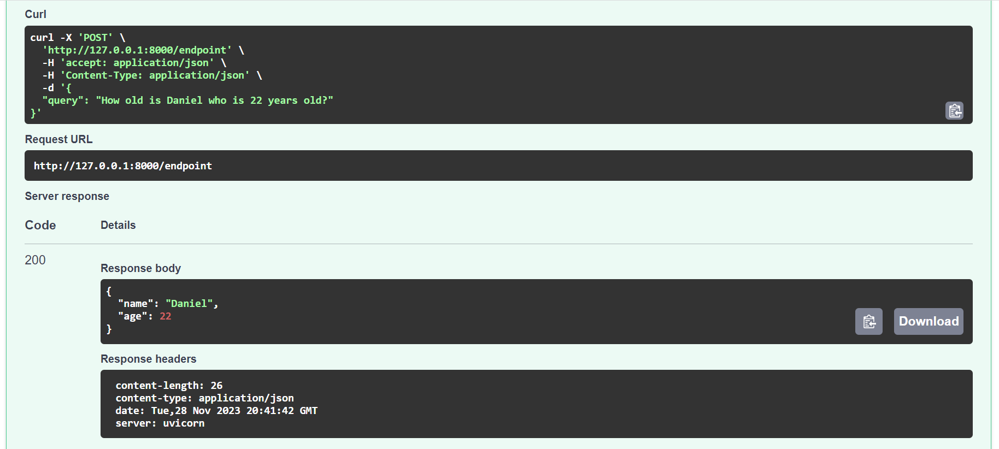

# Integrating Pydantic Models with FastAPI

[FastAPI](https://fastapi.tiangolo.com/) is an enjoyable tool for building web applications in Python. It is well known for its integration with `Pydantic` models, which makes defining and validating data structures straightforward and efficient. In this guide, we explore how simple functions that return `Pydantic` models can seamlessly integrate with `FastAPI`.

## Why Choose FastAPI and Pydantic?

- FastAPI is a modern, high-performance web framework for building APIs with Python.
- Supports OpenAPI and JSON Schema for automatic documentation and validation.
- Supports AsyncIO for asynchronous programming leveraging the AsyncOpenAI() client

## Code Example: Starting a FastAPI App with a POST Request

The following code snippet demonstrates how to start a `FastAPI` app with a POST endpoint. This endpoint accepts and returns data defined by a `Pydantic` model.

```python
import instructor

from fastapi import FastAPI
from pydantic import BaseModel
from openai import AsyncOpenAI

# Enables response_model
client = instructor.from_openai(AsyncOpenAI())
app = FastAPI()


class UserData(BaseModel):
    # This can be the model for the input data
    query: str


class UserDetail(BaseModel):
    name: str
    age: int


@app.post("/endpoint", response_model=UserDetail)
async def endpoint_function(data: UserData) -> UserDetail:
    user_detail = await client.chat.completions.create(
        model="gpt-3.5-turbo",
        response_model=UserDetail,
        messages=[
            {"role": "user", "content": f"Extract: `{data.query}`"},
        ],
    )
    return user_detail
```

## Streaming Responses with FastAPI

`FastAPI` supports streaming responses, which is useful for returning large amounts of data. This feature is particularly useful when working with large language models (LLMs) that generate a large amount of data.

```python hl_lines="6-7"
from fastapi import FastAPI
from fastapi.responses import StreamingResponse
from typing import Iterable
from pydantic import BaseModel

app = FastAPI()


class UserData(BaseModel):
    query: str


class UserDetail(BaseModel):
    name: str
    age: int


# Route to handle SSE events and return users
@app.post("/extract", response_class=StreamingResponse)
async def extract(data: UserData):
    users = await client.chat.completions.create(
        model="gpt-3.5-turbo",
        response_model=Iterable[UserDetail],
        stream=True,
        messages=[
            {"role": "user", "content": data.query},
        ],
    )

    async def generate():
        async for user in users:
            resp_json = user.model_dump_json()
            yield f"data: {resp_json}"
        yield "data: [DONE]"

    return StreamingResponse(generate(), media_type="text/event-stream")
```

## Automatic Documentation with FastAPI

FastAPI leverages the OpenAPI specification to automatically generate a dynamic and interactive documentation page, commonly referred to as the `/docs` page. This feature is incredibly useful for developers, as it offers a live environment to test API endpoints directly through the browser.

To explore the capabilities of your API, follow these steps:

1. Run the API using the Uvicorn command: `uvicorn main:app --reload`.
2. Open your web browser and navigate to `http://127.0.0.1:8000/docs`.
3. You will find an interactive UI where you can send different requests to your API and see the responses in real-time.


