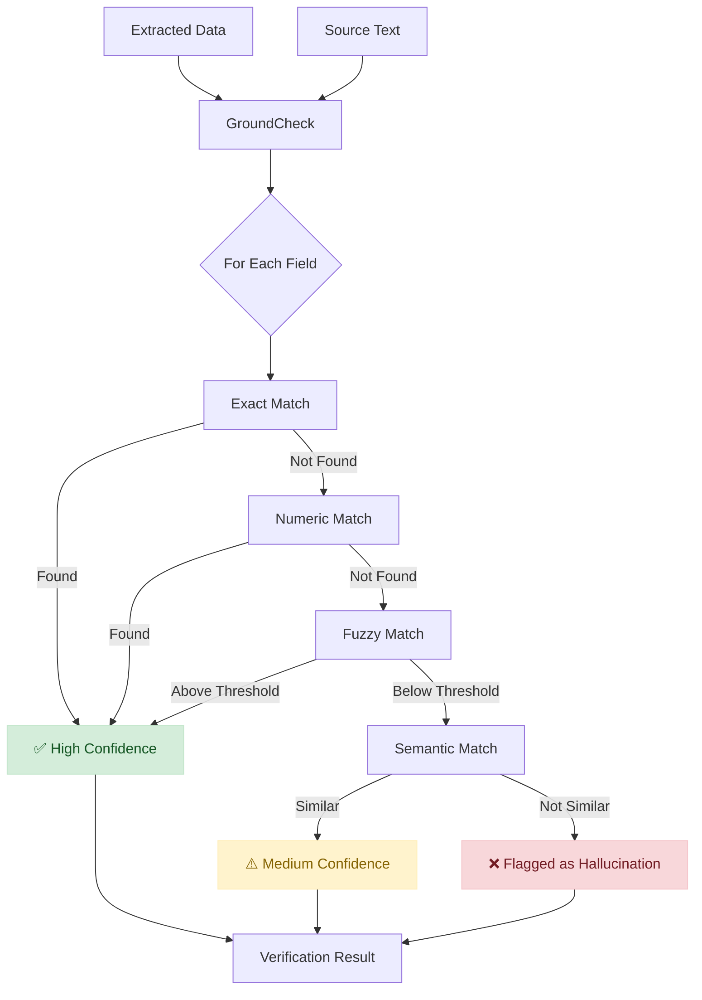

# GroundCheck: Source Grounding Verification

GroundCheck verifies that data extracted by LLMs actually exists in the source text, helping detect hallucinations before they cause problems.

## The Problem

LLMs can return perfectly valid JSON that passes Pydantic validation but contains **hallucinated values** - information that looks correct but doesn't exist in the source:
```python
# Source text
source = "Invoice #12345 from Acme Corp. Total: $500"

# LLM extraction (looks valid!)
extracted = {
    "invoice_number": "12345",      # ✅ In source
    "vendor": "Acme Corp",          # ✅ In source
    "total": 500,                   # ✅ In source
    "currency": "USD",              # ❌ HALLUCINATED!
    "payment_terms": "Net 30",      # ❌ HALLUCINATED!
}
```

Pydantic validates the **structure**. GroundCheck validates the **truth**.

## Quick Start
```python
from instructor import verify_extraction

result = verify_extraction(
    source_text="Invoice #12345 from Acme Corp. Total: $500",
    extracted_data={
        "invoice_number": "12345",
        "vendor": "Acme Corp",
        "currency": "USD"
    }
)

print(result.flagged_fields)      # ["currency"]
print(result.overall_confidence)  # 0.66
print(result.is_reliable)         # False
```

## How It Works


## Verification Methods

| Method | Description | Confidence | Use Case |
|--------|-------------|------------|----------|
| **Exact Match** | Value found verbatim (case-insensitive) | 0.99 | Names, IDs, codes |
| **Numeric Match** | Number found with format variations | 0.90-0.95 | Prices, quantities |
| **Fuzzy Match** | Similar text found (using rapidfuzz) | 0.70-0.95 | Names with typos, OCR errors |
| **Semantic Match** | Meaning is similar (embeddings) | 0.70-0.90 | Paraphrased content |
| **Not Found** | No match found | 0.0-0.30 | Likely hallucination |

## Core API

### verify_extraction()

The simplest way to verify extracted data:
```python
from instructor import verify_extraction, HallucinationError

# Basic verification
result = verify_extraction(
    source_text="Customer: John Smith, Order: #A123",
    extracted_data={"customer": "John Smith", "order_id": "A123"}
)

# Check results
if result.is_reliable:
    print("All fields verified!")
else:
    print(f"Suspicious fields: {result.flagged_fields}")

# Raise exception on hallucination
try:
    result = verify_extraction(
        source_text="Product: iPhone",
        extracted_data={"product": "iPhone", "color": "blue"},
        raise_on_hallucination=True
    )
except HallucinationError as e:
    print(f"Hallucinated: {e.flagged_fields}")
```

### GroundCheck Class

For more control, use the `GroundCheck` class directly:
```python
from instructor import GroundCheck

gc = GroundCheck(
    confidence_threshold=0.7,  # Minimum confidence to pass
    fuzzy_threshold=0.85,      # Minimum fuzzy match ratio
    enable_semantic=False,     # Enable embedding-based matching
)

result = gc.verify(
    source_text="Invoice from Acme Corp dated 2024-01-15",
    extracted_data={
        "vendor": "Acme Corp",
        "date": "2024-01-15"
    },
    field_thresholds={
        "vendor": 0.9,  # Stricter threshold for vendor
        "date": 0.6,    # More lenient for dates
    }
)
```

### VerificationResult

The result object contains detailed information:
```python
result = verify_extraction(source_text, extracted_data)

# Overall metrics
result.overall_confidence    # Average confidence (0.0-1.0)
result.is_reliable          # True if no flagged fields
result.flagged_fields       # List of suspicious field names
result.verification_time_ms # Time taken in milliseconds

# Field-level details
for field_name, field_result in result.field_results.items():
    print(f"{field_name}:")
    print(f"  Confidence: {field_result.confidence}")
    print(f"  Method: {field_result.method.value}")
    print(f"  Flagged: {field_result.flagged}")
    print(f"  Evidence: {field_result.evidence}")

# Serialize to dict
data = result.to_dict()
```

## Integration Patterns

### With Instructor Extraction
```python
import instructor
from pydantic import BaseModel
from instructor import verify_extraction, HallucinationError

client = instructor.from_provider("openai/gpt-4o-mini")

class Invoice(BaseModel):
    invoice_number: str
    vendor: str
    total: float
    currency: str

# Extract data
source_text = """
INVOICE #INV-2024-001
From: Acme Corporation
Amount Due: $1,234.56
"""

invoice = client.chat.completions.create(
    response_model=Invoice,
    messages=[{"role": "user", "content": f"Extract invoice data:\n\n{source_text}"}]
)

# Verify extraction
verification = verify_extraction(source_text, invoice.model_dump())

if not verification.is_reliable:
    print(f"⚠️ Potential hallucinations: {verification.flagged_fields}")
    # Handle accordingly - retry, flag for review, etc.
```

### Using the Decorator
```python
from instructor import with_grounding

source_document = "Contract for John Smith, signed 2024-01-15, value $50,000"

@with_grounding(source_text=source_document, threshold=0.8, raise_on_failure=True)
def extract_contract():
    return client.chat.completions.create(
        response_model=Contract,
        messages=[{"role": "user", "content": f"Extract:\n{source_document}"}]
    )

try:
    contract = extract_contract()  # Automatically verified
except HallucinationError as e:
    print(f"Extraction contained hallucinations: {e.flagged_fields}")
```

### Using GroundedExtractor
```python
from instructor import GroundedExtractor

client = instructor.from_provider("openai/gpt-4o-mini")
grounded = GroundedExtractor(client, default_threshold=0.8)

result = grounded.extract(
    response_model=Invoice,
    source_text="Invoice #123 from Acme, Total: $500",
    messages=[{"role": "user", "content": "Extract invoice data"}],
    raise_on_hallucination=True
)

# Access verification results
print(result._grounding_verification.flagged_fields)
```

### Pydantic Validator Integration
```python
from pydantic import BaseModel, BeforeValidator
from typing import Annotated
from instructor import grounding_validator

source = "Patient: John Doe, DOB: 1990-05-15"

class MedicalRecord(BaseModel):
    # These fields will be validated against source
    patient_name: Annotated[str, BeforeValidator(grounding_validator(source, threshold=0.9))]
    date_of_birth: Annotated[str, BeforeValidator(grounding_validator(source, threshold=0.8))]
```

## Real-World Examples

### Medical Records (High Stakes)
```python
clinical_note = """
Patient: John Smith, DOB 03/15/1980
Chief Complaint: Chest pain for 2 days
Vital Signs: BP 145/92, HR 88
Assessment: Suspected angina
Plan: Start aspirin 81mg daily
"""

extracted = {
    "patient_name": "John Smith",
    "blood_pressure": "145/92",
    "diagnosis": "angina",
    "medication": "aspirin 81mg",
    "allergies": "Penicillin",      # ❌ HALLUCINATED - dangerous!
    "surgery_scheduled": True,       # ❌ HALLUCINATED - dangerous!
}

result = verify_extraction(clinical_note, extracted, threshold=0.9)

for field in result.flagged_fields:
    print(f"🚨 VERIFY MANUALLY: {field}")
```

### Financial Documents
```python
gc = GroundCheck(confidence_threshold=0.85)

quarterly_report = """
Q3 2024 Results
Revenue: $12.5M (up 15% YoY)
Net Income: $2.1M
Operating Margin: 16.8%
"""

extracted = {
    "quarter": "Q3 2024",
    "revenue": 12500000,
    "net_income": 2100000,
    "operating_margin": 16.8,
    "guidance": "Strong Q4 expected",  # ❌ HALLUCINATED
}

result = gc.verify(quarterly_report, extracted)
```

### Legal Contracts
```python
contract_text = """
SERVICE AGREEMENT
Between: ABC Corp ("Client") and XYZ Services ("Provider")
Effective Date: January 1, 2024
Term: 24 months
Monthly Fee: $5,000
"""

result = verify_extraction(
    contract_text,
    {
        "client": "ABC Corp",
        "provider": "XYZ Services",
        "term_months": 24,
        "monthly_fee": 5000,
        "auto_renewal": True,  # ❌ Not in contract!
    },
    raise_on_hallucination=True
)
```

## Configuration Options

| Parameter | Default | Description |
|-----------|---------|-------------|
| `confidence_threshold` | 0.7 | Minimum confidence to consider grounded |
| `fuzzy_threshold` | 0.85 | Minimum ratio for fuzzy matching |
| `enable_semantic` | False | Use sentence embeddings (requires sentence-transformers) |
| `embedding_model` | "all-MiniLM-L6-v2" | Model for semantic matching |

## Dependencies

- **Required**: None (exact matching always works)
- **Optional**: 
  - `rapidfuzz` - For fuzzy string matching
  - `sentence-transformers` - For semantic matching
```bash
# Install optional dependencies
pip install rapidfuzz
pip install sentence-transformers  # Adds ~500MB
```

## Best Practices

1. **Set appropriate thresholds** - Higher for critical fields (medical, financial), lower for descriptive text

2. **Use field-specific thresholds** - Not all fields need the same scrutiny

3. **Handle flagged fields gracefully** - Don't just reject; consider:
   - Human review queue
   - Retry with more specific prompt
   - Partial acceptance with warnings

4. **Log verification results** - Track hallucination patterns to improve prompts

5. **Consider domain-specific matching** - Medical codes, legal citations may need custom logic

## API Reference

::: instructor.groundcheck.GroundCheck
::: instructor.groundcheck.verify_extraction
::: instructor.groundcheck.grounding_validator
::: instructor.groundcheck.with_grounding
::: instructor.groundcheck.GroundedExtractor
::: instructor.groundcheck.VerificationResult
::: instructor.groundcheck.FieldResult
::: instructor.groundcheck.VerificationMethod
::: instructor.core.exceptions.HallucinationError
