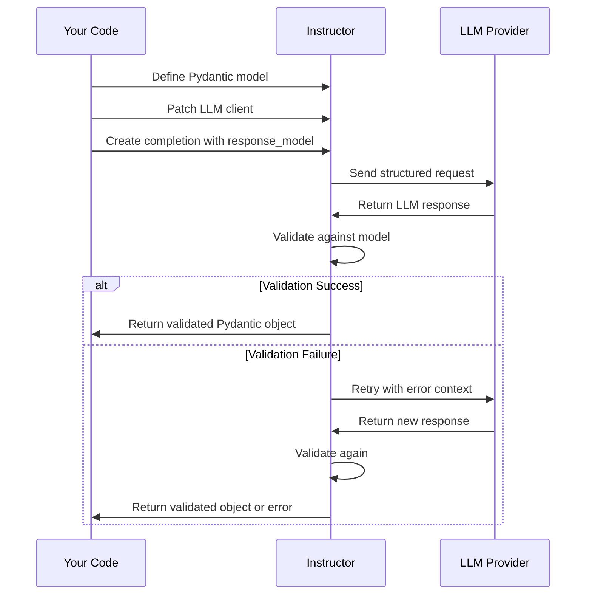

# Instructor Concepts

This section explains the core concepts and features of the Instructor library, organized by category to help you find what you need.

## Core Concepts

These are the fundamental concepts you need to understand to use Instructor effectively:

- [Models](./models.md) - Using Pydantic models to define output structures
- [Patching](./patching.md) - How Instructor patches LLM clients
- [Types](./types.md) - Working with different data types in your models
- [Validation](./validation.md) - Validating LLM outputs against your models
- [Prompting](./prompting.md) - Creating effective prompts for structured output extraction
- [Multimodal](./multimodal.md) - Working with Audio Files, Images and PDFs

## Data Handling and Structures

These concepts relate to defining and working with different data structures:

- [Fields](./fields.md) - Working with Pydantic fields and attributes
- [Lists and Arrays](./lists.md) - Handling lists and arrays in your models
- [TypedDicts](./typeddicts.md) - Using TypedDict for flexible typing
- [Union Types](./unions.md) - Working with union types
- [Enums](./enums.md) - Using enumerated types in your models
- [Missing](./maybe.md) - Handling missing or optional values
- [Alias](./alias.md) - Create field aliases

## Streaming Features

These features help you work with streaming responses:

- [Stream Partial](./partial.md) - Stream partially completed responses
- [Stream Iterable](./iterable.md) - Stream collections of completed objects
- [Raw Response](./raw_response.md) - Access the raw LLM response

## Error Handling and Validation

These features help you ensure data quality:

- [Retrying](./retrying.md) - Configure automatic retry behavior
- [Validators](./reask_validation.md) - Define custom validation logic
- [Hooks](./hooks.md) - Add callbacks for monitoring and debugging

## Performance Optimization

These features help you optimize performance:

- [Caching](./caching.md) - Cache responses to improve performance
- [Prompt Caching](./prompt_caching.md) - Cache prompts to reduce token usage
- [Usage Tokens](./usage.md) - Track token usage
- [Parallel Tools](./parallel.md) - Run multiple tools in parallel

## Integration Features

These features help you integrate with other technologies:

- [FastAPI](./fastapi.md) - Integrate with FastAPI
- [Type Adapter](./typeadapter.md) - Use TypeAdapter with Instructor
- [Templating](./templating.md) - Use templates for dynamic prompts
- [Distillation](./distillation.md) - Optimize models for production

## Philosophy

- [Philosophy](./philosophy.md) - The guiding principles behind Instructor

## How These Concepts Work Together

Instructor is built around a few key ideas that work together:

1. **Define Structure with Pydantic**: Use Pydantic models to define exactly what data you want.
2. **Enhance LLM Clients**: Patch provider clients to add structured output capabilities.
3. **Validate and Retry**: Automatically validate responses and retry if necessary.
4. **Process Streams**: Handle streaming responses for real-time updates.

### Typical Workflow

## What to Read Next

- If you're new to Instructor, start with [Models](./models.md) and [Patching](./patching.md)
- If you're having validation issues, check out [Validators](./reask_validation.md) and [Retrying](./retrying.md)
- For streaming applications, read [Stream Partial](./partial.md) and [Stream Iterable](./iterable.md)
- To optimize your application, look at [Caching](./caching.md) and [Usage Tokens](./usage.md)

For practical examples of these concepts, visit the [Cookbook](../examples/index.md) section.

!!! see-also "See Also"
    - [Getting Started Guide](../getting-started.md) - Begin your journey with Instructor
    - [Examples](../examples/index.md) - Practical implementations of these concepts
    - [Integrations](../integrations/index.md) - Connect with different LLM providers
