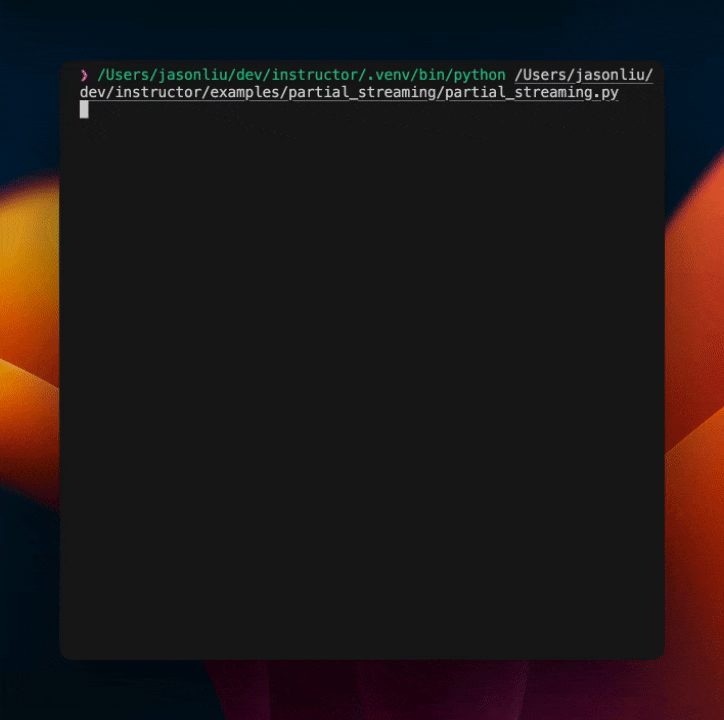

# Streaming Partial Responses

Field level streaming provides incremental snapshots of the current state of the response model that are immediately useable. This approach is particularly relevant in contexts like rendering UI components.

Instructor supports this pattern by making use of `Partial[T]`. This lets us dynamically create a new class that treats all of the original model's fields as `Optional`.

## Understanding Partial Responses

Consider what happens whene we define a response model:

```python
class User(BaseModel):
    name: str
    age: int
```

If we streamed json out from OpenAI, we would only be able to parse when the object is completed returned!

```
{"name": "Jo
{"name": "John", "ag
{"name": "John", "age":
{"name": "John", "age": 25} # Completed
```

When specifying a `Partial[T]` and setting `stream=True`, the response from `instructor` becomes a `Generator[T]`. As the generator yields results, you can iterate over these incremental updates. The last value yielded by the generator represents the completed extraction!

```
{"name": "Jo                 => User(name="Jo", age=None)
{"name": "John", "ag         => User(name="John", age=None)
{"name": "John", "age:       => User(name="John", age=None)
{"name": "John", "age": 25}  => User(name="John", age=25)
```

!!! warning "Limited Validator Support"

    Fewer validators are supported by `Partial` response models as streamed fields will natural raise validation error, as we do not have a strong opinoin on how to handle them.

Let's look at an example of streaming an extraction of conference information, that would be used to stream in an react component.

```python
import instructor

from instructor import Partial
from openai import OpenAI
from pydantic import BaseModel
from typing import List
from rich.console import Console

client = instructor.patch(OpenAI())

text_block = """
In our recent online meeting, participants from various backgrounds joined to discuss the upcoming tech conference. The names and contact details of the participants were as follows:

- Name: John Doe, Email: johndoe@email.com, Twitter: @TechGuru44
- Name: Jane Smith, Email: janesmith@email.com, Twitter: @DigitalDiva88
- Name: Alex Johnson, Email: alexj@email.com, Twitter: @CodeMaster2023

During the meeting, we agreed on several key points. The conference will be held on March 15th, 2024, at the Grand Tech Arena located at 4521 Innovation Drive. Dr. Emily Johnson, a renowned AI researcher, will be our keynote speaker.

The budget for the event is set at $50,000, covering venue costs, speaker fees, and promotional activities. Each participant is expected to contribute an article to the conference blog by February 20th.

A follow-up meetingis scheduled for January 25th at 3 PM GMT to finalize the agenda and confirm the list of speakers.
"""


class User(BaseModel):
    name: str
    email: str
    twitter: str


class MeetingInfo(BaseModel):
    users: List[User]
    date: str
    location: str
    budget: int
    deadline: str


extraction_stream = client.chat.completions.create(
    model="gpt-4",
    response_model=Partial[MeetingInfo],
    messages=[
        {
            "role": "user",
            "content": f"Get the information about the meeting and the users {text_block}",
        },
    ],
    stream=True,
)


console = Console()

for extraction in extraction_stream:
    obj = extraction.model_dump()
    console.clear()
    console.print(obj)

```

This will output the following:



## Asynchronous Streaming

I also just want to call out in this example that `instructor` also supports asynchronous streaming. This is useful when you want to stream a response model and process the results as they come in, but you'll need to use the `async for` syntax to iterate over the results.

```python
model = await client.chat.completions.create(
    model="gpt-4",
    response_model=Partial[UserExtract],
    max_retries=2,
    stream=True,
    messages=[
        {"role": "user", "content": "Jason Liu is 12 years old"},
    ],
)
async for m in model:
    assert isinstance(m, UserExtract)
```
