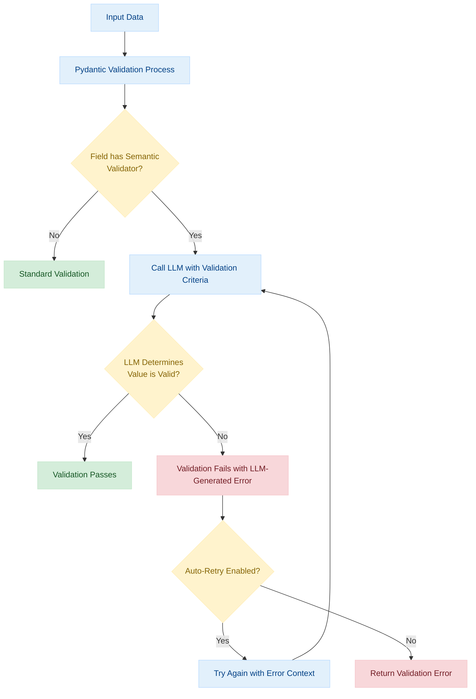

# Semantic Validation with LLMs

This guide covers semantic validation in Instructor - using LLMs themselves to validate content against complex, subjective, or contextual criteria that would be difficult to implement with traditional rule-based approaches.

## Overview

Semantic validation leverages the language understanding capabilities of LLMs to validate inputs against natural language criteria. While traditional validation uses explicit rules and patterns, semantic validation can understand nuance, context, and subjective qualities in data.

### When to Use Semantic Validation

Semantic validation is particularly useful for:

- **Complex criteria** that are difficult to express with rules
- **Subjective qualities** like tone, style, or appropriateness
- **Contextual validation** that requires understanding relationships between fields
- **Policy enforcement** that involves nuanced understanding of guidelines
- **Content moderation** for detecting harmful or inappropriate content

### How It Works

In Instructor, semantic validation is implemented through the `llm_validator` function, which creates a validator that uses an LLM to check if values conform to specified requirements:

```python
import instructor
from typing import Annotated
from pydantic import BaseModel, BeforeValidator
from instructor import llm_validator

# Initialize client
client = instructor.from_provider("openai/gpt-4o-mini")

class UserComment(BaseModel):
    username: str
    comment: Annotated[
        str,
        BeforeValidator(
            llm_validator(
                "Comment must be constructive, respectful, and not contain hate speech or profanity",
                client=client
            )
        )
    ]
```

The `llm_validator` function takes:

1. A natural language description of the validation criteria
2. An Instructor client instance to perform the validation
3. Optional parameters for configuration

During validation, the LLM evaluates whether the input matches the specified criteria and either passes the value or raises a validation error with a detailed explanation.

## Validation Flow

The following diagram illustrates how semantic validation works in Instructor:



## Basic Usage

Here's a complete example of semantic validation in action:

```python
# Standard library imports
from typing import Annotated

# Third-party imports
from pydantic import BaseModel, BeforeValidator
import instructor
from instructor import llm_validator

# Initialize client
client = instructor.from_provider("openai/gpt-4o-mini")

class ProductDescription(BaseModel):
    """Model for validating product descriptions."""
    
    name: str
    description: Annotated[
        str,
        BeforeValidator(
            llm_validator(
                """The description must be:
                1. Professional and factual
                2. Free of excessive hyperbole or unsubstantiated claims
                3. Between 50-200 words in length
                4. Written in third person (no "you" or "your")
                5. Free of spelling and grammar errors""",
                client=client
            )
        )
    ]

# Example usage with Jinja templating
try:
    product = client.chat.completions.create(
        response_model=ProductDescription,
        messages=[
            {
                "role": "system",
                "content": "Generate a product description based on the product name."
            },
            {
                "role": "user", 
                "content": "Create a description for: {{ product_name }}"
            }
        ],
        context={"product_name": "UltraClean 9000 Washing Machine"}
    )
    print(product.model_dump_json(indent=2))
except Exception as e:
    print(f"Validation error: {e}")
```

## Advanced Validation Patterns

### Content Policy Enforcement

This example validates user-generated content against community guidelines:

```python
import instructor
from typing import Annotated
from pydantic import BaseModel, BeforeValidator
from instructor import llm_validator

client = instructor.from_provider("openai/gpt-4o-mini")

class Comment(BaseModel):
    """Model representing a user comment with content moderation."""
    
    user_id: str
    content: Annotated[
        str,
        BeforeValidator(
            llm_validator(
                """Content must comply with community guidelines:
                - No hate speech, harassment, or discrimination
                - No explicit sexual or violent content
                - No promotion of illegal activities
                - No sharing of personal information
                - No spamming or excessive self-promotion""", 
                client=client
            )
        )
    ]
```

### Topic Relevance Validation

This validator ensures that responses stay on topic:

```python
import instructor
from typing import Annotated
from pydantic import BaseModel, BeforeValidator
from instructor import llm_validator

client = instructor.from_provider("openai/gpt-4o-mini")

class ForumPost(BaseModel):
    topic: str
    post: Annotated[
        str,
        BeforeValidator(
            llm_validator(
                "The post must be directly relevant to the specified topic and not drift to unrelated subjects",
                client=client
            )
        )
    ]
    
    # Using Jinja templating for validation against dynamic values
    @classmethod
    def validate_post(cls, topic_name: str, post_content: str) -> "ForumPost":
        return client.chat.completions.create(
            response_model=cls,
            messages=[
                {
                    "role": "system",
                    "content": """Validate that the forum post content stays relevant to the topic.
                    If it's not relevant, explain why in detail."""
                },
                {
                    "role": "user",
                    "content": """
                    Topic: {{ topic }}
                    
                    Post content:
                    {{ post }}
                    
                    Is this post relevant to the topic?
                    """
                }
            ],
            context={
                "topic": topic_name,
                "post": post_content
            }
        )
```

### Fact-Checking Validator

This complex validator assesses factual accuracy:

```python
import instructor
from typing import Annotated, List
from pydantic import BaseModel, Field, BeforeValidator
from instructor import llm_validator

client = instructor.from_provider("openai/gpt-4o-mini")

class FactCheckedClaim(BaseModel):
    """Model for validating factual accuracy of claims."""
    
    claim: str
    is_accurate: bool = Field(description="Whether the claim is factually accurate")
    supporting_evidence: List[str] = Field(
        default_factory=list,
        description="Evidence supporting or refuting the claim"
    )
    
    @classmethod
    def validate_claim(cls, text: str) -> "FactCheckedClaim":
        return client.chat.completions.create(
            response_model=cls,
            messages=[
                {
                    "role": "system",
                    "content": "You are a fact-checking system. Assess the factual accuracy of the claim."
                },
                {
                    "role": "user",
                    "content": "Fact check this claim: {{ claim }}"
                }
            ],
            context={"claim": text}
        )
```

## Complex Multi-Field Validation

For validation that needs to compare multiple fields, you can use model validators:

```python
import instructor
from typing import List
from pydantic import BaseModel, model_validator
from instructor import Validator  # For response type

client = instructor.from_provider("openai/gpt-4o-mini")

class Report(BaseModel):
    """Model representing a report with related fields that need semantic validation."""
    
    title: str
    summary: str
    key_findings: List[str]
    
    @model_validator(mode='after')
    def validate_consistency(self):
        # Semantic validation at the model level using Jinja templating
        validation_result = client.chat.completions.create(
            response_model=Validator,
            messages=[
                {
                    "role": "system",
                    "content": "Validate that the summary accurately reflects the key findings."
                },
                {
                    "role": "user",
                    "content": """
                        Please validate if this summary accurately reflects the key findings:
                        
                        Title: {{ title }}
                        Summary: {{ summary }}
                        
                        Key findings:
                        
                        - {{ finding }}
                        
                        
                        Evaluate for consistency, completeness, and accuracy.
                    """
                }
            ],
            context={
                "title": self.title,
                "summary": self.summary,
                "findings": self.key_findings
            }
        )
        
        if not validation_result.is_valid:
            raise ValueError(f"Consistency error: {validation_result.reason}")
        
        return self
```

## Best Practices

1. **Be Specific in Criteria**: Provide clear, detailed validation criteria in natural language
2. **Use Appropriate Models**: Larger models tend to give better, more nuanced validation
3. **Balance Cost and Latency**: Remember that each validation adds an LLM API call
4. **Provide Examples**: Include examples of both valid and invalid content in your criteria
5. **Handle Retries**: Configure retry logic for edge cases
6. **Use Jinja Templates**: When validating against dynamic values, use Jinja templating
7. **Separate Concerns**: Keep validation criteria focused on specific aspects
8. **Consider Context**: Use model-level validation when comparing multiple fields

## Advanced Configuration

The `llm_validator` function supports several configuration options:

```python
from instructor import llm_validator
from pydantic import BaseModel, BeforeValidator
from typing import Annotated

# Configure the validator with options
validator = llm_validator(
    statement="Must be a professional, concise product description",
    client=client,  # Required Instructor client
    allow_override=True,  # Allow LLM to fix invalid values
    model="gpt-4o",  # Specify model to use for validation
    temperature=0.2  # Add variability (default is 0)
)

class Product(BaseModel):
    description: Annotated[str, BeforeValidator(validator)]
```

## Performance Considerations

Semantic validation adds API calls to your workflow, which impacts:

1. **Latency**: Each validation requires an additional API call
2. **Cost**: More API calls mean higher usage costs
3. **Reliability**: Depends on API availability and response quality

Consider these trade-offs when implementing semantic validation, especially for high-volume applications.

## Comparison with Rule-Based Validation

| Aspect | Rule-Based Validation | Semantic Validation |
|--------|----------------------|---------------------|
| **Implementation** | Regular expressions, constraints | Natural language criteria |
| **Complexity** | Simple rules, explicit patterns | Can handle subjective criteria |
| **Speed** | Fast, no external calls | Slower, requires API calls |
| **Cost** | No additional API costs | Each validation costs tokens |
| **Flexibility** | Limited to programmable rules | Can validate against any natural language criteria |
| **Maintenance** | Rules must be updated manually | Criteria can be more adaptable |

## Related Resources

- [Validation in Instructor](./validation.md) - Core validation concepts
- [Custom Validators](../learning/validation/custom_validators.md) - Creating custom validators
- [llm_validator API Reference](../api.md#api-reference) - Full API reference

---

Semantic validation expands what's possible with validation beyond traditional rule-based approaches. By using LLMs to validate content against natural language criteria, you can build more sophisticated validation systems that understand context, nuance, and complex relationships.