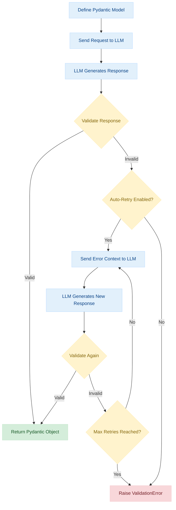

# Validation in Instructor

This guide covers validation concepts and best practices when using Instructor for structured outputs.

## Overview

Validation in Instructor ensures that the output from language models matches your expected schema. This is crucial for:
- Data consistency
- Error handling
- Type safety
- Business logic enforcement

### Validation Flow

The following diagram illustrates how validation works in Instructor:



This process ensures that the LLM output conforms to your defined schema, with built-in retry mechanisms to handle validation failures.

## Basic Validation

Instructor uses Pydantic for validation, which provides:
1. Type checking
2. Data coercion
3. Custom validators
4. Field constraints

```python
# Standard library imports
from typing import List

# Third-party imports
from pydantic import BaseModel, Field, field_validator


class User(BaseModel):
    """Model representing a user with validation rules."""

    name: str = Field(
        ..., min_length=2, description="User's full name, minimum 2 characters"
    )
    age: int = Field(..., ge=0, le=150, description="User's age between 0 and 150")
    emails: List[str] = Field(description="List of user's email addresses")

    @field_validator('emails')
    @classmethod
    def validate_emails(cls, v):
        """Validate that all email addresses contain an @ symbol."""
        if not all('@' in email for email in v):
            raise ValueError('Invalid email format')
        return v
```

## Validation Strategies

### 1. Field Validation

Use Field() for basic constraints:
```python
# Third-party imports
from pydantic import BaseModel, Field


class Product(BaseModel):
    """Model representing a product with field validation constraints."""

    name: str = Field(
        ...,
        min_length=1,
        max_length=100,
        description="Product name between 1-100 characters",
    )
    price: float = Field(..., gt=0, description="Product price, must be greater than 0")
    quantity: int = Field(
        ..., ge=0, description="Available quantity, must be 0 or greater"
    )
```

### 2. Semantic Validation

Semantic validation uses LLMs to validate content against complex criteria expressed in natural language. The `llm_validator` function enables validations that would be difficult to implement with traditional rule-based systems:

```python
# Standard library imports
from typing import Annotated

# Third-party imports
from pydantic import BaseModel, BeforeValidator
import instructor
from instructor import llm_validator

# Initialize client
client = instructor.from_provider("openai/gpt-4o-mini")

class ContentReview(BaseModel):
    """Model for reviewing user-generated content."""

    title: str
    content: Annotated[
        str,
        BeforeValidator(
            llm_validator("Content must be family-friendly and not contain profanity", client=client)
        ),
    ]
    summary: Annotated[
        str,
        BeforeValidator(
            llm_validator("Summary must be concise (under 30 words) and accurately reflect the content", client=client)
        ),
    ]
```

Semantic validation is particularly useful for:

- Content moderation and policy adherence
- Ensuring contextual consistency between fields
- Validating against subjective criteria (tone, style, formality)
- Complex relationship validation where rule-based checks would be cumbersome

For a comprehensive guide on semantic validation, including advanced patterns and best practices, see the dedicated [Semantic Validation](./semantic_validation.md) guide.

### 3. Custom Validators

Use @validator for complex validation:
```python
# Standard library imports
from typing import List

# Third-party imports
from pydantic import BaseModel, Field, field_validator


class Order(BaseModel):
    """Model representing an order with custom validation logic."""

    items: List[str] = Field(description="List of item names in the order")
    total: float = Field(description="Total order amount")

    @field_validator('total')
    @classmethod
    def validate_total(cls, v):
        """Validate that the total amount is not negative."""
        if v < 0:
            raise ValueError('Total cannot be negative')
        return v
```

### 3. Pre-validation Hooks

Use pre-validation hooks for data transformation:
```python
# Third-party imports
from pydantic import BaseModel, Field, validator


class UserProfile(BaseModel):
    """Model representing a user profile with pre-validation transformation."""

    username: str = Field(description="User's unique username")

    @validator('username', pre=True)
    def lowercase_username(cls, v):
        """Transform username to lowercase before validation."""
        return v.lower()
```

## Error Handling

Instructor provides robust error handling for validation failures:

```python
# Standard library imports
import os

# Third-party imports
import instructor
from pydantic import BaseModel, Field, field_validator

# Set up environment (typically handled before script execution)
# os.environ["OPENAI_API_KEY"] = "your-api-key"  # Uncomment and replace with your API key if not set


# Define model with validation
class User(BaseModel):
    """Model representing a user with validation rules."""

    name: str = Field(description="User's full name")
    age: int = Field(description="User's age in years")

    @field_validator('age')
    @classmethod
    def validate_age(cls, v):
        """Validate that age is a positive number."""
        if v < 0:
            raise ValueError("Age cannot be negative")
        return v


# Initialize client using unified provider interface
client = instructor.from_provider("openai/gpt-4o-mini", mode=instructor.Mode.JSON)

try:
    # Attempt to extract with validation using Jinja templating
    user = client.chat.completions.create(
        response_model=User,
        messages=[
            {
                "role": "system",
                "content": "Extract structured user information from the text.",
            },
            {"role": "user", "content": "Extract: {{ person_name }}, age: {{ person_age }}"},
        ],
        context={
            "person_name": "John Doe",
            "person_age": "-5"
        }
    )
    print(user.model_dump_json(indent=2))
    """
    {
      "name": "John Doe",
      "age": 0
    }
    """
except instructor.exceptions.InstructorValidationError as e:
    print(f"Validation error: {e}")
    # Expected output:
    # Validation error: 1 validation error for User
    # age
    #   Age cannot be negative (type=value_error)
except Exception as e:
    print(f"Other error: {e}")
```

## Best Practices

1. **Start Simple**: Begin with basic type validation before adding complex rules
2. **Use Type Hints**: Always specify types for better code clarity
3. **Document Constraints**: Add clear descriptions to Field() definitions
4. **Choose the Right Validation Type**: Use rule-based validation for objective criteria and semantic validation for subjective or complex criteria
5. **Handle Errors**: Implement proper error handling for validation failures
6. **Test Edge Cases**: Verify validation works with unexpected inputs
7. **Consider Validation Cost**: Remember that semantic validation using LLMs incurs additional API costs and latency

## Common Patterns

### Advanced Semantic Validation Patterns

Instructor's semantic validation offers similar capabilities to dedicated guardrails frameworks, but with the advantage of being integrated directly into your Pydantic models. Here are a few examples of advanced patterns (for a complete guide, see the [Semantic Validation](./semantic_validation.md) page):

#### Topic Relevance Validation

This validator ensures that responses stay on topic and don't drift into unrelated subjects:

```python
from typing import Annotated
from pydantic import BaseModel, BeforeValidator
import instructor
from instructor import llm_validator

client = instructor.from_provider("openai/gpt-4o-mini")

class ResponseValidation(BaseModel):
    question: str
    answer: Annotated[
        str,
        BeforeValidator(
            llm_validator(
                "The answer must be directly relevant to the question and stay on topic. "
                "Don't introduce unrelated information.",
                client=client
            )
        )
    ]
```

#### Toxic Language Detection

This validator can flag or filter out potentially harmful content:

```python
from typing import Annotated
from pydantic import BaseModel, BeforeValidator, Field
import instructor
from instructor import llm_validator

client = instructor.from_provider("openai/gpt-4o-mini")

class SafeContent(BaseModel):
    content: Annotated[
        str,
        BeforeValidator(
            llm_validator(
                "The content must not contain any offensive, harmful, toxic language, "
                "or profanity. It should be appropriate for all audiences.",
                client=client
            )
        )
    ]
    toxicity_score: float = Field(
        default=0.0,
        description="A score from 0.0 to 1.0 indicating detected toxicity level"
    )
```

#### Fact-checking Validator

This complex validator checks factual accuracy of claims:

```python
from typing import Annotated, List
from pydantic import BaseModel, BeforeValidator, Field
import instructor
from instructor import llm_validator

client = instructor.from_provider("openai/gpt-4o-mini")

class FactCheckedClaim(BaseModel):
    claim: str
    is_accurate: bool = Field(description="Whether the claim is factually accurate")
    confidence: float = Field(
        default=0.0,
        description="Confidence level in the accuracy assessment (0.0-1.0)"
    )
    supporting_evidence: List[str] = Field(
        default_factory=list,
        description="Evidence supporting or refuting the claim"
    )
    
    @classmethod
    def validate_claim(cls, text: str) -> "FactCheckedClaim":
        return client.chat.completions.create(
            response_model=FactCheckedClaim,
            messages=[
                {
                    "role": "system",
                    "content": "You are a fact-checking system. Assess the factual accuracy of the claim."
                },
                {
                    "role": "user",
                    "content": "Fact check this claim: {{ claim }}"
                }
            ],
            context={"claim": text}
        )
```

### Semantic Validation Patterns

Semantic validation with `llm_validator` enables validation against complex criteria that is difficult to express programmatically. Here are common patterns:

#### Content Policy Enforcement
```python
# Standard library imports
from typing import Annotated

# Third-party imports
from pydantic import BaseModel, BeforeValidator
from instructor import llm_validator
import instructor

# Initialize client
client = instructor.from_provider("openai/gpt-4o-mini")

class Comment(BaseModel):
    """Model representing a user comment with content moderation."""
    
    user_id: str
    content: Annotated[
        str,
        BeforeValidator(
            llm_validator(
                "Content must comply with community guidelines: no hate speech, harassment, or explicit content", 
                client=client
            )
        )
    ]
```

#### Ensuring Consistency Between Fields
```python
# Standard library imports
from typing import Annotated, List
from pydantic import BaseModel, field_validator, BeforeValidator, model_validator

# Third-party imports
from instructor import llm_validator
import instructor

# Initialize client
client = instructor.from_provider("openai/gpt-4o-mini")

class Report(BaseModel):
    """Model representing a financial report with semantic validation."""
    
    title: str
    summary: str
    key_findings: List[str]
    
    @model_validator(mode='after')
    def validate_consistency(self):
        # Semantic validation at the model level using Jinja templating
        validation_result = client.chat.completions.create(
            response_model=Validator,
            messages=[
                {
                    "role": "system",
                    "content": "Validate that the summary accurately reflects the key findings.",
                },
                {
                    "role": "user",
                    "content": """
                        Please validate if this summary accurately reflects the key findings:
                        
                        Summary: {{ summary }}
                        
                        Key findings:
                        
                        - {{ finding }}
                        
                    """,
                },
            ],
            context={
                "summary": self.summary,
                "findings": self.key_findings
            }
        )
        
        if not validation_result.is_valid:
            raise ValueError(f"Consistency error: {validation_result.reason}")
        
        return self
```

#### Validating Writing Style and Tone
```python
# Standard library imports
from typing import Annotated

# Third-party imports
from pydantic import BaseModel, BeforeValidator
from instructor import llm_validator
import instructor

# Initialize client
client = instructor.from_provider("openai/gpt-4o-mini")

class CompanyAnnouncement(BaseModel):
    """Model representing a company announcement with tone validation."""
    
    title: str
    content: Annotated[
        str,
        BeforeValidator(
            llm_validator(
                "The announcement must maintain a professional, positive tone without being overly informal or using slang", 
                client=client
            )
        )
    ]
```

#### External Knowledge Validation
```python
# Standard library imports
from typing import Annotated

# Third-party imports
from pydantic import BaseModel, BeforeValidator
from instructor import llm_validator
import instructor

# Initialize client
client = instructor.from_provider("openai/gpt-4o-mini")

class MedicalClaim(BaseModel):
    """Model representing a medical claim with factual validation."""
    
    statement: Annotated[
        str,
        BeforeValidator(
            llm_validator(
                "The medical claim must be factually accurate and supported by scientific consensus", 
                client=client
            )
        )
    ]
    source: str
```

### Optional Fields
```python
# Standard library imports
from typing import Optional

# Third-party imports
from pydantic import BaseModel, Field


class Profile(BaseModel):
    """Model representing a user profile with optional fields."""

    name: str = Field(description="User's full name")
    bio: Optional[str] = Field(None, description="Optional user biography")
```

### Nested Validation
```python
# Standard library imports
from typing import List

# Third-party imports
from pydantic import BaseModel, Field


class Address(BaseModel):
    """Model representing a physical address."""

    street: str = Field(description="Street address including number")
    city: str = Field(description="City name")
    country: str = Field(description="Country name")


class User(BaseModel):
    """Model representing a user with nested address validation."""

    name: str = Field(description="User's full name")
    addresses: List[Address] = Field(description="List of user's addresses")
```

### Complex Validation
```python
# Standard library imports
from datetime import datetime

# Third-party imports
from pydantic import BaseModel, Field, validator


class Transaction(BaseModel):
    """Model representing a financial transaction with complex validation."""

    amount: float = Field(description="Transaction amount")
    currency: str = Field(description="Three-letter currency code (USD, EUR, GBP)")
    timestamp: datetime = Field(description="Transaction timestamp")

    @validator('currency')
    def validate_currency(cls, v):
        """Validate that currency is one of the supported codes."""
        valid_currencies = ['USD', 'EUR', 'GBP']
        if v not in valid_currencies:
            raise ValueError(f'Currency must be one of {valid_currencies}')
        return v

    @validator('timestamp')
    def validate_timestamp(cls, v):
        """Validate that timestamp is not in the future."""
        if v > datetime.now():
            raise ValueError("Transaction timestamp cannot be in the future")
        return v
```

## Related Resources

- [Pydantic Documentation](https://docs.pydantic.dev/)
- [OpenAI Function Calling](https://platform.openai.com/docs/guides/gpt/function-calling)
- [Instructor Examples](../examples/index.md)

## Updates and Compatibility

- Works with all supported LLM providers
- Compatible with latest Pydantic versions
- Regular updates for new validation features
