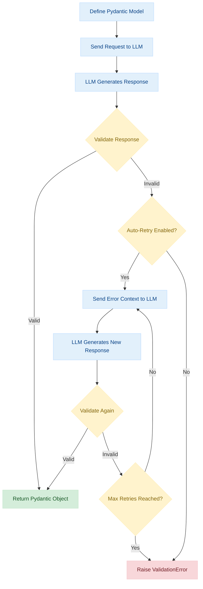

# Validation in Instructor

This guide covers validation concepts and best practices when using Instructor for structured outputs.

## Overview

Validation in Instructor ensures that the output from language models matches your expected schema. This is crucial for:
- Data consistency
- Error handling
- Type safety
- Business logic enforcement

### Validation Flow

The following diagram illustrates how validation works in Instructor:



This process ensures that the LLM output conforms to your defined schema, with built-in retry mechanisms to handle validation failures.

## Basic Validation

Instructor uses Pydantic for validation, which provides:
1. Type checking
2. Data coercion
3. Custom validators
4. Field constraints

```python
# Standard library imports
from typing import List

# Third-party imports
from pydantic import BaseModel, Field, field_validator


class User(BaseModel):
    """Model representing a user with validation rules."""

    name: str = Field(
        ..., min_length=2, description="User's full name, minimum 2 characters"
    )
    age: int = Field(..., ge=0, le=150, description="User's age between 0 and 150")
    emails: List[str] = Field(description="List of user's email addresses")

    @field_validator('emails')
    @classmethod
    def validate_emails(cls, v):
        """Validate that all email addresses contain an @ symbol."""
        if not all('@' in email for email in v):
            raise ValueError('Invalid email format')
        return v
```

## Validation Strategies

### 1. Field Validation

Use Field() for basic constraints:
```python
# Third-party imports
from pydantic import BaseModel, Field


class Product(BaseModel):
    """Model representing a product with field validation constraints."""

    name: str = Field(
        ...,
        min_length=1,
        max_length=100,
        description="Product name between 1-100 characters",
    )
    price: float = Field(..., gt=0, description="Product price, must be greater than 0")
    quantity: int = Field(
        ..., ge=0, description="Available quantity, must be 0 or greater"
    )
```

### 2. Custom Validators

Use @validator for complex validation:
```python
# Standard library imports
from typing import List

# Third-party imports
from pydantic import BaseModel, Field, field_validator


class Order(BaseModel):
    """Model representing an order with custom validation logic."""

    items: List[str] = Field(description="List of item names in the order")
    total: float = Field(description="Total order amount")

    @field_validator('total')
    @classmethod
    def validate_total(cls, v):
        """Validate that the total amount is not negative."""
        if v < 0:
            raise ValueError('Total cannot be negative')
        return v
```

### 3. Pre-validation Hooks

Use pre-validation hooks for data transformation:
```python
# Third-party imports
from pydantic import BaseModel, Field, validator


class UserProfile(BaseModel):
    """Model representing a user profile with pre-validation transformation."""

    username: str = Field(description="User's unique username")

    @validator('username', pre=True)
    def lowercase_username(cls, v):
        """Transform username to lowercase before validation."""
        return v.lower()
```

## Error Handling

Instructor provides robust error handling for validation failures:

```python
# Standard library imports
import os

# Third-party imports
import instructor
from openai import OpenAI
from pydantic import BaseModel, Field, validator

# Set up environment (typically handled before script execution)
# os.environ["OPENAI_API_KEY"] = "your-api-key"  # Uncomment and replace with your API key if not set


# Define model with validation
class User(BaseModel):
    """Model representing a user with validation rules."""

    name: str = Field(description="User's full name")
    age: int = Field(description="User's age in years")

    @validator('age')
    def validate_age(cls, v):
        """Validate that age is a positive number."""
        if v < 0:
            raise ValueError("Age cannot be negative")
        return v


# Initialize client with explicit mode
client = instructor.from_openai(
    OpenAI(api_key=os.environ.get("OPENAI_API_KEY")), mode=instructor.Mode.JSON
)

try:
    # Attempt to extract with validation
    user = client.chat.completions.create(
        model="gpt-4o",  # Use latest stable model
        response_model=User,
        messages=[
            {
                "role": "system",
                "content": "Extract structured user information from the text.",
            },
            {"role": "user", "content": "Extract: John Doe, age: -5"},
        ],
    )
    print(user.model_dump_json(indent=2))
    """
    {
      "name": "John Doe",
      "age": 0
    }
    """
except instructor.exceptions.InstructorValidationError as e:
    print(f"Validation error: {e}")
    # Expected output:
    # Validation error: 1 validation error for User
    # age
    #   Age cannot be negative (type=value_error)
except Exception as e:
    print(f"Other error: {e}")
```

## Best Practices

1. **Start Simple**: Begin with basic type validation before adding complex rules
2. **Use Type Hints**: Always specify types for better code clarity
3. **Document Constraints**: Add clear descriptions to Field() definitions
4. **Handle Errors**: Implement proper error handling for validation failures
5. **Test Edge Cases**: Verify validation works with unexpected inputs

## Common Patterns

### Optional Fields
```python
# Standard library imports
from typing import Optional

# Third-party imports
from pydantic import BaseModel, Field


class Profile(BaseModel):
    """Model representing a user profile with optional fields."""

    name: str = Field(description="User's full name")
    bio: Optional[str] = Field(None, description="Optional user biography")
```

### Nested Validation
```python
# Standard library imports
from typing import List

# Third-party imports
from pydantic import BaseModel, Field


class Address(BaseModel):
    """Model representing a physical address."""

    street: str = Field(description="Street address including number")
    city: str = Field(description="City name")
    country: str = Field(description="Country name")


class User(BaseModel):
    """Model representing a user with nested address validation."""

    name: str = Field(description="User's full name")
    addresses: List[Address] = Field(description="List of user's addresses")
```

### Complex Validation
```python
# Standard library imports
from datetime import datetime

# Third-party imports
from pydantic import BaseModel, Field, validator


class Transaction(BaseModel):
    """Model representing a financial transaction with complex validation."""

    amount: float = Field(description="Transaction amount")
    currency: str = Field(description="Three-letter currency code (USD, EUR, GBP)")
    timestamp: datetime = Field(description="Transaction timestamp")

    @validator('currency')
    def validate_currency(cls, v):
        """Validate that currency is one of the supported codes."""
        valid_currencies = ['USD', 'EUR', 'GBP']
        if v not in valid_currencies:
            raise ValueError(f'Currency must be one of {valid_currencies}')
        return v

    @validator('timestamp')
    def validate_timestamp(cls, v):
        """Validate that timestamp is not in the future."""
        if v > datetime.now():
            raise ValueError("Transaction timestamp cannot be in the future")
        return v
```

## Related Resources

- [Pydantic Documentation](https://docs.pydantic.dev/)
- [OpenAI Function Calling](https://platform.openai.com/docs/guides/gpt/function-calling)
- [Instructor Examples](../examples/index.md)

## Updates and Compatibility

- Works with all supported LLM providers
- Compatible with latest Pydantic versions
- Regular updates for new validation features
