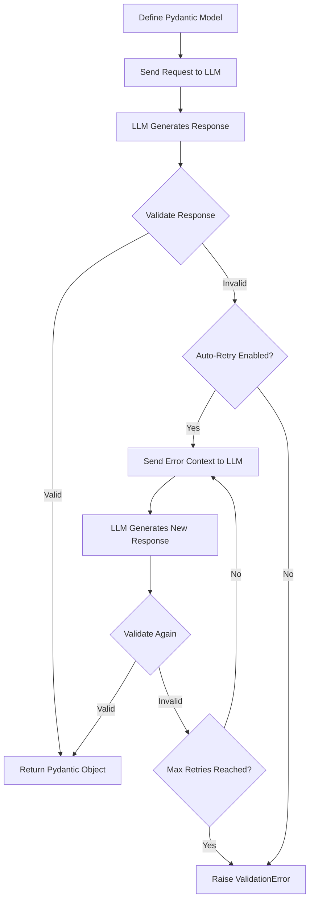

# Validation

Instructor uses Pydantic for validation, providing type checking, data coercion, custom validators, and field constraints.

## Validation Flow


```mermaid
flowchart TD
    A[Define Pydantic Model] --> B[Send Request to LLM]
    B --> C[LLM Generates Response]
    C --> D{Validate Response}

    D -->|Valid| E[Return Pydantic Object]
    D -->|Invalid| F{Auto-Retry Enabled?}

    F -->|Yes| G[Send Error Context to LLM]
    F -->|No| H[Raise ValidationError]

    G --> I[LLM Generates New Response]
    I --> J{Validate Again}

    J -->|Valid| E
    J -->|Invalid| K{Max Retries Reached?}

    K -->|No| G
    K -->|Yes| H
```

## Basic Validation

Define models with type hints and field constraints:

```python
from typing import List
from pydantic import BaseModel, Field, field_validator


class User(BaseModel):
    name: str = Field(..., min_length=2, description="User's full name")
    age: int = Field(..., ge=0, le=150, description="User's age")
    emails: List[str] = Field(description="List of email addresses")

    @field_validator('emails')
    @classmethod
    def validate_emails(cls, v):
        if not all('@' in email for email in v):
            raise ValueError('Invalid email format')
        return v
```

## Field Validation

Use `Field()` for basic constraints:

```python
from pydantic import BaseModel, Field


class Product(BaseModel):
    name: str = Field(..., min_length=1, max_length=100)
    price: float = Field(..., gt=0)
    quantity: int = Field(..., ge=0)
```

## Custom Validators

Use `@field_validator` for complex validation:

```python
from pydantic import BaseModel, Field, field_validator


class Order(BaseModel):
    items: list[str] = Field(description="List of item names")
    total: float = Field(description="Total order amount")

    @field_validator('total')
    @classmethod
    def validate_total(cls, v):
        if v < 0:
            raise ValueError('Total cannot be negative')
        return v
```

## Async Validators

Use Instructor's async decorators with an async client when validation needs an
awaitable operation. Pydantic's regular validators remain synchronous.

```python
import asyncio

from openai import AsyncOpenAI
from pydantic import BaseModel, ValidationInfo

import instructor
from instructor.validation import async_field_validator


class Answer(BaseModel):
    value: int

    @async_field_validator("value")
    async def within_limit(cls, value: int, info: ValidationInfo) -> int:
        if value > info.context["limit"]:
            raise ValueError("Value exceeds the current limit")
        return value


async def main() -> None:
    async with AsyncOpenAI() as sdk:
        client = instructor.from_openai(sdk)
        answer = await client.create(
            model="gpt-4.1-mini",
            response_model=Answer,
            messages=[{"role": "user", "content": "Return the number 42"}],
            context={"limit": 100},
        )
        print(answer.value)


asyncio.run(main())
```

Async validation runs after Pydantic parsing for a non-streaming, single response
model. Nested models, including those inside lists, tuples, and dictionaries, are
validated before their parent. Field validators run in declaration order and pass
their returned value to the next validator. Model validators run afterward.
Overriding a validator method in a subclass replaces its inherited behavior.

Raise `ValueError` to reject a response and enter the normal validation retry flow.
Cache hits also run async validators with the current request context; a rejected
cache hit raises `AsyncValidationError` without making another provider request.
Validators should preserve field types and be safe to run more than once.

Sync clients reject models with async validators. Streaming, partial, iterable,
and parallel responses are not supported with async validators and raise
`ConfigurationError` before making a request.

## Pre-validation Transformation

Transform data before validation:

```python
from pydantic import BaseModel, field_validator


class UserProfile(BaseModel):
    username: str

    @field_validator('username', mode='before')
    @classmethod
    def lowercase_username(cls, v):
        return v.lower() if isinstance(v, str) else v
```

## Semantic Validation

Use `llm_validator` for validations that are hard to express programmatically:

```python
from typing import Annotated
from pydantic import BaseModel, BeforeValidator
import instructor
from instructor import llm_validator

client = instructor.from_provider("openai/gpt-4.1-mini")


class ContentReview(BaseModel):
    title: str
    content: Annotated[
        str,
        BeforeValidator(
            llm_validator(
                "Content must be family-friendly and not contain profanity",
                client=client,
            )
        ),
    ]
```

Semantic validation works well for content moderation, tone validation, consistency checks, and complex relationships. For more patterns and details, see the [Semantic Validation](./semantic_validation.md) guide.

## Nested Validation

Validate nested structures:

```python
from pydantic import BaseModel, Field


class Address(BaseModel):
    street: str
    city: str
    country: str


class User(BaseModel):
    name: str
    addresses: list[Address] = Field(description="User's addresses")
```

## Error Handling

Handle validation failures with appropriate error types:

```python
import instructor
from pydantic import BaseModel, field_validator


class User(BaseModel):
    name: str
    age: int

    @field_validator("age")
    @classmethod
    def validate_age(cls, v):
        if v < 0:
            raise ValueError("Age cannot be negative")
        return v


client = instructor.from_provider("openai/gpt-4.1-mini")

try:
    user = client.create(
        response_model=User,
        messages=[
            {"role": "user", "content": "Extract: John, age: -5"},
        ],
    )
except instructor.exceptions.InstructorValidationError as e:
    print(f"Validation error: {e}")
```

## Best Practices

1. **Start simple**: Begin with basic type validation before adding complex rules
2. **Use type hints**: Always specify types for clarity
3. **Document constraints**: Add descriptions to Field() definitions
4. **Choose the right validation type**: Rule-based for objective criteria, semantic for subjective
5. **Handle errors**: Implement proper error handling for validation failures
6. **Consider costs**: Semantic validation with LLMs incurs API costs and latency

## See Also

- [Semantic Validation](./semantic_validation.md) - LLM-based validation patterns
- [Reask Validation](./reask_validation.md) - Automatic retry with validation feedback
- [Retrying](./retrying.md) - Configure retry behavior
- [Error Handling](./error_handling.md) - Handle validation failures
