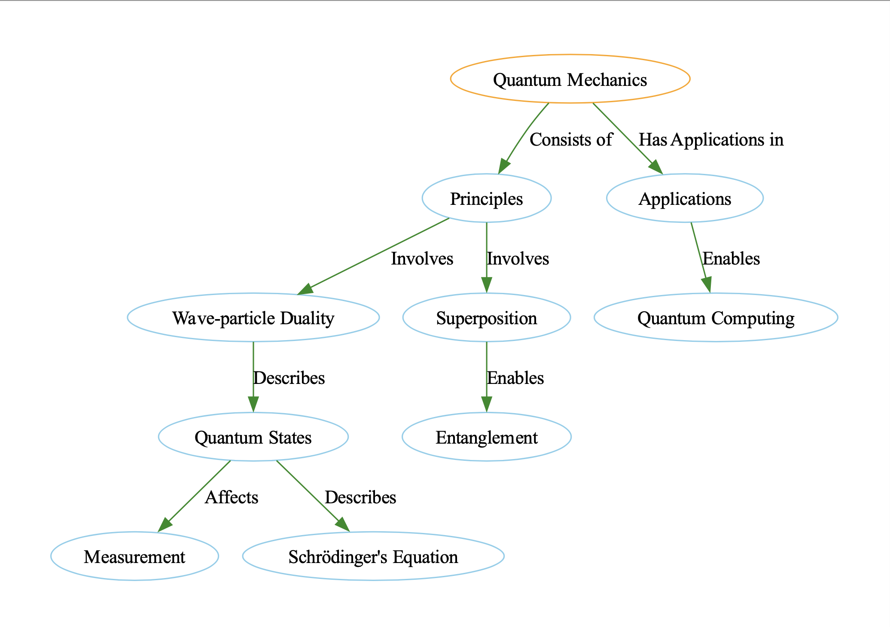

# Visualizing Knowledge Graphs for Complex Topics

In this guide, you'll discover how to visualise a detailed knowledge graph when dealing with complex topics. We'll then move on to iteratively updating our knowledge graph with new information through a series of sequential api calls using only the Instructor library, Pydantic and Graphviz to visualise our graph.

!!! tips "Motivation"

    Knowledge graphs offer a visually appealing and coherent way to understand complicated topics like quantum mechanics. By generating these graphs automatically, you can accelerate the learning process and make it easier to digest complex information.

## Defining the Structures

Let's model a knowledge graph with **`Node`** and **`Edge`** objects. **`Node`** objects represent key concepts or entities, while **`Edge`** objects indicate the relationships between them.

```python
from pydantic import BaseModel, Field
from typing import List


class Node(BaseModel):
    id: int
    label: str
    color: str


class Edge(BaseModel):
    source: int
    target: int
    label: str
    color: str = "black"


class KnowledgeGraph(BaseModel):
    nodes: List[Node] = Field(..., default_factory=list)
    edges: List[Edge] = Field(..., default_factory=list)
```

## Generating Knowledge Graphs

The **`generate_graph`** function leverages OpenAI's API to generate a knowledge graph based on the input query.

```python hl_lines="8"
from openai import OpenAI
import instructor

# Adds response_model to ChatCompletion
# Allows the return of Pydantic model rather than raw JSON
client = instructor.patch(OpenAI())


def generate_graph(input) -> KnowledgeGraph:
    return client.chat.completions.create(
        model="gpt-3.5-turbo",
        messages=[
            {
                "role": "user",
                "content": f"Help me understand the following by describing it as a detailed knowledge graph: {input}",
            }
        ],
        response_model=KnowledgeGraph,
    )  # type: ignore
```

## Visualizing the Graph

The **`visualize_knowledge_graph`** function uses the Graphviz library to render the generated knowledge graph.

```python
from graphviz import Digraph


def visualize_knowledge_graph(kg: KnowledgeGraph):
    dot = Digraph(comment="Knowledge Graph")

    # Add nodes
    for node in kg.nodes:
        dot.node(str(node.id), node.label, color=node.color)

    # Add edges
    for edge in kg.edges:
        dot.edge(str(edge.source), str(edge.target), label=edge.label, color=edge.color)

    # Render the graph
    dot.render("knowledge_graph.gv", view=True)

graph = generate_graph("Teach me about quantum mechanics")
visualize_knowledge_graph(graph)
```



This will produce a visual representation of the knowledge graph, stored as "knowledge_graph.gv". You can open this file to explore the key concepts and their relationships in quantum mechanics.

## Iterative Updates

Now that we've seen how to generate a knowledge graph from a single input, let's see how we can iteratively update our knowledge graph with new information, or when informatino does not fit into a single prompt.

Let's take an easy example where we want to visualise the combined knowledge graph that the following sentences represent.

```python
text_chunks = [
    "Jason knows a lot about quantum mechanics. He is a physicist. He is a professor",
    "Professors are smart.",
    "Sarah knows Jason and is a student of his.",
    "Sarah is a student at the University of Toronto. and UofT is in Canada",
]
```

### Updating Our Data Model

To support our new iterative approach, we need to update our data model. We can do this by adding helper methods `update` and `draw` to our Pydantic models. These methods will simplify our code and allow us to easily visualize the knowledge graph.

In the `KnowledgeGraph` class, we have migrated the code from the `visualize_knowledge_graph` method and added new lists for nodes and edges.

```python
class KnowledgeGraph(BaseModel):
    nodes: Optional[List[Node]] = Field(..., default_factory=list)
    edges: Optional[List[Edge]] = Field(..., default_factory=list)

    def update(self, other: "KnowledgeGraph") -> "KnowledgeGraph":
        """Updates the current graph with the other graph, deduplicating nodes and edges."""
        return KnowledgeGraph(
            nodes=list(set(self.nodes + other.nodes)),
            edges=list(set(self.edges + other.edges)),
        )

    def draw(self, prefix: str = None):
        dot = Digraph(comment="Knowledge Graph")

        for node in self.nodes:  # (1)!
            dot.node(str(node.id), node.label, color=node.color)

        for edge in self.edges:  # (2)!
            dot.edge(
                str(edge.source), str(edge.target), label=edge.label, color=edge.color
            )
        dot.render(prefix, format="png", view=True)
```

1. We iterate through all the nodes in our graph and add them to the graph
2. We iterate through all the edges in our graph and add them to the graph

We can modify our `generate_graph` function to now take in a list of strings. At each step, it'll extract out the key insights from the sentences in the form of edges and nodes like we've seen before. We can then combine these new edges and nodes with our existing knowledge graph through iterative updates to our graph before arriving at our final result.

```python hl_lines="2 21-25 31-32"
def generate_graph(input: List[str]) -> KnowledgeGraph:
    cur_state = KnowledgeGraph()  # (1)!
    num_iterations = len(input)
    for i, inp in enumerate(input):
        new_updates = client.chat.completions.create(
            model="gpt-3.5-turbo-16k",
            messages=[
                {
                    "role": "system",
                    "content": """You are an iterative knowledge graph builder.
                    You are given the current state of the graph, and you must append the nodes and edges
                    to it Do not procide any duplcates and try to reuse nodes as much as possible.""",
                },
                {
                    "role": "user",
                    "content": f"""Extract any new nodes and edges from the following:
                    # Part {i}/{num_iterations} of the input:

                    {inp}""",
                },
                {
                    "role": "user",
                    "content": f"""Here is the current state of the graph:
                    {cur_state.model_dump_json(indent=2)}""",
                },  # (2)!
            ],
            response_model=KnowledgeGraph,
        )  # type: ignore

        # Update the current state
        cur_state = cur_state.update(new_updates)  # (3)!
        cur_state.draw(prefix=f"iteration_{i}")
    return cur_state
```

1.  We first initialise an empty `KnowledgeGraph`. In this state, it has zero nodes and edges

2.  We then add in the current state of the graph into the prompt so that the model knows what new information needs to be added

3.  We then update the nodes and edges of our graph with the information that our model has returned before visualizing the new changes

Once we've done this, we can now run this new `generate_graph` function with the following two lines.

```python
graph: KnowledgeGraph = generate_graph(text_chunks)
graph.draw(prefix="final")
```

## Conclusion

We've seen how we can use `Instructor` to obtain structured outputs from the OpenAI LLM API but you could use that for any of the other open-source models that the library is compatible with. If you enjoy the content or want to try out `Instructor` check out the [github](https://github.com/jxnl/instructor) and don't forget to give us a star!
