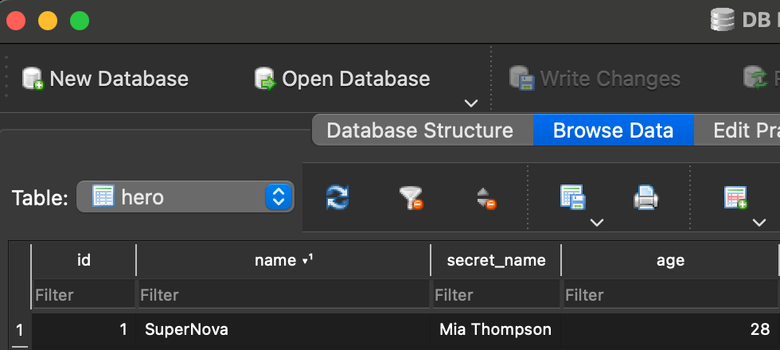

# Integrating Instructor with SQLModel

[SQLModel](https://sqlmodel.tiangolo.com/) is a library designed for interacting with SQL databases from Python code using Python objects. `SQLModel` is based on `Pydantic` and `SQLAlchemy` and was created by [tiangolo](https://twitter.com/tiangolo) who also developed `FastAPI`. So you can expect seamless integration across all these libraries, reducing code duplicating and improving your developer experience. 

# Example: Adding responses from Instructor directly to your DB

## Defining the Models

First we'll define a model that will serve as a table for our database and the structure of our outputs from `Instructor`

!!! tips "Model Definition"

    You'll need to subclass your models with both `SQLModel` and `instructor.OpenAISchema` for them to work with SQLModel

```python
import instructor
from openai import OpenAI
from typing import Optional
from sqlmodel import Field, SQLModel, create_engine


class Hero(SQLModel, instructor.OpenAISchema, table=True):
    id: Optional[int] = Field(default=None, primary_key=True)
    name: str
    secret_name: str
    age: Optional[int] = None
```

## Generating a record

The `create_hero` function will query `OpenAI` for a `Hero` record

```python
client = instructor.from_openai(OpenAI())

def create_hero() -> Hero:
    return client.chat.completions.create(
        model="gpt-3.5-turbo",
        response_model=Hero,
        messages=[
            {"role": "user", "content": "Make a new superhero"},
        ],
    )
```

## Inserting the response into the DB

```python
engine = create_engine("sqlite:///database.db")
SQLModel.metadata.create_all(engine)

hero = create_hero()
print(hero.model_dump())
    """
    {'name': 'SuperNova', 'secret_name': 'Mia Thompson', 'age': 28, 'id': None}
    """

with Session(engine) as session:
    session.add(hero)
    session.commit()
```



And there you have it! You can now use the same models for your database and `Instructor` enabling them work seamlessly! Also checkout the [FastAPI](../concepts/fastapi.md) guide to see how you can use these models in an API as well. 