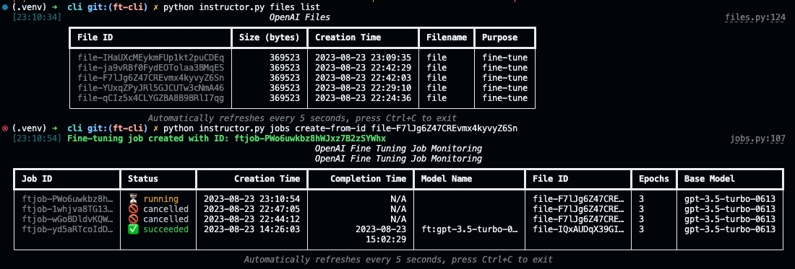

Instructor-FT CLI Documentation
Jobs Module
1. list (Jobs List)
Monitor the status of the most recent fine-tuning jobs.

Usage:

bash
Copy code
python instructor.py jobs watch
Options:

--limit: Limit the number of jobs to monitor (default 5).
--poll: Polling interval in seconds (default 5).
--screen: Enable or disable screen output (default False).
2. create_from_id (Create from ID)
Create a fine-tuning job from an existing ID.

Usage:

bash
Copy code
python instructor.py jobs create_from_id [ID]
Options:
# Finetuning

While function calling finetunes are not out yet I've build some additional features to make 
finetuning a bit easier. After you intall the instructor library you'll be able to use the instructor commands like so:

## Using the command line

```sh
instructor --help           
Usage: instructor [OPTIONS] COMMAND [ARGS]...

  A CLI for fine-tuning OpenAI's models

Options:
  --install-completion [bash|zsh|fish|powershell|pwsh]
                                  Install completion for the specified shell.
  --show-completion [bash|zsh|fish|powershell|pwsh]
                                  Show completion for the specified shell, to
                                  copy it or customize the installation.
  --help                          Show this message and exit.

Commands:
  files  Manage files on OpenAI's servers
  jobs   Monitor and create fine tuning jobs
```

## Creating a finetuning job

Here we're going to assume you already have a file of jsonlines that you want to upload. `finetune.jsonl`

You can upload, kick off, and monitor your finetuning jobs easily

```sh
$ instructor jobs create-from-file transformed_data.jsonl 
```

You'll first see some logging status since it takes time for data to be uplaoded 

```sh
Monitoring file upload for <file-id>
```

One that completes you'll see a similar progress for kicking off the finetunes and ulimately the monitoring stages,

