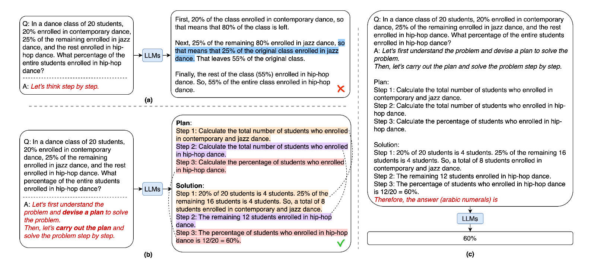

Plan and Solve<sup><a href="https://arxiv.org/pdf/2305.04091">1</a></sup> improves the use of an improved Zero-Shot Chain Of Thought (CoT) prompt which adds more detailed instructions to the prompt given to these large language models.

!!! example "Plan and Solve Prompt"

    [User Prompt]

    **Let’s first understand the problem, extract relevant variables and their corresponding numerals, and make a complete plan.Then, let’s carry out the plan, calculate intermediate variables (pay attention to correct numerical calculation and commonsense), solve the problem step by step, and show the answer.**

    [Model Response]

    **Therefore the answer(arabic numerals) is**

This is a two step process which guides the LLM to pay more attention to calculation and intermediate results to ensure that they are correctly performed as much as possible.

1. **Generate Reasoning**: In the first step we prompt the model with the user's query and prime the model using plan and solve prompting to explicitly devise a plan for solving a problem before generating an intermediate reasoning process
2. **Extract Answer** : Once we've obtained the model's reasoning, we then extract the answer from a new prompt which includes the model's chain of thought.



We can implement this using `instructor` as seen below.

```python hl_lines="26-34 67"
import instructor
from openai import OpenAI
from pydantic import BaseModel

client = instructor.from_openai(OpenAI())


class Reasoning(BaseModel):
    chain_of_thought: str


class Response(BaseModel):
    correct_answer: str


def generate_reasoning(query: str):
    return client.chat.completions.create(
        messages=[
            {
                "role": "user",
                "content": f"""
                <user query>
                {query}
                </user query>

                Let's first understand the problem,
                extract relevant variables and their
                corresponding numerals, and make a
                complete plan. Then, let's carry out
                the plan, calculate intermediate
                variables (pay attention to correct
                numerical calculation and commonsense),
                solve the problem step by step, and
                show the answer.
                """,
            },
        ],
        response_model=Reasoning,
        model="gpt-4o",
    )


def extract_answer(query: str, reasoning: Reasoning):
    return client.chat.completions.create(
        messages=[
            {
                "role": "user",
                "content": f"""
                <user query>
                    {query}
                </user query>

                Let's first understand the problem,
                extract relevant variables and their
                corresponding numerals, and make a
                complete plan. Then, let's carry out
                the plan, calculate intermediate
                variables (pay attention to correct
                numerical calculation and commonsense),
                solve the problem step by step, and
                show the answer.

                <reasoning>
                {reasoning.chain_of_thought}
                </reasoning>

                Therefore the answer (arabic numerals) is
                """,
            }
        ],
        model="gpt-4o",
        response_model=Response,
    )


if __name__ == "__main__":
    query = (
        "In a dance class of 20 students, 20% enrolled "
        "in contemporary dance, 25% of the remaining "
        "enrolled in jazz dance and the rest enrolled "
        "in hip-hop dance. What percentage of the entire "
        "students enrolled in hip-hop dance?"
    )

    reasoning = generate_reasoning(query)
    print(reasoning.model_dump_json(indent=2))
    """
    {
    "chain_of_thought": "Let's first break down the
    problem:\n\n1. Total number of students = 20\n2.
    Percentage enrolled in contemporary dance = 20%\n\n
    Step-by-Step Plan:\n1. Calculate the number of
    students enrolled in contemporary dance.\n2.
    Calculate the remaining students after contemporary
    dance enrollment.\n3. Calculate the percentage and
    number of students from the remaining who enrolled in
    jazz dance.\n4. Determine the remaining students who
    enrolled in hip-hop dance.\n5. Finally, calculate the
    percentage of the entire students who enrolled in
    hip-hop dance.\n\nLet's carry out the plan:\n\n1.
    Number of students enrolled in contemporary dance =
    20% of 20 = (20/100) * 20 = 4\n2. Remaining students
    after contemporary = 20 - 4 = 16\n3. Percentage of
    remaining students enrolled in jazz dance = 25%\n
    Number of students enrolled in jazz dance = 25% of 16
    = (25/100) * 16 = 4\n4. Remaining students after
    contemporary and jazz = 16 - 4 = 12\n5. The number of
    students enrolled in hip-hop dance = 12\n6.
    Percentage of entire students enrolled in hip-hop =
    (Number of hip-hop students / Total students) *
    100\n   Percentage = (12 / 20) * 100 = 60%\n\nThus,
    60% of the entire students enrolled in hip-hop dance."
    }
    """

    response = extract_answer(query, reasoning)
    print(response.model_dump_json(indent=2))
    """
    {
      "correct_answer": "60"
    }
    """
```

### References

<sup id="ref-1">1</sup>: [Plan-and-Solve Prompting: Improving Zero-Shot Chain-of-Thought Reasoning by Large Language Models](https://arxiv.org/pdf/2305.04091)
