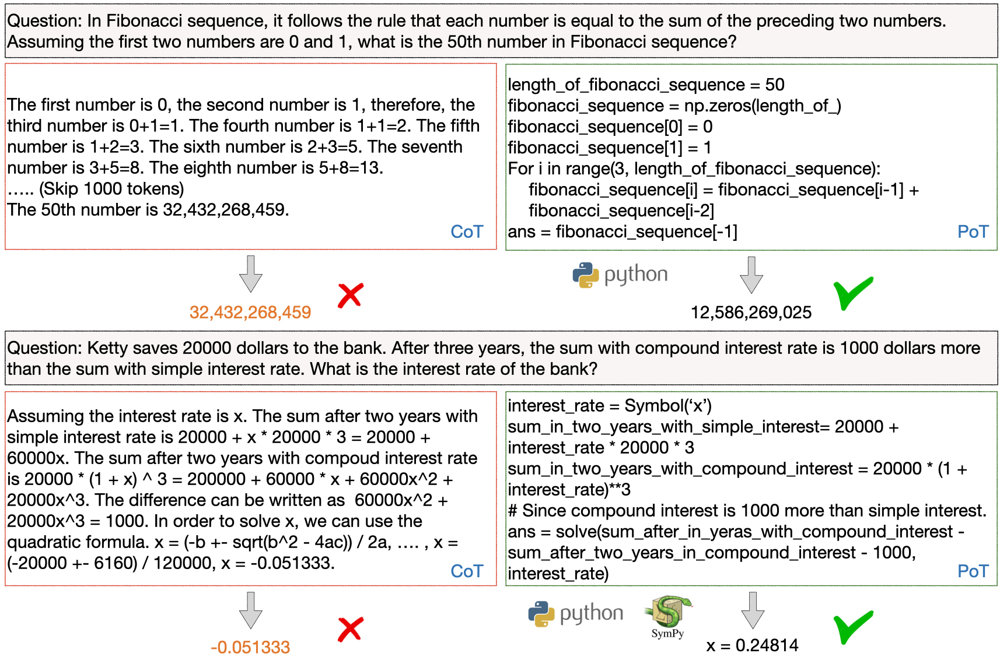

Program of Thought aims to leverage an external python interpreter in order to generate intermediate reasoning steps. This helps us to achieve a greater degree of performance in mathematical and programming-related tasks by grounding our final response in deterministic code.



We can implement it in `instructor` as seen below

```python hl_lines="120-125"
from openai import OpenAI
from pydantic import BaseModel, Field, field_validator
import instructor
from textwrap import dedent
from typing import Literal

client = instructor.from_openai(OpenAI())

prefix = """
# Answer this question by implementing a solver()
# function, use for loop if necessary.
def solver():
    # Let's write a Python program step by step,
    # and then return the answer
    # Firstly, we need to define the following
    # variable:
""".strip()


def execute_program(code: str):
    code = code.strip() + "\nans = solver()"
    print(code)
    """
    # Answer this question by implementing a
    # solver() function, use for loop if necessary.
    def solver():
        # Let's write a Python program step by step,
        # and then return the answer
        # Firstly, we need to define the following
        # variable:
        selling_price = 360
        profit_percentage = 20

        # To find the cost price, use the formula:
        # cost_price = selling_price / (1 + profit_percentage / 100)
        cost_price = selling_price / (1 + profit_percentage / 100)

        return cost_price

    # Running the solver function to get the cost price
    result = solver()
    print(result)
    ans = solver()
    """
    exec(code)
    locals_ = locals()
    return locals_.get("ans")


class Prediction(BaseModel):
    choice: Literal["A", "B", "C", "D", "E"]


class ProgramExecution(BaseModel):
    program_code: str = Field(
        description="""Program Code that
    once executed contains the final answer"""
    )

    @field_validator("program_code")
    @classmethod
    def ensure_valid_code(cls, v: str) -> str:
        if not v.startswith(prefix):
            raise ValueError(
                f"""Program Code must begin with the desired
                prefix of {prefix}"""
            )

        answer = execute_program(v)
        if not answer:
            raise ValueError(
                f"""Make sure to return the answer to the
                question within the solver function"""
            )

        return str(answer)


def generate_intermediate_reasoning(query: str):
    return client.chat.completions.create(
        model="gpt-4o",
        messages=[
            {
                "role": "system",
                "content": dedent(
                    f"""
                You are a world class AI system that excels
                at answering user queries in a systematic
                and detailed manner. You are about to be
                passed a user query to respond to. Make sure
                to generate a valid program that can be
                executed to answer the user query.

                Make sure to begin your generated program
                with the following prefix

                {prefix}
                """
                ),
            },
            {
                "role": "user",
                "content": query,
            },
        ],
        response_model=ProgramExecution,
    )


def generate_prediction(
    predicted_answer: str, options: list[str], query: str
) -> Prediction:
    formatted_options = ",".join(options)
    return client.chat.completions.create(
        model="gpt-4o",
        response_model=Prediction,
        messages=[
            {
                "role": "system",
                "content": dedent(
                    f"""
                Find the closest options based on the
                question and prediction.

                Question: {query}
                Prediction: {predicted_answer}
                Options: [{formatted_options}]
                """
                ),
            }
        ],
    )


if __name__ == "__main__":
    query = """A trader sold an article at a profit of 20%
    for Rs.360. What is the cost price of the article?"""
    reasoning = generate_intermediate_reasoning(query)
    options = ["A)270", "B)300", "C)280", "D)320", "E)315"]
    print(reasoning.model_dump_json(indent=2))
    """
    {
      "program_code": "300.0"
    }
    """

    prediction = generate_prediction(reasoning.program_code, options, query)
    print(prediction.model_dump_json(indent=2))
    """
    {
      "choice": "B"
    }
    """
```
