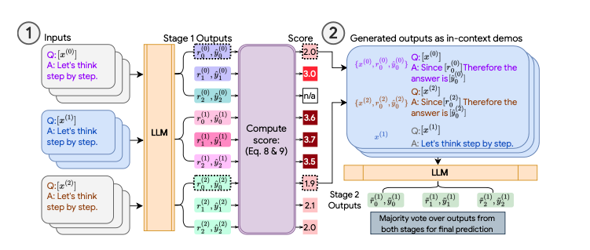
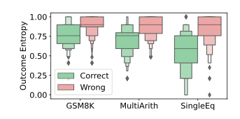

Consistency Based Self Adaptive Prompting (COSP) aims to improve LLM output quality by generating high quality few shot examples to be included in the final prompt. These are examples without labelled ground truth so they use self-consistency and a metric known as normalized entropy to select the best examples.

Once they've selected the examples, they then append them to the prompt and generate multiple reasoning chains before selecting the final result using [Self-Consistency](self_consistency.md).

## COSP process



How does this look in practice? Let's dive into greater detail.

### Step 1 - Selecting Examples

In the first step, we try to generate high quality examples from questions that don't have ground truth labels. This is challenging because we want to find a way to automatically determine answer quality when sampling our model multiple times.

In this case, we have `n` questions which we want to generate `m` possible reasoning chains for each question. This gives a total of `nm` examples. We then want to filter out `k` final few shot examples from these `nm` examples to be included inside our final prompt.

1. Using chain of thought, we first generate `m` responses for each question. These responses contain a final answer and a rationale behind that answer.
2. We compute a score for each response using a weighted sum of two values - normalized entropy and repetitiveness ( How many times this rationale appears for this amswer )
3. We rank all of our `nm` responses using this score and choose the `k` examples with the lowest scores as our final few shot examples.

#### Normalized Entropy

> In the paper, the authors write that normalized entropy is a good proxy over a number of different tasks where low entropy is positively correlated with correctness. Entropy is also supposed to range from 0 to 1.
>
> Therefore in order to do so, we introduce a `-` term in our implementation so that the calculated values range from 0 to 1.



Assuming that for a specific question $x^{(i)}$, we have generated $m$ final answers of which $u$ are unique. ( Note that this only cares about the answer itself and not the rationale )

$$
\mathcal{H}\left(x^{(i)} \mid \left\{\hat{y}_j^{(i)}\right\}_{j=1}^m\right) = \frac{\sum_{\alpha=1}^u \hat{p}\left(\hat{y}_{\alpha}^{(i)}\right) \log \hat{p}\left(\hat{y}_{\alpha}^{(i)}\right)}{\log m},
$$

We can measure the entropy of the generated responses using the formula above where

- $x_i$ is the original question that we prompted the model with
- $y_j^{i}$ represents the $i$-th sampled response from the $m$ that we generated
- $\hat{p}\left(\hat{y}_{\alpha}^{(i)}\right)$ is the frequency of the unique answer in all the $m$ generated answers. (Eg. if we generate 8 responses and 4 of them return the value 10, then $\hat{p}\left(\hat{y}_{\alpha}^{(i)}\right)$ is just going to be 0.5)

#### Repetitiveness

$$
R_r(r_j^{(i)}) = \frac{2}{Q(Q-1)} \sum_{a=1}^{Q} \sum_{b=a+1}^{Q} W_{ab}
$$

In the formula above, $Q$ refers to the number of phrases in the sentence and $W_{ab}$ refers to the cosine similarity of two phrases $a$ and $b$.

Repetitiveness aims to measure how often the language model repeats itself. To do so, the paper sums up the cosine similarity between each sentence inside the generated chain of thought rationale before normalizing it.

The intuition behind this is that high repetitiveness indicates redundancy, which can lead to poorer performance.

### Step 2 - Self Consistency

We now take our `k` responses and append them to our prompt. We then sample our model multiple times using this new prompt and take the majority vote as the answer.

## Implementation

Now that we understand what COSP is, let's see how we can implement it in instructor. Note that here we'll measure repetitiveness using exact string match for simplicity.

!!! Info "Quick Note"

    In our implementation below, there are two things that we do which are slightly different to simplify the implementation. Firstly, we do a sentence wise comparison and see if we have an exact match for each rationale. In the paper they calculate the cosine similarity between each sentence. Therefore the more similar the sentences, the larger the repetitiveness score. We also add in a new sorting term to favour longer chain of thoughts in our function.

```python
import instructor
from pydantic import BaseModel
from openai import AsyncOpenAI
from collections import defaultdict, Counter
import asyncio
from textwrap import dedent
import math

client = instructor.from_openai(AsyncOpenAI())


class Response(BaseModel):
    chain_of_thought: str
    answer: int


class ResponseScore(BaseModel):
    query: str
    response: Response
    score: float

    def format_response(self):
        return dedent(
            f"""
        Q: {self.query}
        A: {self.response.chain_of_thought}. Therefore the answer
        is {self.response.answer}.
        """
        )


async def generate_cot_response(query: str) -> tuple[Response, str]:
    return (
        await client.chat.completions.create(
            model="gpt-4o",
            messages=[{"role": "user", "content": query}],
            response_model=Response,
            temperature=0.4,
        ),
        query,
    )


async def generate_batch_cot_responses(
    queries: list[str], m: int
) -> list[tuple[Response, str]]:
    coros = [generate_cot_response(query) for query in queries for _ in range(m)]
    return await asyncio.gather(*coros)


def score_entropy(predictions: list[Response]):
    counter = Counter([prediction.answer for prediction in predictions])

    prob = [counter[i] / len(predictions) for i in counter]

    numer = -sum([p * math.log(p) for p in prob])
    denom = math.log(len(predictions))

    return numer / denom


def score_repetitiveness(prediction: Response):
    sentences = prediction.chain_of_thought.split(".")
    if len(sentences) == 1:
        return 0

    ttl = 0
    for idx in range(len(sentences)):
        for idx2 in range(idx + 1, len(sentences)):
            if sentences[idx] == sentences[idx2]:
                ttl += 1

    return ttl / ((len(sentences) - 1) * len(sentences))


def score_responses(
    predictions: list[tuple[Response, str]], trade_off_param: float
) -> list[ResponseScore]:
    query_to_responses: dict[str, list[Response]] = defaultdict(list)
    for prediction, query in predictions:
        query_to_responses[query].append(prediction)

    query_to_entropy = {
        query: score_entropy(predictions)
        for query, predictions in query_to_responses.items()
    }

    return [
        ResponseScore(
            query=query,
            response=prediction,
            score=query_to_entropy[query]
            + trade_off_param * score_repetitiveness(prediction),
        )
        for prediction, query in predictions
    ]


def get_top_k_examples(queries: list[ResponseScore], k: int):
    """
    This gets the top k responses that have the minimum possible score
    """
    sorted_responses = sorted(
        queries, key=lambda x: (x.score, -len(x.response.chain_of_thought))
    )
    return sorted_responses[:k]


async def generate_answer_with_examples(query: str, examples: list[ResponseScore]):
    examples = [example.format_response() for example in examples]
    formatted_examples = "\n".join(examples)
    return await client.chat.completions.create(
        model="gpt-4o",
        messages=[
            {
                "role": "system",
                "content": dedent(
                    f"""
                You are a world class AI system that excels at answering
                user queries

                <query>
                {query}
                </query>

                <examples>
                {formatted_examples}
                </examples>
                """
                ),
            }
        ],
        response_model=Response,
    )


async def generate_final_answers(
    query: str, examples: list[ResponseScore], number_samples: int
):
    coros = [
        generate_answer_with_examples(query, examples)
        for _ in range(number_samples)
    ]

    return await asyncio.gather(*coros)


if __name__ == "__main__":
    query = """The schools debate team had 5 boys and 40 girls on it.
    If they were split into groups of 9 how many groups
    could they make?"""

    example_questions = [
        """Debby's class is going on a field trip to the zoo.
        If each van can hold 4 people and there are 2 students
        and 6 adults going, how many vans will they need?""",
        """Nancy had 80 files on her computer. She deleted 31
        of them and put the rest into folders with 7 files in
        each one. How many folders did Nancy end up with?""",
        """At the arcade, Tom won 32 tickets playing 'whack a
        mole' and 25 tickets playing 'skee ball'. If he spent
        7 of his tickets on a hat, how many tickets does Tom
        have left?""",
    ]

    m = 2  # Number of Reasoning Chains per example ( Step 1 )
    k = 3  # Number of Examples to include in final prompt (Step 2)
    n = 2  # Number of Reasoning Chains For Self-Consistency ( Step 2 )

    # Step 1 : Generate the examples
    responses = asyncio.run(generate_batch_cot_responses(example_questions, m))
    scored_responses = score_responses(responses, 0.2)

    for scored_response in scored_responses[:3]:
        print(scored_response.model_dump_json(indent=2))
        """
        {
          "query": "Debby's class is going on a field trip to the zoo. If
          each van can hold 4 people and there are 2 students and 6 adults
          going, how many vans will they need?",
          "response": {
            "chain_of_thought": "First, I will calculate the total number of
            people going on the trip by adding the number of students and
            adults. Then, I will divide this total by the capacity of each
            van to determine the number of vans needed. Since the number of
            vans must be a whole number, I will round up if necessary.",
            "answer": 2
          },
          "score": 0.0
        }
        """
        """
        {
          "query": "Debby's class is going on a field trip to the zoo. If
          each van can hold 4 people and there are 2 students and 6 adults
          going, how many vans will they need?",
          "response": {
            "chain_of_thought": "First, I need to calculate the total number
            of people going on the field trip. There are 2 students and 6
            adults, so the total number of people is 2 + 6 = 8. Next, I need
            to determine how many vans are required if each van can hold 4
            people. To find this, I will divide the total number of people
            by the capacity of each van: 8 / 4 = 2. Therefore, they will
            need 2 vans.",
            "answer": 2
          },
          "score": 0.0
        }
        """
        """
        {
          "query": "Nancy had 80 files on her computer. She deleted 31 of
          them and put the rest into folders with 7 files in each one. How
          many folders did Nancy end up with?",
          "response": {
            "chain_of_thought": "Nancy started with 80 files and deleted 31.
            This leaves her with 80 - 31 = 49 files. She then put these 49
            files into folders, each containing 7 files. To find out how
            many folders she ended up with, we divide the total number of
            files by the number of files per folder: 49 ÷ 7 = 7 folders.",
            "answer": 7
          },
          "score": 0.0
        }
        """

    chosen_examples = get_top_k_examples(scored_responses, k)

    # Step 2 : Run Self-Consistency
    final_responses = asyncio.run(
        generate_final_answers(query, chosen_examples, n)
    )

    c = Counter([response.answer for response in final_responses])
    answer = c.most_common(1)[0][0]

    print(answer)
    #> 5
```
