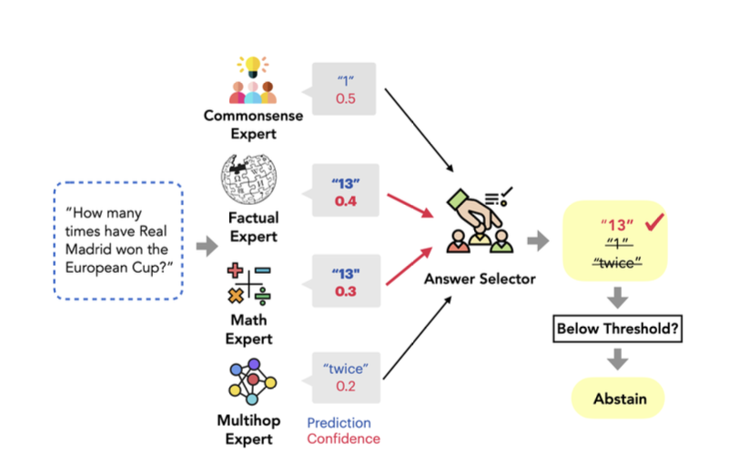

Language Models struggle to generalize across question types that require distinct reasoning abilities. By combining a variety of different specialized language models, we can improve the quality of our responses. This is done through a technique called Mixture Of Reasoning Experts (MoRE).

In the original paper, they utilise four different experts

1. Factual Expert : This is a model that is augmented by a RAG prompting pipeline. WHen it recieves a query, it retrieves the top 10 most relevant passages from Wikipedia and appends them to the prompt right before the question.

2. Multihop Expert : This is an expert that has manually written rationales after each demo to elicit multi-step reasoning processes for the questions

3. Math Expert : This is an expert that has manually written explanations for the GSM8k Dataset to bias the model towards different reasoning steps

4. Commonsense expert: This is an expert that is provided with 10 different facts that are generated by a Codex model which are appended to the prompt right before the question



Once each expert has genearted a response, they then use a random forest classifier to score it from 0 to 1. This is then used for selecting the final answer and determining if we've generated a sufficiently good answer ( Since we have the option to abstain at each point )

We can implement a simplified version of MoRE with `instructor` with a few modifications.

```python
from openai import OpenAI
from pydantic import BaseModel, Field
import instructor
from textwrap import dedent

client = instructor.from_openai(OpenAI())


class MultihopExpert(BaseModel):
    chain_of_thought: str
    answer: str


class FactualExpert(BaseModel):
    answer: str


class ModelScore(BaseModel):
    score: float = Field(ge=0, lt=1)


def query_factual_expert(query: str, evidence: list[str]):
    formatted_evidence = "\n-".join(evidence)
    return client.chat.completions.create(
        model="gpt-4o",
        response_model=FactualExpert,
        messages=[
            {
                "role": "system",
                "content": dedent(
                    f"""
                <query>
                {query}
                </query>

                <evidences>
                {formatted_evidence}
                </evidences>
                """
                ),
            }
        ],
    )


def query_multihop_expert(query: str):
    return client.chat.completions.create(
        model="gpt-4o",
        response_model=MultihopExpert,
        messages=[
            {
                "role": "system",
                "content": dedent(
                    f"""
                <query>
                {query}
                </query>
                """
                ),
            }
        ],
    )


def score_answer(query: str, answer: str):
    return client.chat.completions.create(
        model="gpt-4o",
        response_model=ModelScore,
        messages=[
            {
                "role": "system",
                "content": """You are a helpful assistant that scores
                answers based on well they are able to answer a
                specific user query""",
            },
            {
                "role": "user",
                "content": f"""
                <user query>
                {query}
                </user query>

                <response>
                {answer}
                </response>
                """,
            },
        ],
    )


if __name__ == "__main__":
    query = """Who's the original singer of Help Me Make It
    Through The Night?"""
    evidences = [
        """Help Me Make It Through The Night is a country
        music ballad written and composed by Kris Kristofferson
        and released on his 1970 album 'Kristofferson'"""
    ]

    threshold = 0.8

    factual_expert_output = query_factual_expert(query, evidences)
    print(factual_expert_output.model_dump_json(indent=2))
    """
    {
      "answer": "The original singer of 'Help Me Make It Through the
      Night' is Kris Kristofferson, who released it on his 1970 album
      'Kristofferson'."
    }
    """

    multihop_expert_output = query_multihop_expert(query)
    print(multihop_expert_output.model_dump_json(indent=2))
    """
    {
      "chain_of_thought": "To identify the original singer of 'Help Me
      Make It Through The Night,' I need to look for the person who
      first recorded and released the song.",
      "answer": "The original singer of 'Help Me Make It Through
      The Night' is Kris Kristofferson."
    }
    """

    factual_expert_score = score_answer(query, factual_expert_output.answer)
    multihop_expert_score = score_answer(query, multihop_expert_output.answer)

    if max(factual_expert_score.score, multihop_expert_score.score) < threshold:
        answer = "Abstaining from responding"
    elif factual_expert_score.score > multihop_expert_score.score:
        answer = factual_expert_output.answer
    else:
        answer = multihop_expert_output.answer

    print(answer)
    """
    The original singer of 'Help Me Make It Through the Night' is Kris
    Kristofferson, who released it on his 1970 album 'Kristofferson'.
    """
```
