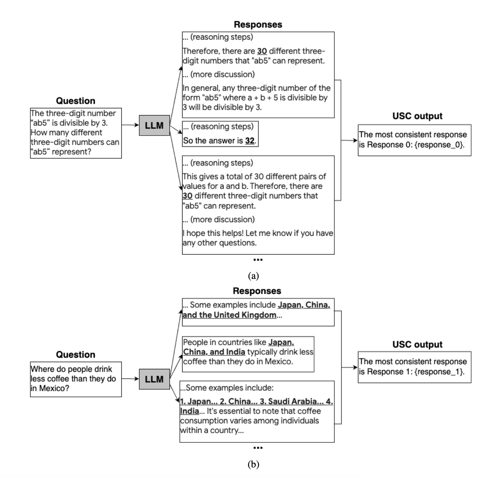

Universal Self Consistency<sup><a href="https://arxiv.org/pdf/2311.17311">1</a></sup> aims to extend self-consistency by using a second LLM model to judge the quality of individual responses. Therefore instead of choosing the final answer based on the most frequently occuring value among each reasoning chain, we instead prompt the model to choose the most consistent answer for us relative to the prompt.



This enables us to support a greater variety of different response formats and answer, leading to greater diversity of outputs and hence higher accuracy.

We can implement this in `instructor` as seen below.

```python hl_lines="71-73"
from openai import AsyncOpenAI
from pydantic import BaseModel, Field, ValidationInfo, field_validator
import instructor
from textwrap import dedent
import asyncio

client = instructor.from_openai(AsyncOpenAI())


class Response(BaseModel):
    chain_of_thought: str
    answer: str


class SelectedResponse(BaseModel):
    most_consistent_response_id: int = Field(
        description="""The ID of the most consistent response that
        was provided"""
    )

    @field_validator("most_consistent_response_id")
    @classmethod
    def validate_id(cls, v: int, info: ValidationInfo):
        context = info.context
        number_responses = context.get("number_responses", float("inf"))

        if v > number_responses:
            raise ValueError(
                f"""Most consistent response ID {v} is greater than the
                number of responses {number_responses}. Please return a
                valid id between 0 and {number_responses-1}"""
            )
        return v


async def generate_response(query: str) -> Response:
    return await client.chat.completions.create(
        model="gpt-4o",
        response_model=Response,
        messages=[{"role": "user", "content": query}],
    )


async def generate_batch_responses(query: str, no_responses: int):
    coros = [generate_response(query) for _ in range(no_responses)]
    return await asyncio.gather(*coros)


async def select_consistent_response(responses: list[Response], query: str):
    formatted_responses = "\n".join(
        [
            f"Response {idx}: {response.chain_of_thought}. {response.answer}"
            for idx, response in enumerate(responses)
        ]
    )

    return await client.chat.completions.create(
        model="gpt-4o",
        response_model=SelectedResponse,
        messages=[
            {
                "role": "user",
                "content": dedent(
                    f"""
                <user query>
                {query}
                </user query>

                {formatted_responses}

                Evaluate these responses.
                Select the most consistent response based on majority
                consensus
                """
                ),
            }
        ],
        validation_context={"number_responses": len(responses)},
    )


if __name__ == "__main__":
    query = """The three-digit number 'ab5' is divisible by 3. How many different
     three-digit numbers can 'ab5' represent?"""
    responses = asyncio.run(generate_batch_responses(query, 3))

    for response in responses:
        print(response.model_dump_json(indent=2))
        """
        {
          "chain_of_thought": "A number is divisible by 3 if
          the sum of its digits is divisible by 3. Given the
          number 'ab5', we need to check how many different
          values of 'a' and 'b', where both are digits (0-9)
          can make the sum divisible by 3.\n\nThe sum of the
          digits is a + b + 5.\n\nWe need to find pairs (a, b)
          such that (a + b + 5) % 3 == 0.",
          "answer": "30"
        }
        """
        """
        {
          "chain_of_thought": "A number is divisible by 3 if
          the sum of its digits is divisible by 3. Let's
          denote the digits a and b. The number 'ab5' has
          digits a, b, and 5. Therefore, the sum of the
          digits is a + b + 5. Since the number is divisible
          by 3, a + b + 5 must be divisible by 3.\n\nNow,
          since a and b are single digits (0-9), we need to
          find pairs (a, b) such that a + b + 5 is divisible
          by 3. We will evaluate all possible combinations of
          values for a and b to count how many valid pairs
          (a, b) exist.\n\nLet's start by considering b's
          values:\n1. If b = 0, then a + 5 must be divisible
          by 3.\n2. If b = 1, then a + 6 must be divisible by
          3.\n3. If b = 2, then a + 7 must be divisible by
          3.\n4. If b = 3, then a + 8 must be divisible by
          3.\n5. If b = 4, then a + 9 must be divisible by
          3.\n6. If b = 5, then a + 10 must be divisible by
          3.\n7. If b = 6, then a + 11 must be divisible by
          3.\n8. If b = 7, then a + 12 must be divisible by
          3.\n9. If b = 8, then a + 13 must be divisible by
          3.\n10. If b = 9, then a + 14 must be divisible by
          3.\n\nWe will find all corresponding a values for
          each b and count the valid combinations.\n",
          "answer": "There are 30 different three-digit
          numbers that 'ab5' can represent."
        }
        """
        """
        {
          "chain_of_thought": "A number is divisible by 3 if
          the sum of its digits is divisible by 3. The given
          number is in the form 'ab5', where 'a' and 'b' are
          digits from 0 to 9. To find the total number of
          different three-digit numbers that 'ab5' can
          represent, we need to determine all possible digit
          combinations for 'a' and 'b' such that 'a + b + 5'
          is divisible by 3.",
          "answer": "30"
        }
        """

    selected_response = asyncio.run(select_consistent_response(responses, query))
    print(selected_response.model_dump_json(indent=2))
    """
    {
      "most_consistent_response_id": 0
    }
    """

    print(
        responses[selected_response.most_consistent_response_id].model_dump_json(
            indent=2
        )
    )
    """
    {
      "chain_of_thought": "A number is divisible by 3 if the sum of its digits is divisible by 3. Given the number 'ab5', we need to
      check how many different values of 'a' and 'b', where both are digits (0-9) can make the sum divisible by 3.\n\nThe sum of the
      digits is a + b + 5.\n\nWe need to find pairs (a, b) such that (a + b + 5) % 3 == 0.",
      "answer": "30"
    }
    """
```

### References

<sup id="ref-1">1</sup>: [Universal Self-Consistency For Large Language Model Generation](https://arxiv.org/pdf/2311.17311)
