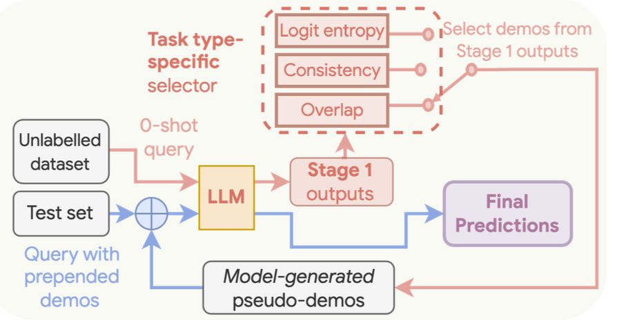

Universal Self Prompting is a two stage process similar to [Consistency Based Self Adaptive Prompting (COSP)](../few_shot/cosp.md). Here is a breakdown of the two stages.

1. **Generate Examples** : LLMs are prompted to generate a collection of candidate responses using a test dataset
2. **Answer Query** : We then select a few of these model-generated responses as examples to prompt the LLM to obtain a final prediction.

Note here that the final answer is obtained using a single forward pass with greedy decoding.

## USP Process



Let's see how this works in greater detail.

### Generate Few Shot Examples

We first prompt our model to generate responses for a given set of prompts. Instead of measuring the entropy and repetitiveness as in COSP, we use one of three possible methods to measure the quality of the generated responses. These methods are decided based on the three categories supported.

This category has to be specified by a user ahead of time.

Note that for Short Form and Long Form generation, we generate $m$ different samples. This is not the case for classification tasks.

- **Classification** : Classification Tasks are evaluated using the normalized probability of each label using the raw logits from the LLM.

$$
F_{CLS}(p^{(j)}|d^{(j)}) := -\sum_{c \in C} P(c|d^{(j)}) \log P(c|d^{(j)})
$$

In short, we take the raw logit for each token corresponding to the label, use a softmax to normalize each of them and then sum across the individual probabilities and their log probs. We also try to sample enough queries such that we have a balanced number of predictions across each class ( so that our model doesn't have a bias towards specific classes )

- **Short Form Generation**: This is done by using a similar formula to COSP but without the normalizing term

$$
\mathcal{H}\left(x^{(i)} \mid \left\{\hat{y}_j^{(i)}\right\}_{j=1}^m\right) = \frac{\sum_{\alpha=1}^u \hat{p}\left(\hat{y}_{\alpha}^{(i)}\right) \log \hat{p}\left(\hat{y}_{\alpha}^{(i)}\right)}{\log m},
$$

- **Long Form Generation**: This is done by using the average pairwise ROUGE score between all pairs of the $m$ responses.

What is key here is that depending on the task specified by the user, we have a task-specific form of evaluation. This eventually allows us to better evaluate our individual generated examples. Samples of tasks for each category include

1. **Classification**: Natural Language Inference, Topic Classification and Sentiment Analysis
2. **Short Form Generation** : Question Answering and Sentence Completion
3. **Long Form Generation** : Text Summarization and Machine Translation

This helps to ultimately improve the performance of these large language models across different types of tasks.

### Generate Single Response

Once we've selected our examples, the second step is relatively simple. We just need to append a few of our chosen examples that score best on our chosen metric to append to our solution.

## Implementation

We've implemented a classification example below that tries to sample across different classes in a balanced manner before generating a response using a single inference call.

We bias this sampling towards samples that the model is more confident towards by using a confidence label.

```python
from pydantic import BaseModel
from typing import Literal
from instructor import from_openai
from openai import AsyncOpenAI
import asyncio
from collections import defaultdict


class Classification(BaseModel):
    chain_of_thought: str
    label: Literal["Happy", "Angry", "Sadness"]
    confidence: Literal[
        "Uncertain", "Somewhat Confident", "Confident", "Highly Confident"
    ]

    def confidence_score(self) -> int:
        confidence_order = {
            "Highly Confident": 4,
            "Confident": 3,
            "Somewhat Confident": 2,
            "Uncertain": 1,
        }
        return confidence_order[self.confidence]


client = from_openai(AsyncOpenAI())


async def generate_prediction(query: str):
    return (
        await client.chat.completions.create(
            model="gpt-3.5-turbo",
            messages=[
                {
                    "role": "user",
                    "content": f"""Classify the following query {query} into
                    one of the following categories: Happy, Angry, Sadness""",
                }
            ],
            response_model=Classification,
        ),
        query,
    )


async def generate_predictions(queries: list[str]) -> list[tuple[Classification, str]]:
    return await asyncio.gather(*[generate_prediction(query) for query in queries])


def get_balanced_sample(predictions: list[tuple[Classification, str]], k: int):
    label_to_queries: dict[str, list[tuple[Classification, str]]] = defaultdict(list)

    for prediction in predictions:
        label_to_queries[prediction[0].label].append(prediction)

    num_classes = len(label_to_queries)
    num_samples_per_class = k // num_classes

    res: list[str] = []
    for label, label_queries in label_to_queries.items():
        label_queries = sorted(
            label_queries, key=lambda x: x[0].confidence_score(), reverse=True
        )
        label_queries = [
            label_queries[1] for label_queries in label_queries[:num_samples_per_class]
        ]
        res.extend([f"{query} ({label})" for query in label_queries])

    return res


async def generate_response_with_examples(query: str, examples: list[str]):
    formatted_examples = "\n".join(examples)
    return await client.chat.completions.create(
        model="gpt-4o",
        response_model=Classification,
        messages=[
            {
                "role": "system",
                "content": f"""
                You are a helpful assistant that classifies queries into one of the following categories: Happy, Angry, Sadness.

                Here are some samples of queries and their categories:

                <examples>
                {formatted_examples}
                </examples>

                Here is a user query to classify

                <query>
                {query}
                </query>
                """,
            },
        ],
    )


if __name__ == "__main__":
    examples = [
        """
        i do feel that running is a divine experience and
        that i can expect to have some type of spiritual
        encounter
        """,
        """
        i get giddy over feeling elegant in a perfectly
        fitted pencil skirt
        """,
        """
        i plan to share my everyday life stories traveling
        adventures inspirations and handmade creations with
        you and hope you will also feel inspired
        """,
        """
        i need to feel the dough to make sure its just
        perfect
        """,
        """
        i found myself feeling a little discouraged that
        morning
        """,
        "i didnt really feel that embarrassed",
        "i feel like a miserable piece of garbage",
        """
        i feel like throwing away the shitty piece of shit
        paper
        """,
        """
        i feel irritated and rejected without anyone doing
        anything or saying anything
        """,
        "i feel angered and firey",
        """
        im feeling bitter today my mood has been strange the
        entire day so i guess its that
        """,
        "i just feel really violent right now",
        "i know there are days in which you feel distracted",
    ]

    labels = asyncio.run(generate_predictions(examples))
    balanced_sample = get_balanced_sample(labels, 3)
    for sample in balanced_sample:
        print(sample)
        """
        i do feel that running is a divine experience and that i can
        expect to have some type of spiritual encounter (Happy)
        """
        #> i feel like a miserable piece of garbage (Sadness)
        #> i feel like throwing away the shitty piece of shit paper (Angry)

    response = asyncio.run(
        generate_response_with_examples(
            """
            i feel furious that right to life advocates can
            and do tell me how to live and die through
            lobbying and supporting those politicians
            sympathic to their views
            """,
            balanced_sample,
        )
    )
    print(response.model_dump_json(indent=2))
    """
    {
      "chain_of_thought": "The user expresses feelings of
      anger and frustration specifically directed at right
      to life advocates. The language used, such as
      'furious,' indicates a high level of emotion
      associated with anger.",
      "label": "Angry",
      "confidence": "Highly Confident"
    }
    """
```
