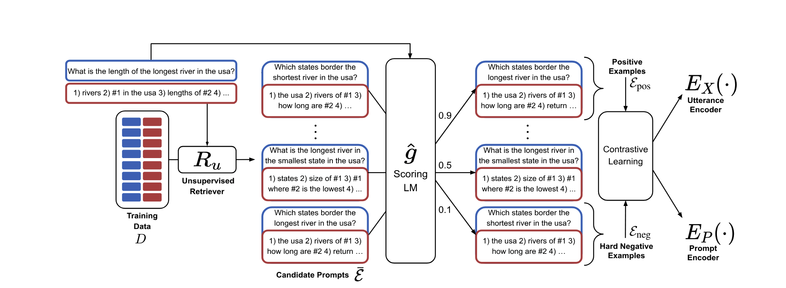

# Example Ordering

The order of few-shot examples in the prompt can affect LLM outputs <a href="https://arxiv.org/abs/2104.08786">1</a><a href="https://arxiv.org/abs/2106.01751">2</a><a href="https://arxiv.org/abs/2101.06804">3</a><a href="https://aclanthology.org/2022.naacl-main.191/">4</a><a href="https://arxiv.org/abs/2406.06608">\*</a>. Consider permutating the order of these examples in your prompt to achieve better results.

## Choosing Your Examples

Depending on your use-case, here are a few different methods that you can consider using to improve the quality of your examples.

### Combinatorics

One of the easiest methods is for us to manually iterate over each of the examples that we have and try all possible combinations we could create. This will in turn allow us to find the best combination that we can find.

### KATE

KATE (k-Nearest Example Tuning) is a method designed to enhance GPT-3's performance by selecting the most relevant in-context examples. The method involves:

For each example in the test set, K nearest neighbors (examples) are retrieved based on semantic similarity.
Among these K examples, those that appear most frequently across different queries are selected as the best in-context examples.

### Using a Unsupervised Retriever

We can use a large LLM to compute a single score for each example with respect to a given prompt. This allows us to create a training set that scores an example's relevance when compared against a prompt. Using this training set, we can train a model that mimics this functionality. This allows us to determine the top `k` most relevant and most irrelevant examples when a user makes a query so that we can include this in our final prompt.

### References

1: [Fantastically Ordered Prompts and Where to Find Them: Overcoming Few-Shot Prompt Order Sensitivity](https://arxiv.org/abs/2104.08786)

2: [Reordering Examples Helps during Priming-based Few-Shot Learning](https://arxiv.org/abs/2106.01751)

3: [What Makes Good In-Context Examples for GPT-3?](https://arxiv.org/abs/2101.06804)

4: [Learning To Retrieve Prompts for In-Context Learning](https://aclanthology.org/2022.naacl-main.191/)

\*: [The Prompt Report: A Systematic Survey of Prompting Techniques](https://arxiv.org/abs/2406.06608)
