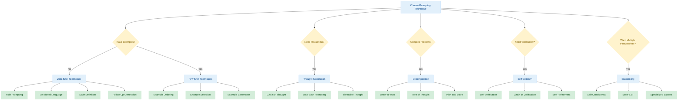

# Advanced Prompting Techniques

<div class="grid cards" markdown>

- :material-lightbulb: **Basic Approaches**

    Zero-shot and few-shot techniques for immediate improvements

    [:octicons-arrow-right-16: Zero-Shot](#zero-shot) · [:octicons-arrow-right-16: Few-Shot](#few-shot)

- :material-brain: **Reasoning Methods**

    Techniques to improve model reasoning and problem-solving

    [:octicons-arrow-right-16: Thought Generation](#thought-generation) · [:octicons-arrow-right-16: Decomposition](#decomposition)

- :material-check-all: **Verification**

    Methods for self-assessment and correction

    [:octicons-arrow-right-16: Self-Criticism](#self-criticism)

- :material-group: **Collaboration**

    Ensemble techniques for aggregating multiple model outputs

    [:octicons-arrow-right-16: Ensembling](#ensembling)

</div>

This guide presents 58 research-backed prompting techniques mapped to Instructor implementations. Based on [The Prompt Report](https://trigaten.github.io/Prompt_Survey_Site) by [Learn Prompting](https://learnprompting.org) which analyzed over 1,500 academic papers on prompting.

## Prompting Technique Map

The following diagram shows how different prompting techniques relate to each other and when to use them:



## When to Use Each Technique

| Goal | Recommended Techniques |
|------|------------------------|
| Improve accuracy | Chain of Thought, Self-Verification, Self-Consistency |
| Handle complex problems | Decomposition, Tree of Thought, Least-to-Most |
| Generate creative content | Role Prompting, Emotional Language, Style Definition |
| Verify factual correctness | Chain of Verification, Self-Calibration |
| Optimize with few examples | KNN Example Selection, Active Prompting |
| Handle uncertainty | Uncertainty-Routed CoT, Self-Consistency |

## Zero-Shot {#zero-shot}

These techniques improve model performance without examples:

| Technique | Description | Use Case |
|-----------|-------------|----------|
| [Emotional Language](zero_shot/emotion_prompting.md) | Add emotional tone to prompts | Creative writing, empathetic responses |
| [Role Assignment](zero_shot/role_prompting.md) | Give the model a specific role | Expert knowledge, specialized perspectives |
| [Style Definition](zero_shot/style_prompting.md) | Specify writing style | Content with particular tone or format |
| [Prompt Refinement](zero_shot/s2a.md) | Automatic prompt optimization | Iterative improvement of results |
| [Perspective Simulation](zero_shot/simtom.md) | Have the model adopt viewpoints | Multiple stakeholder analysis |
| [Ambiguity Clarification](zero_shot/rar.md) | Identify and resolve unclear aspects | Improving precision of responses |
| [Query Repetition](zero_shot/re2.md) | Ask model to restate the task | Better task understanding |
| [Follow-Up Generation](zero_shot/self_ask.md) | Generate clarifying questions | Deep exploration of topics |

## Few-Shot {#few-shot}

Techniques for effectively using examples in prompts:

| Technique | Description | Use Case |
|-----------|-------------|----------|
| [Example Generation](few_shot/example_generation/sg_icl.md) | Automatically create examples | Domains with limited example data |
| [Example Ordering](few_shot/example_ordering.md) | Optimal sequencing of examples | Improved pattern recognition |
| [KNN Example Selection](few_shot/exemplar_selection/knn.md) | Choose examples similar to query | Domain-specific accuracy |
| [Vote-K Selection](few_shot/exemplar_selection/vote_k.md) | Advanced similarity-based selection | Complex pattern matching |

## Thought Generation {#thought-generation}

Methods to encourage human-like reasoning in models:

### Zero-Shot Reasoning

| Technique | Description | Use Case |
|-----------|-------------|----------|
| [Analogical CoT](thought_generation/chain_of_thought_zero_shot/analogical_prompting.md) | Generate reasoning using analogies | Complex problem-solving |
| [Step-Back Prompting](thought_generation/chain_of_thought_zero_shot/step_back_prompting.md) | Consider higher-level questions first | Scientific and abstract reasoning |
| [Thread of Thought](thought_generation/chain_of_thought_zero_shot/thread_of_thought.md) | Encourage step-by-step analysis | Detailed explanation generation |
| [Tabular CoT](thought_generation/chain_of_thought_zero_shot/tab_cot.md) | Structure reasoning in table format | Multi-factor analysis |

### Few-Shot Reasoning

| Technique | Description | Use Case |
|-----------|-------------|----------|
| [Active Prompting](thought_generation/chain_of_thought_few_shot/active_prompt.md) | Annotate uncertain examples | Improved accuracy on edge cases |
| [Auto-CoT](thought_generation/chain_of_thought_few_shot/auto_cot.md) | Choose diverse examples | Broad domain coverage |
| [Complexity-Based CoT](thought_generation/chain_of_thought_few_shot/complexity_based.md) | Use complex examples | Challenging problem types |
| [Contrastive CoT](thought_generation/chain_of_thought_few_shot/contrastive.md) | Include correct and incorrect cases | Error detection and avoidance |
| [Memory of Thought](thought_generation/chain_of_thought_few_shot/memory_of_thought.md) | Use high-certainty examples | Reliability in critical applications |
| [Uncertainty-Routed CoT](thought_generation/chain_of_thought_few_shot/uncertainty_routed_cot.md) | Select the most certain reasoning path | Decision-making under uncertainty |
| [Prompt Mining](thought_generation/chain_of_thought_few_shot/prompt_mining.md) | Generate templated prompts | Efficient prompt engineering |

## Ensembling {#ensembling}

Techniques for combining multiple prompts or responses:

| Technique | Description | Use Case |
|-----------|-------------|----------|
| [Consistent, Diverse Sets](ensembling/cosp.md) | Build consistent example sets | Stable performance |
| [Batched In-Context Examples](ensembling/dense.md) | Efficient example batching | Performance optimization |
| [Step Verification](ensembling/diverse.md) | Validate individual steps | Complex workflows |
| [Maximizing Mutual Information](ensembling/max_mutual_information.md) | Information theory optimization | Information-dense outputs |
| [Meta-CoT](ensembling/meta_cot.md) | Merge multiple reasoning chains | Complex problem-solving |
| [Specialized Experts](ensembling/more.md) | Use different "expert" prompts | Multi-domain tasks |
| [Self-Consistency](ensembling/self_consistency.md) | Choose most consistent reasoning | Logical accuracy |
| [Universal Self-Consistency](ensembling/universal_self_consistency.md) | Domain-agnostic consistency | General knowledge tasks |
| [Task-Specific Selection](ensembling/usp.md) | Choose examples per task | Specialized domain tasks |
| [Prompt Paraphrasing](ensembling/prompt_paraphrasing.md) | Use variations of the same prompt | Robust outputs |

## Self-Criticism {#self-criticism}

Methods for models to verify or improve their own responses:

| Technique | Description | Use Case |
|-----------|-------------|----------|
| [Chain of Verification](self_criticism/chain_of_verification.md) | Generate verification questions | Fact-checking, accuracy |
| [Self-Calibration](self_criticism/self_calibration.md) | Ask if answer is correct | Confidence estimation |
| [Self-Refinement](self_criticism/self_refine.md) | Auto-generate feedback and improve | Iterative improvement |
| [Self-Verification](self_criticism/self_verification.md) | Score multiple solutions | Quality assessment |
| [Reverse CoT](self_criticism/reversecot.md) | Reconstruct the problem | Complex reasoning verification |
| [Cumulative Reasoning](self_criticism/cumulative_reason.md) | Generate possible steps | Thorough analysis |

## Decomposition {#decomposition}

Techniques for breaking down complex problems:

| Technique | Description | Use Case |
|-----------|-------------|----------|
| [Functional Decomposition](decomposition/decomp.md) | Implement subproblems as functions | Modular problem-solving |
| [Faithful CoT](decomposition/faithful_cot.md) | Use natural and symbolic language | Mathematical reasoning |
| [Least-to-Most](decomposition/least_to_most.md) | Solve increasingly complex subproblems | Educational applications |
| [Plan and Solve](decomposition/plan_and_solve.md) | Generate a structured plan | Project planning |
| [Program of Thought](decomposition/program_of_thought.md) | Use code for reasoning | Algorithmic problems |
| [Recursive Thought](decomposition/recurs_of_thought.md) | Recursively solve subproblems | Hierarchical problems |
| [Skeleton of Thought](decomposition/skeleton_of_thought.md) | Generate outline structure | Writing, planning |
| [Tree of Thought](decomposition/tree-of-thought.md) | Search through possible paths | Decision trees, exploration |

## Implementation with Instructor

All these prompting techniques can be implemented with Instructor by:

1. Defining appropriate Pydantic models that capture the expected structure
2. Incorporating the prompting technique in your model docstrings or field descriptions
3. Using the patched LLM client with your response model

```python
import instructor
from openai import OpenAI
from pydantic import BaseModel, Field

# Example implementing Chain of Thought with a field
class ReasonedAnswer(BaseModel):
    """Answer the following question with detailed reasoning."""
    
    chain_of_thought: str = Field(
        description="Step-by-step reasoning process to solve the problem"
    )
    final_answer: str = Field(
        description="The final conclusion after reasoning"
    )

client = instructor.from_openai(OpenAI())

response = client.chat.completions.create(
    model="gpt-4",
    response_model=ReasonedAnswer,
    messages=[
        {"role": "user", "content": "What is the cube root of 27?"}
    ]
)

print(f"Reasoning: {response.chain_of_thought}")
print(f"Answer: {response.final_answer}")
```

## References

<sup>\*</sup> Based on [The Prompt Report: A Systematic Survey of Prompting Techniques](https://arxiv.org/abs/2406.06608)
