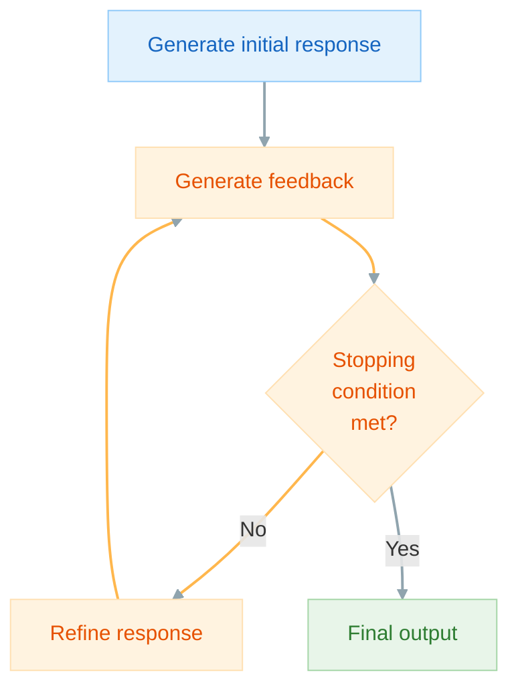

How can we provide feedback for an LLM to improve its responses?

Self-refine is an approach that uses an LLM to generate an output, provide feedback on the output, and improve the output based on the provided feedback. This processes repeats until a stopping condition is achieved. The same LLM is used for all three steps.



```python hl_lines="102-106"
import instructor
from pydantic import BaseModel, Field
from openai import OpenAI
from typing import Optional


class Response(BaseModel):
    code: str


class Feedback(BaseModel):
    feedback: list[str] = Field(
        description="A list of actions to take to improve the code."
    )
    done: bool


class Timestep(BaseModel):
    response: str
    feedback: Optional[list[str]] = Field(default_factory=list)
    refined_response: Optional[str] = Field(default="")


class History(BaseModel):
    history: list[Timestep] = Field(default_factory=list)

    def add(self, code, feedback, refined_code):
        self.history.append(
            Timestep(response=code, feedback=feedback, refined_response=refined_code)
        )


client = instructor.from_openai(OpenAI())


def generate_feedback(response):
    return client.chat.completions.create(
        model="gpt-4o",
        response_model=Feedback,
        messages=[
            {
                "role": "user",
                "content": f"""
                        You are an expert Python coder.
                        Provide feedback on this code.
                        How can we make it (1) faster and (2) more readable?

                        <code>
                        {response.code}
                        </code>

                        If the code does not need to be improved, then indicate by setting "done" to True.
                        """,
            }
        ],
    )


def refine(response, feedback):
    return client.chat.completions.create(
        model="gpt-4o",
        response_model=Response,
        messages=[
            {
                "role": "user",
                "content": f"""
                        You are an expert Python coder.

                        <response>
                        {response.code}
                        </response>

                        <feedback>
                        {feedback.feedback}
                        </feedback>

                        Refine your response.
                        """,
            }
        ],
    )


def stop_condition(feedback, history):
    return feedback.done or len(history.history) >= 3


if __name__ == "__main__":
    response = client.chat.completions.create(
        model="gpt-4o",
        response_model=Response,
        messages=[
            {
                "role": "user",
                "content": "Write Python code to calculate the fibonacci sequence.",
            }
        ],
    )

    history = History()

    while True:
        feedback = generate_feedback(response)
        if stop_condition(feedback, history):
            break
        refined_response = refine(response, feedback)

        # Save to history
        history.add(response.code, feedback.feedback, refined_response.code)
        response = refined_response

    print(history.history[0].response)
    """
    def fibonacci(n):
        sequence = [0, 1]
        while len(sequence) < n:
            sequence.append(sequence[-1] + sequence[-2])
        return sequence[:n]

    # Example usage:
    n = 10
    print(fibonacci(n))
    """
    print(history.history[0].feedback)
    """
    [
        'Use a generator to reduce memory consumption for large `n` values and improve speed.',
        'Enhance readability by adding type hints for input and output.',
        "Add docstrings to explain the function's purpose and parameters.",
        "Avoid slicing the list at the end if it's not necessary; instead, ensure the loop condition is precise.",
    ]
    """
    print(history.history[0].refined_response)
    """
    def fibonacci(n: int) -> list[int]:
        """Generate a Fibonacci sequence of length n.

        Args:
            n (int): The length of the Fibonacci sequence to generate.

        Returns:
            list[int]: A list containing the Fibonacci sequence of length n.
        """
        def fibonacci_generator():
            a, b = 0, 1
            for _ in range(n):
                yield a
                a, b = b, a + b
        return list(fibonacci_generator())

    # Example usage:
    n = 10
    print(fibonacci(n))
    """
    print(f"...process repeated {len(history.history)} times...")
    #> ...process repeated 3 times...
    print(response.code)
    """
    def fibonacci(n: int) -> list[int]:
        """Generate a Fibonacci sequence of length n.

        Args:
            n (int): The length of the Fibonacci sequence to generate.

        Returns:
            list[int]: A list containing the Fibonacci sequence of length n.
        """
        if n <= 0:
            return []
        sequence = [0] * n
        if n > 1:
            sequence[1] = 1
        for i in range(2, n):
            sequence[i] = sequence[i-1] + sequence[i-2]
        return sequence

    # Example usage:
    n = 10
    print(fibonacci(n))
    """
```

### References

<sup id="ref-1">1</sup>: [Self-Refine: Iterative Refinement with Self-Feedback](https://arxiv.org/abs/2303.17651)

<sup id="ref-asterisk">\*</sup>: [The Prompt Report: A Systematic Survey of Prompting Techniques](https://arxiv.org/abs/2406.06608)