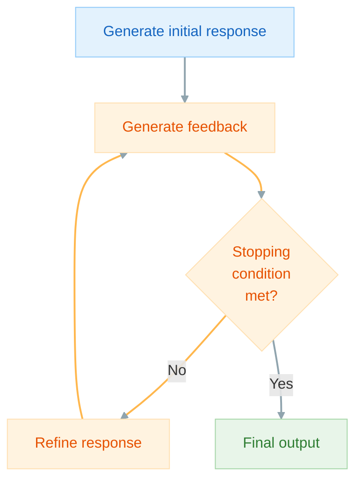

How can we provide feedback for an LLM to improve its responses?

Self-refine is an approach that uses an LLM to generate an output, provide feedback on the output, and improve the output based on the provided feedback. This processes repeats until a stopping condition is achieved. The same LLM is used for all three steps.



```python hl_lines="88-92"
import instructor
from pydantic import BaseModel, Field
from openai import OpenAI
from typing import Optional


class Response(BaseModel):
    code: str


class Feedback(BaseModel):
    feedback: list[str] = Field(
        description="A list of actions to take to improve the code."
    )
    done: bool


class Timestep(BaseModel):
    response: str
    feedback: Optional[list[str]] = []
    refined_response: Optional[str] = ""


class History(BaseModel):
    history: list[Timestep] = []


client = instructor.from_openai(OpenAI())


def generate_feedback(response):
    return client.chat.completions.create(
        model="gpt-4o",
        response_model=Feedback,
        messages=[
            {
                "role": "user",
                "content": f"""
                        You are an expert Python coder.
                        Provide feedback on this code.
                        How can we make it (1) faster and (2) more readable?
                        {response.code}
                        If the code does not need to be improved, then indicate by setting "done" to True.
                        """,
            }
        ],
    )


def refine(response, feedback):
    return client.chat.completions.create(
        model="gpt-4o",
        response_model=Response,
        messages=[
            {
                "role": "user",
                "content": f"""
                        You are an expert Python coder.
                        Given this response:
                        {response.code}
                        And this feedback:
                        {feedback.feedback}
                        Refine your response.
                        """,
            }
        ],
    )


def stop_condition(feedback, history):
    return feedback.done or len(history.history) >= 3


if __name__ == "__main__":
    response = client.chat.completions.create(
        model="gpt-4o",
        response_model=Response,
        messages=[
            {
                "role": "user",
                "content": "Write Python code to calculate the fibonacci sequence.",
            }
        ],
    )

    history = History()

    while True:
        feedback = generate_feedback(response)
        if stop_condition(feedback, history):
            break
        refined_response = refine(response, feedback)

        # Save to history
        history.history.append(
            Timestep(
                response=response.code,
                feedback=feedback.feedback,
                refined_response=refined_response.code,
            )
        )
        response = refined_response

    print(history.history[0].response)
    """
    def fibonacci(n):
        sequence = [0, 1]
        while len(sequence) < n:
            next_value = sequence[-1] + sequence[-2]
            sequence.append(next_value)
        return sequence[:n]

    # Example usage
    n = 10
    print(fibonacci(n))
    """
    print(history.history[0].feedback)
    """
    [
        'To optimize the code for better performance and readability, we can consider the following changes:',
        '1. Use a generator to improve memory efficiency and potentially speed up the calculations. Generators yield items one at a time and thus reduce memory overhead.',
        '2. Add type hints for better readability and to help static analysis tools.',
        '3. Improve the loop logic to make it more concise.',
        '4. Add a docstring for better code documentation.',
    ]
    """
    print(history.history[0].refined_response)
    """
    def fibonacci(n: int) -> list[int]:
        """
        Generate a Fibonacci sequence of length n.

        Parameters:
        n (int): The length of the Fibonacci sequence to generate.

        Returns:
        list[int]: A list containing the first n numbers in the Fibonacci sequence.
        """
        def fibonacci_generator() -> int:
            a, b = 0, 1
            for _ in range(n):
                yield a
                a, b = b, a + b
        return list(fibonacci_generator())

    # Example usage
    n = 10
    print(fibonacci(n))
    """
    print(f"...process repeated {len(history.history)} times...")
    #> ...process repeated 3 times...
    print(response.code)
    """
    from typing import Generator

    def fibonacci(n: int) -> Generator[int, None, None]:
        """
        Generate a Fibonacci sequence of length n.

        Parameters:
        n (int): The length of the Fibonacci sequence to generate.

        Returns:
        Generator[int, None, None]: A generator yielding the first n numbers in the Fibonacci sequence.

        Raises:
        ValueError: If the length of the Fibonacci sequence is negative.
        """
        if n < 0:
            raise ValueError("The length of the Fibonacci sequence must be non-negative.")
        current: int, next_val: int = 0, 1
        count: int = 0
        while count < n:
            yield current
            current, next_val = next_val, current + next_val
            count += 1

    # Example usage
    n = 10
    for number in fibonacci(n):
        print(number)
    """
```

### References

<sup id="ref-1">1</sup>: [Self-Refine: Iterative Refinement with Self-Feedback](https://arxiv.org/abs/2303.17651)

<sup id="ref-asterisk">\*</sup>: [The Prompt Report: A Systematic Survey of Prompting Techniques](https://arxiv.org/abs/2406.06608)